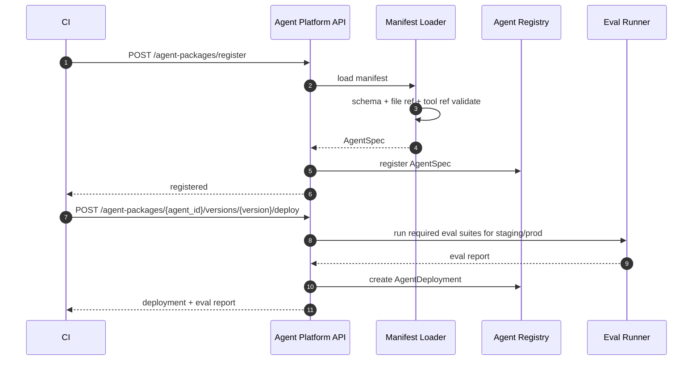

# Agent Manifest v1 契约

`manifest.yaml` 是 Agent Package 的入口文件。平台通过 manifest 加载 Agent 的身份、版本、运行时、模型、工具、知识源、路由策略、输出能力和评测集。

## 1. 设计目标

1. 让新增 Agent 不需要修改平台核心代码。
2. 让 Agent 的业务资产可以版本化、评测、发布和回滚。
3. 让工具、知识源、prompt 和策略引用显式化。
4. 让 CI 可以在合并前做静态校验。
5. 让生产运行时可以根据 manifest 构造 `AgentSpec`。

## 2. 文件位置

推荐：

```text
agents/<agent_id>/manifest.yaml
```

示例：

```text
agents/myj/manifest.yaml
agents/promo_recommendation/manifest.yaml
```

## 3. 最小示例

```yaml
api_version: agent.platform/v1
kind: AgentPackage

metadata:
  id: myj
  name: 美宜佳数字店员
  description: 面向门店屏和前端渠道的便利店业务助手
  owner: retail-ai
  domain: retail
  tags:
    - store-assistant
    - product-search

version:
  package_version: 0.1.0
  runtime_compat: ">=0.1.0 <0.2.0"
  release_channel: dev

runtime:
  backend: native
  entrypoint: agents.myj.adapter:MyjAdapter
  max_iterations: 4
  timeout_ms: 5000

entry:
  mode: single_agent
  orchestrator: null
  default_worker: null

models:
  default:
    provider: openai-compatible
    model: default-chat
    temperature: 0.2
    max_tokens: 1024

prompts:
  orchestrator: prompts/orchestrator.md
  reply_style: prompts/reply_style.md

tools:
  allow:
    - myj.goods_search
    - myj.goods_location
  deny:
    - terminal
    - browser
  timeout_ms: 3000
  max_parallel: 2

knowledge:
  sources:
    - id: myj_goods
      type: vector_collection
      backend: weaviate
      collection: Good
      filters:
        tenant_field: org_id
        store_field: store_code

routing:
  strategy: hybrid
  rules: policies/routing.yaml
  fallback_worker: direct_reply

session:
  scope: tenant_store_user
  history_window: 20
  memory_enabled: false

context:
  required:
    - context.tenant.org_id
  optional:
    - context.location.location_id
    - context.channel.channel_id

output:
  protocol: agent-chat/v1
  supports:
    - text
    - cards
    - commands
  command_allowlist:
    - product.recommend
    - product.locate

safety:
  policy: policies/safety.yaml

evals:
  suites:
    - evals/golden.yaml
  required_pass_rate: 0.9
```

## 4. 字段说明

| 字段 | 必填 | 说明 |
| --- | --- | --- |
| `api_version` | 是 | 当前固定 `agent.platform/v1` |
| `kind` | 是 | 当前固定 `AgentPackage` |
| `metadata` | 是 | Agent 稳定身份 |
| `version` | 是 | 版本和运行时兼容信息 |
| `runtime` | 是 | 运行时后端和入口 |
| `entry` | 否 | Agent 入口模式 (`mode`, `orchestrator`, `default_worker`) |
| `models` | 否 | 模型配置 |
| `prompts` | 否 | prompt 文件引用 |
| `tools` | 否 | 工具白名单、黑名单和执行限制 |
| `knowledge` | 否 | 知识源声明 |
| `routing` | 否 | Agent 内部路由策略 |
| `session` | 否 | 会话和记忆配置 |
| `context` | 否 | 请求上下文字段要求 |
| `output` | 是 | 输出协议和能力 |
| `safety` | 否 | 安全策略 |
| `evals` | 否 | 评测集和门槛 |
| `extensions` | 否 | 第三方 runtime 或业务扩展 |

## 5. Runtime Backend

MVP 支持：

```yaml
runtime:
  backend: native
```

后续可扩展：

```yaml
runtime:
  backend: hermes
```

```yaml
runtime:
  backend: langgraph
```

平台必须通过 `RuntimeBackend` 接口适配，不允许在核心路由里写 `if agent_id == "myj"` 这种业务分支。

## 6. 校验规则

CI 和注册接口必须校验：

1. `metadata.id` 只能包含小写字母、数字、`-`、`_`。
2. `version.package_version` 必须符合 SemVer。
3. `version.runtime_compat` 必须能被当前平台版本满足。
4. `runtime.backend` 必须是平台支持的 backend，例如 `native`、`hermes`、`langgraph`。
5. `runtime.entrypoint` 必须使用 `python.module:Symbol` 格式。
6. 所有文件引用必须存在，且不能越过 Agent Package 根目录。
7. `tools.allow` 中的工具必须已注册或声明为 package-local tool。
8. `tools.deny` 优先级高于 `tools.allow`。
9. `knowledge.sources` 的 backend、collection、filter 字段必须合法。
10. `context.required` 和 `context.optional` 必须使用 `context.*` 路径。
11. `context.required` 缺失时，运行时必须返回明确错误或 clarification。
12. `output.protocol` 必须是平台支持的协议版本。
13. `output.supports` 必须是平台支持的输出能力集合。
14. `output.command_allowlist` 的命名必须符合 `domain.action` 风格，且必须约束 Agent 返回的 commands。
15. 发布到 staging / prod 前必须满足 `evals.required_pass_rate`。

## 7. Extension 设计

Manifest 允许扩展，但扩展不能影响核心字段语义。

示例：

```yaml
extensions:
  hermes:
    enabled_toolsets:
      - safe
      - search
    disabled_toolsets:
      - terminal
      - code_execution
    max_iterations: 8
  myj:
    cv_event_enabled: true
    store_required: true
```

规则：

1. 扩展字段必须挂在 `extensions.<namespace>` 下。
2. 平台核心不能依赖某个业务 namespace。
3. Hermes、LangGraph 等 runtime 专属配置只能由对应 adapter 消费。

## 8. 注册和发布流程



当前约束：

1. `register` 只负责加载、校验和注册本地 AgentSpec。
2. `deploy` 负责 staging / prod 的 eval gate 和 deployment 记录。
3. 客户端不能通过传入 `eval_passed=true` 绕过服务端 eval gate。

## 9. 版本策略

| 变更 | 版本建议 |
| --- | --- |
| prompt 小改 | patch |
| eval case 增加 | patch |
| 工具参数兼容新增 | minor |
| 输出协议兼容新增 | minor |
| 删除字段或破坏兼容 | major |
| runtime backend 变化 | minor 或 major，视兼容性 |

## 10. 第一版限制

MVP 阶段暂不支持：

1. Manifest 内嵌密钥。
2. 动态下载远程 prompt。
3. Agent 之间互相依赖。
4. 同一个 package 多 runtime 同时启用。
5. 生产环境自动放开高风险工具。
