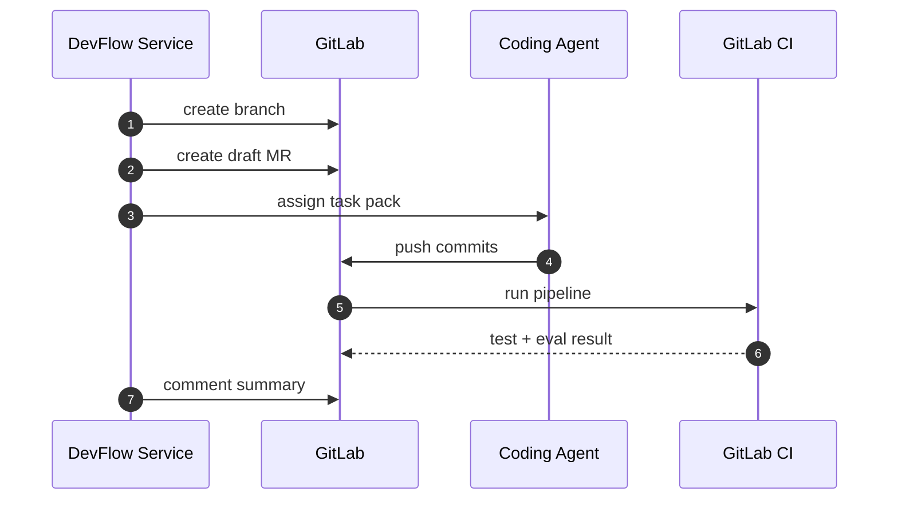

# DevFlow Task Pack 契约

DevFlow Task Pack 是 AI coding agent 的结构化任务输入。它的目标是约束 Codex、Claude Code、OpenHands 等工具只围绕明确需求、明确范围和明确验收标准工作。

## 1. 为什么需要 Task Pack

不能把一句自然语言需求直接交给 coding agent 改全仓库。Task Pack 需要解决：

1. 需求边界不清。
2. AI 修改范围不可控。
3. 测试和文档容易漏。
4. Issue、MR、Eval、发布状态无法追踪。
5. 多个 AI 工具接入时缺少统一协议。

## 2. 使用位置

```text
Plane Work Item / GitLab Issue
        |
        v
DevFlow Requirement Parser
        |
        v
Task Pack
        |
        v
Codex / Claude Code / OpenHands
        |
        v
GitLab MR + CI + Eval
```

## 3. Task Pack 示例

```yaml
api_version: devflow.agent-platform/v1
kind: DevelopmentTask

metadata:
  task_id: issue-123
  title: 新增促销推荐 Agent
  type: agent:new
  priority: P1
  source:
    system: plane
    issue_id: AGENT-123
    url: http://10.193.0.147:3333/

repository:
  provider: gitlab
  project_id: agent-platform
  default_branch: main
  work_branch: feat/agent-123-promo-recommendation
  merge_request:
    title: "feat(agent): add promo recommendation agent"
    labels:
      - agent:new
      - ai-generated
    reviewers:
      - backend-owner
      - product-owner

requirement:
  background: 新增一个面向门店用户的促销推荐 Agent
  user_scenarios:
    - 用户询问今天有什么饮料优惠
    - 用户要求推荐低糖且有优惠的商品
  acceptance:
    - 能根据门店筛选促销商品
    - 不推荐缺货商品
    - 返回文本和商品卡片
    - 返回的 command 必须在 manifest allowlist 内
  non_goals:
    - 不做会员画像推荐
    - 不修改现有 /chat 对外协议

agent:
  agent_id: promo_recommendation
  package_path: agents/promo_recommendation
  runtime_backend: native

scope:
  write_allowed:
    - agents/promo_recommendation/**
    - src/agent_platform/**
    - tests/**
    - docs/**
    - pyproject.toml
    - uv.lock
    - eval-report.json
  write_denied:
    - .env
    - secrets/**
    - deploy/prod/**
    - infra/prod/**

implementation:
  required_outputs:
    - agents/promo_recommendation/manifest.yaml
    - agents/promo_recommendation/prompts/orchestrator.md
    - agents/promo_recommendation/evals/golden.yaml
    - tests/unit
    - docs update if contract changes
  constraints:
    - 新增工具必须声明 timeout
    - 不允许把密钥写入代码
    - 修改平台核心接口必须更新 docs/contracts

validation:
  commands:
    - pytest tests/unit
    - python scripts/validate_manifest.py agents/promo_recommendation/manifest.yaml
    - python scripts/run_agent_eval.py --agent promo_recommendation
  required_reports:
    - eval-report.json

review:
  required_reviewers:
    - backend-owner
    - product-owner
  checklist:
    - manifest 已校验
    - tests 已补充
    - eval 已通过
    - 无密钥泄露
    - 可回滚
```

## 4. 字段说明

| 字段 | 必填 | 说明 |
| --- | --- | --- |
| `api_version` | 是 | 当前固定 `devflow.agent-platform/v1` |
| `kind` | 是 | 当前固定 `DevelopmentTask` |
| `metadata` | 是 | 任务身份、类型、来源 |
| `repository` | 是 | 代码仓库、分支、MR 信息 |
| `requirement` | 是 | 业务背景、场景、验收和非目标 |
| `agent` | 否 | 涉及的业务 Agent |
| `scope` | 是 | AI 允许和禁止修改的路径 |
| `implementation` | 是 | 必须产出的文件和约束 |
| `validation` | 是 | 必须执行或生成的校验 |
| `review` | 是 | 人审要求 |

## 5. 任务类型

| 类型 | 说明 |
| --- | --- |
| `agent:new` | 新增业务 Agent |
| `agent:change` | 修改已有 Agent |
| `tool:new` | 新增工具 |
| `tool:change` | 修改工具 |
| `knowledge:sync` | 新增或修改知识同步 |
| `eval:add` | 增加评测 |
| `bug` | 修复问题 |
| `docs` | 更新文档 |
| `platform:change` | 修改平台核心 |

## 6. AI 执行约束

Coding agent 必须遵守：

1. 先阅读 task pack、相关文档和相关代码。
2. 修改前输出简短执行计划。
3. 不修改 `write_denied` 路径。
4. 不扩大需求范围。
5. 不写入密钥、token、生产地址。
6. 不绕过测试和 eval。
7. 不直接发布生产。
8. 最终报告必须列出变更文件、测试结果、风险点。

## 7. GitLab 集成

DevFlow Service 根据 Task Pack 调用 GitLab：



MR 描述必须包含：

```markdown
## Source Task

Plane Work Item / GitLab issue link

## Requirement Summary

## Changes

## Validation

## Risk

## Human Review Checklist
```

## 8. Task Pack 生命周期

| 状态 | 说明 |
| --- | --- |
| `draft` | AI 生成草案，等待人确认 |
| `ready` | 可交给 coding agent |
| `running` | coding agent 执行中 |
| `changes_submitted` | 已提交 MR |
| `validation_failed` | 测试或 eval 失败 |
| `review_required` | 等待人审 |
| `approved` | 人审通过 |
| `closed` | 任务关闭 |

## 9. MVP 限制

第一阶段只要求：

1. Task Pack 可以用 YAML 文件表示。
2. 可以手动触发 coding agent。
3. 可以创建 GitLab MR。
4. 可以把测试和 eval 结果回写 MR。

不要求：

1. 自动拆分多个子任务。
2. 多 coding agent 并发。
3. 自动合并。
4. 自动生产发布。
