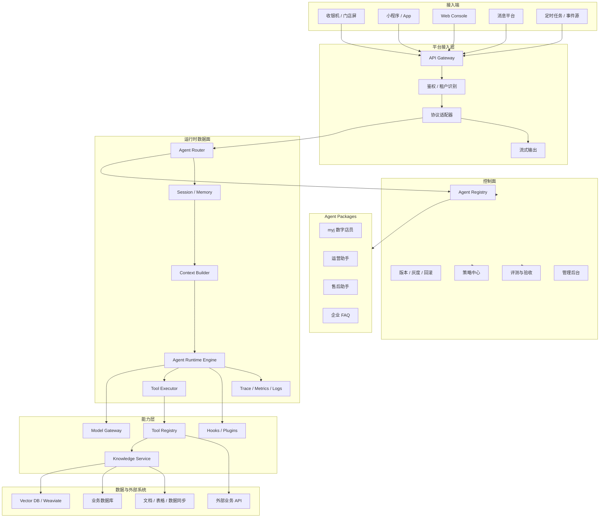
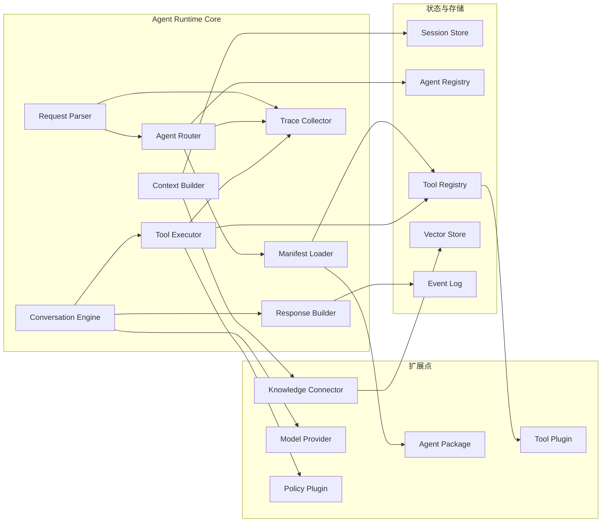
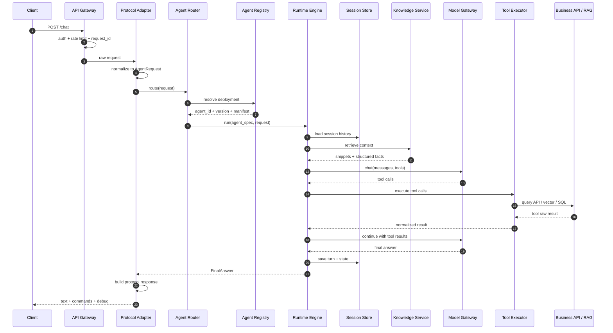
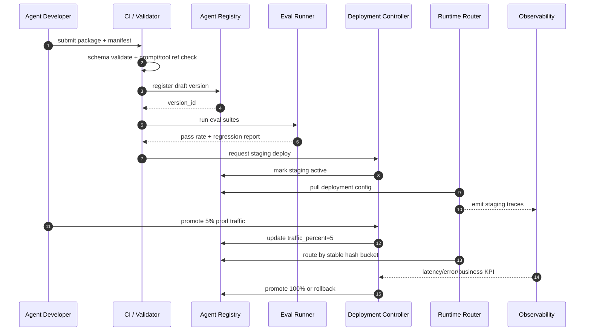
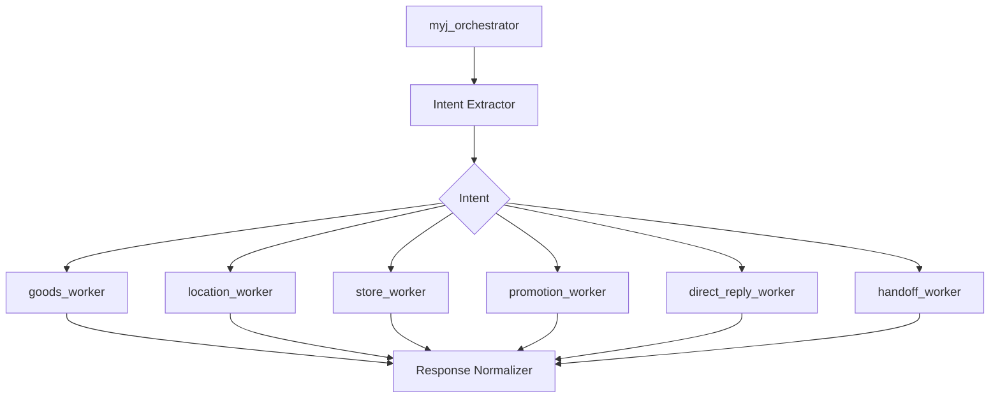
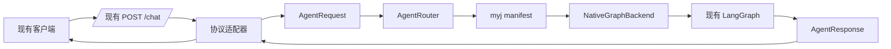

# 多 Agent 平台设计草案

> 本文档定位：平台**总体设计**——做什么、怎么分层、外部交互模型。平台内部代码组织和去业务化重构见 [`agent-platform-core-design.md`](agent-platform-core-design.md)；研发自动化流程见 [`ai-human-vibecoding-rd-platform.md`](ai-human-vibecoding-rd-platform.md)。

本文档描述一个可承载多个业务 Agent 的平台设计。目标不是把 `myj` 继续扩成一个更大的单体 Agent，而是把 `myj` 抽象成平台里的第一个 Agent Package，后续可以用同一套运行时接入更多零售商、业务域、设备形态和知识库。

## 1. 设计目标

平台需要解决的问题：

1. 多个 Agent 共用统一运行时，避免每个项目重复实现模型调用、工具调用、会话、日志、评测和权限。
2. 每个 Agent 保留自己的业务规则、工具、知识源、回复策略和协议适配。
3. Agent 可以版本化发布，支持灰度、回滚、评测和审计。
4. 输入协议、会话模型、工具模型和知识模型保持平台统一，避免每接一个客户就新增一组零散字段。
5. 能逐步接入 Hermes 这类通用 Agent Runtime 能力，但不把业务编排硬塞进通用运行时。

## 2. 总体架构图



## 3. 分层职责

| 层 | 职责 | 不应该承担的职责 |
| --- | --- | --- |
| 接入层 | HTTP、SSE、WebSocket、鉴权、协议兼容、租户识别 | 业务意图识别、工具执行 |
| 控制面 | Agent 注册、版本、灰度、回滚、评测、策略配置 | 单次对话执行 |
| 运行时数据面 | 会话、上下文构建、模型调用、工具调用、状态保存、观测 | 具体业务知识实现 |
| 能力层 | 工具、知识库、模型网关、插件、外部系统连接 | Agent 专属业务策略 |
| Agent Package | prompt、policy、tools、knowledge、evals、输出策略 | 通用运行时能力 |

## 4. 多 Agent 路由图

多 Agent 平台至少需要三层路由：入口路由、Agent 路由、Agent 内部任务路由。

```mermaid
flowchart TB
    Request[平台请求] --> Normalize[协议归一化]
    Normalize --> TenantRoute{租户 / 应用 / 渠道路由}

    TenantRoute -->|retailer_id=myj| MyjPackage[myj Agent Package]
    TenantRoute -->|app_id=ops| OpsPackage[运营 Agent Package]
    TenantRoute -->|app_id=faq| FaqPackage[FAQ Agent Package]
    TenantRoute -->|未命中| DefaultAgent[默认兜底 Agent]

    MyjPackage --> MyjOrch{myj Orchestrator}
    MyjOrch -->|商品查询| GoodsAgent[商品点餐 Worker]
    MyjOrch -->|位置查询| LocationAgent[商品位置 Worker]
    MyjOrch -->|店务咨询| StoreAgent[店务咨询 Worker]
    MyjOrch -->|优惠查询| PromotionAgent[优惠 Worker]
    MyjOrch -->|直接回复| DirectReply[模板 / LLM 直接回复]
    MyjOrch -->|转人工| HumanHandoff[转人工 / 业务系统]

    GoodsAgent --> GoodsTools[goods_search / recommend]
    LocationAgent --> LocationTools[goods_location]
    StoreAgent --> StoreTools[store_consult]
    PromotionAgent --> PromoTools[promotion_lookup]

    GoodsTools --> Knowledge[Knowledge Service]
    LocationTools --> Knowledge
    StoreTools --> Knowledge
    PromoTools --> BusinessAPI[促销 / 会员 / 商品 API]
```



## 5. 路由决策模型

### 5.1 入口级路由

入口级路由决定请求交给哪个 Agent Package。

建议优先级：

1. 显式 `agent_id`
2. `app_id`
3. `context.tenant.retailer_id`
4. `context.channel.channel_id`
5. 默认 Agent

### 5.2 Package 内部路由

Package 内部路由决定由哪个 worker 或工具处理任务。

以 `myj` 为例：

| 输入特征 | 路由目标 |
| --- | --- |
| 用户提到具体点餐商品、即食商品、推荐商品 | `goods_worker` |
| 用户明确问货架、位置、在哪里 | `location_worker` |
| 用户问支付、退款、售后、点单流程 | `store_worker` |
| 用户问优惠、促销、会员价 | `promotion_worker` |
| 用户问候、闲聊、自我介绍、家电查询 | `direct_reply` |
| 用户要求人工 | `handoff` |

### 5.3 工具级路由

工具级路由决定调用哪个具体能力：

1. 先由 Agent policy 约束工具白名单。
2. 再由 task planner 或规则路由选择工具。
3. Tool Executor 负责执行、超时、重试、审计和结果标准化。

## 6. Agent Package 目录草案

```
agents/
  myj/
    manifest.yaml
    prompts/
      orchestrator.md
      direct_reply.md
      reply_style.md
    policies/
      routing.yaml
      safety.yaml
      output.yaml
    tools/
      goods_search.py
      goods_location.py
      store_consult.py
      promotion_lookup.py
    knowledge/
      sources.yaml
      sync.yaml
    evals/
      intent_cases.yaml
      golden_answers.yaml
    tests/
      test_routing.py
      test_tools.py
```

Package 内只放业务资产，不放平台通用运行时。

## 7. Agent Manifest 设计草案

`manifest.yaml` 是 Agent Package 的入口。平台通过它加载 Agent 的模型、工具、知识源、路由策略、输出协议和评测集。

```yaml
api_version: agent.platform/v1
kind: AgentPackage

metadata:
  id: myj
  name: 美宜佳数字店员
  description: 面向门店屏、收银机、小程序的便利店业务助手
  owner: retail-ai
  domain: retail
  tags:
    - store-assistant
    - product-search
    - location

version:
  package_version: 1.0.0
  runtime_compat: ">=0.1.0 <0.2.0"
  release_channel: dev

entry:
  mode: orchestrator
  orchestrator: main
  default_worker: direct_reply

models:
  default:
    provider: huaweicloud
    model: main-chat
    temperature: 0.2
    max_tokens: 1024
  extraction:
    provider: huaweicloud
    model: main-chat
    temperature: 0.0
    max_tokens: 512
  reply:
    provider: huaweicloud
    model: response-chat
    temperature: 0.3
    max_tokens: 1024

prompts:
  orchestrator: prompts/orchestrator.md
  direct_reply: prompts/direct_reply.md
  reply_style: prompts/reply_style.md

tools:
  allow:
    - goods_search
    - goods_location
    - store_consult
    - promotion_lookup
  deny:
    - terminal
    - browser
  timeout_ms: 3000
  max_parallel: 4

knowledge:
  sources:
    - id: myj_goods
      type: vector_collection
      backend: weaviate
      collection: Good
      filters:
        tenant_field: retailer_id
        store_field: store_code
    - id: myj_location
      type: vector_collection
      backend: weaviate
      collection: Location
      filters:
        tenant_field: retailer_id
        store_field: store_code
    - id: myj_consultation
      type: vector_collection
      backend: weaviate
      collection: Consultation
      filters:
        tenant_field: retailer_id
        store_field: store_code

routing:
  strategy: hybrid
  rules: policies/routing.yaml
  fallback_worker: direct_reply
  human_handoff_intents:
    - 转人工

session:
  scope: tenant_store_user
  memory_enabled: true
  history_window: 20
  compression:
    enabled: true
    threshold_tokens: 12000

context:
  required:
    - context.tenant.retailer_id
    - context.store.store_id
  optional:
    - context.device.device_id
    - context.channel.channel_id
    - input.capabilities

output:
  protocol: retail-agent/v2
  supports:
    - text
    - cards
    - commands
    - debug
  command_allowlist:
    - product.recommend
    - product.locate
    - cart.add
    - human.handoff

safety:
  policy: policies/safety.yaml
  moderation:
    input: true
    output: true

evals:
  suites:
    - evals/intent_cases.yaml
    - evals/golden_answers.yaml
  required_pass_rate: 0.95
```

## 8. Manifest 字段说明

| 字段 | 说明 |
| --- | --- |
| `metadata` | Agent 的稳定身份，不随版本频繁变化 |
| `version` | Package 版本、运行时兼容范围、发布通道 |
| `entry` | Agent 执行模式，通常是 `orchestrator` 或 `single_worker` |
| `models` | 默认模型和专项模型配置 |
| `prompts` | prompt 文件入口 |
| `tools` | 工具白名单、黑名单、超时和并发限制 |
| `knowledge` | 知识源定义，不直接写死在代码里 |
| `routing` | 路由策略和 fallback worker |
| `session` | 会话范围、历史窗口、压缩策略 |
| `context` | 请求上下文要求 |
| `output` | 输出协议和可返回的命令集合 |
| `safety` | 审核、拒答、转人工策略 |
| `evals` | 发布前必须通过的评测集 |

## 9. 平台核心数据模型

### 9.1 AgentDefinition

存储 Agent Package 的静态定义：

| 字段 | 说明 |
| --- | --- |
| `agent_id` | 稳定 ID，如 `myj` |
| `version` | Package 版本 |
| `status` | `draft`、`active`、`deprecated`、`archived` |
| `manifest` | manifest 原文或解析后的 JSON |
| `created_at` | 创建时间 |
| `updated_at` | 更新时间 |

### 9.2 AgentDeployment

描述某个租户或渠道使用哪个 Agent 版本：

| 字段 | 说明 |
| --- | --- |
| `deployment_id` | 部署 ID |
| `tenant_id` | 租户 |
| `agent_id` | Agent ID |
| `version` | 生效版本 |
| `channel` | `dev`、`staging`、`prod` |
| `traffic_percent` | 灰度比例 |

### 9.3 AgentSession

描述一次对话会话：

| 字段 | 说明 |
| --- | --- |
| `session_id` | 外部或平台生成的会话 ID |
| `agent_id` | 当前 Agent |
| `tenant_id` | 租户 |
| `store_id` | 门店 |
| `user_id` | 用户 |
| `channel_id` | 渠道 |
| `history` | 消息历史 |
| `state_snapshot` | Agent 当前状态 |

### 9.4 ToolDefinition

描述平台工具：

| 字段 | 说明 |
| --- | --- |
| `tool_name` | 工具名 |
| `schema` | JSON Schema |
| `handler_ref` | 处理器引用 |
| `permissions` | 权限要求 |
| `timeout_ms` | 超时 |
| `owner` | 工具归属团队 |

## 10. 平台 API 草案

### 10.1 对话执行

```http
POST /api/v1/agents/{agent_id}/chat
```

请求：

```json
{
  "protocol_version": "2.0",
  "request_id": "req_001",
  "session_id": "sess_001",
  "context": {
    "tenant": {
      "retailer_id": "myj"
    },
    "store": {
      "store_id": "V01031"
    }
  },
  "input": {
    "query": "可乐在哪里",
    "history": [],
    "capabilities": [
      "product.locate"
    ]
  },
  "meta": {
    "is_debug": true
  }
}
```

响应：

```json
{
  "id": "req_001",
  "agent_id": "myj",
  "session_id": "sess_001",
  "output": {
    "text": {
      "display": "可乐在饮料区的第三层货架。",
      "tts": "可乐在饮料区的第三层货架。"
    },
    "commands": [
      {
        "name": "product.locate",
        "data": {
          "items": [
            {
              "sku_id": "10001",
              "layoutimg": "https://example.com/layout.png",
              "xtip": "0.35",
              "ytip": "0.42"
            }
          ]
        }
      }
    ]
  },
  "debug": {
    "route": "myj.location_worker",
    "tools": [
      "goods_location"
    ],
    "latency_ms": 842
  }
}
```

### 10.2 Agent 注册

```http
POST /api/v1/agent-packages
```

请求体为 manifest 或 package artifact 引用。

### 10.3 Agent 发布

```http
POST /api/v1/agent-packages/{agent_id}/versions/{version}/deploy
```

用于绑定租户、渠道和灰度比例。

## 11. myj 迁移策略

当前 `myj` 项目可以按以下顺序平台化：

1. 保留现有 `/chat` 协议兼容层，新增协议 v2 到内部标准输入的转换。
2. 把 `MainAgent` 抽象为 `myj` package 的 orchestrator。
3. 把 `goods_agent_tool`、`location_agent_tool`、`store_agent_tool`、`get_goods_promotion` 注册为平台工具。
4. 把 Weaviate collection、数据同步任务、RAG 配置从代码常量迁移到 `knowledge/sources.yaml`。
5. 把意图识别 prompt 拆到 `prompts/orchestrator.md`。
6. 把业务路由规则拆到 `policies/routing.yaml`。
7. 建立 `evals/intent_cases.yaml` 和 `evals/golden_answers.yaml`，作为发布门槛。

## 12. Hermes 能力接入边界

Hermes 更适合被接入为通用运行时能力，而不是替换 `myj` 的业务编排。

建议复用：

1. Tool Registry / Toolsets：作为平台工具注册与可见性控制的参考。
2. Agent Runtime：用于工具循环、重试、fallback、上下文压缩和会话恢复。
3. Session / Memory：用于多轮会话、跨入口恢复和长期记忆。
4. Plugin Hooks：用于审计、观测、结果改写、业务策略插入。
5. Gateway / TUI 思路：用于多入口统一接入。

不建议直接替换：

1. `myj` 的业务意图识别逻辑。
2. `myj` 的商品、位置、店务 RAG。
3. 现有数据同步链路。
4. 前端业务协议里的商品卡片、位置命令和门店上下文。

## 13. 第一阶段落地范围

第一阶段目标是做出可运行的平台骨架，而不是一次性重写所有业务。

建议包含：

1. `AgentDefinition` 和 `AgentDeployment` 的最小表结构。
2. `manifest.yaml` 加载器。
3. `AgentRouter`，支持按 `agent_id`、`app_id`、`retailer_id` 路由。
4. `ToolRegistry`，先接入 `myj` 的四个业务工具。
5. `myj` package 化，保留现有 MainAgent 逻辑。
6. 统一 trace 结构，记录 route、tools、latency、model、session_id。

暂不包含：

1. 完整可视化管理后台。
2. 跨租户 agent marketplace。
3. 多模型自动调度。
4. 分布式工具执行。
5. 完整 Hermes runtime 替换。

## 14. 运行时组件图

平台运行时建议拆成稳定内核和可替换扩展点。稳定内核负责协议、路由、会话、工具执行、模型调用和观测；业务扩展点通过 Agent Package、Tool Plugin、Knowledge Connector 注入。



组件边界：

| 组件 | 输入 | 输出 | 关键职责 |
| --- | --- | --- | --- |
| `RequestParser` | 原始 HTTP / gateway event | 标准 `AgentRequest` | 协议版本识别、字段归一化、兼容旧协议 |
| `AgentRouter` | `AgentRequest`、部署规则 | `ResolvedAgent` | 选 agent、选版本、选灰度桶 |
| `ManifestLoader` | `agent_id`、`version` | `AgentSpec` | 读取 manifest、校验 schema、解析 prompt/tool/knowledge 引用 |
| `ContextBuilder` | 请求上下文、会话、知识源 | `RuntimeContext` | 拼装系统提示词、历史、门店上下文、RAG 检索片段 |
| `ConversationEngine` | `RuntimeContext`、模型配置 | `AgentStep` / `FinalAnswer` | LLM 调用、工具循环、预算控制、fallback |
| `ToolExecutor` | tool call | 标准 tool result | 权限校验、参数校验、超时、重试、审计 |
| `ResponseBuilder` | `FinalAnswer`、协议能力 | `AgentResponse` | 文本、卡片、命令、debug 输出 |
| `TraceCollector` | 全链路事件 | trace / metrics / logs | 可观测性、评测回放、问题排查 |

## 15. 请求执行时序图



这个时序的重点是：协议适配、路由、运行时和业务工具分离。`myj` 现有 `/chat` 可以先保留在 `Protocol Adapter` 内，逐步把内部执行迁到平台标准对象。

## 16. 发布与灰度时序图

Agent 平台不能只关注“跑起来”，还要关注“如何安全发布”。每个 Agent Package 应该先经过静态校验、离线评测、小流量灰度，再切主版本。



发布控制建议：

| 阶段 | 必须检查 | 阻断条件 |
| --- | --- | --- |
| package 注册 | manifest schema、文件引用、工具引用、知识源引用 | manifest 无法解析、引用缺失 |
| 离线评测 | 意图识别、工具选择、标准回答、协议输出 | 低于 `required_pass_rate` |
| staging | 延迟、错误率、工具失败率、人工复核 | P95 超阈值、工具错误率升高 |
| prod 灰度 | 业务指标、投诉率、fallback 率 | fallback 或人工转接异常升高 |
| 全量 | 回归监控、版本审计、可回滚 | 无法定位版本、trace 缺失 |

## 17. 多 Agent 路由算法草案

路由不要完全交给 LLM。平台级路由应该优先使用确定性信息，LLM 只处理语义意图和模糊请求。

```python
def route_agent(request: AgentRequest) -> ResolvedAgent:
    # 1. 显式 agent_id 拥有最高优先级，适合调试、后台、内部调用。
    if request.agent_id:
        return resolve_deployment(
            agent_id=request.agent_id,
            tenant_id=request.context.tenant_id,
            channel=request.context.channel_id,
        )

    # 2. app_id / retailer_id 用于业务入口路由。
    candidate = find_by_app_or_tenant(
        app_id=request.app_id,
        retailer_id=request.context.retailer_id,
        channel=request.context.channel_id,
    )
    if candidate:
        return apply_rollout(candidate, request.stable_user_key)

    # 3. 语义路由只在没有明确业务绑定时启用。
    semantic_candidate = semantic_router.match(request.input.query)
    if semantic_candidate.confidence >= 0.85:
        return apply_rollout(semantic_candidate, request.stable_user_key)

    # 4. 兜底 agent 必须可解释、可审计。
    return resolve_default_agent(request.context.channel_id)
```

路由返回对象建议包含：

```json
{
  "agent_id": "myj",
  "version": "1.0.0",
  "deployment_id": "dep_myj_prod",
  "route_reason": "retailer_id",
  "traffic_bucket": 37,
  "runtime_profile": "prod",
  "debug": {
    "matched_key": "context.tenant.retailer_id",
    "matched_value": "myj"
  }
}
```

## 18. Agent 内部编排模式

不同 Agent 不一定都需要复杂多 worker。平台应该支持三种编排模式，避免简单 Agent 被迫套复杂框架。

| 模式 | 适用场景 | 优点 | 风险 |
| --- | --- | --- | --- |
| `single_worker` | FAQ、固定流程、轻量查询 | 简单、低延迟、易测试 | 扩展复杂任务时容易膨胀 |
| `orchestrator_workers` | `myj` 这类多业务意图 Agent | 清晰拆分意图、工具和回复策略 | orchestrator 容易变成新的大单体 |
| `graph` | 多步骤状态机、审批流、复杂工作流 | 可视化、状态明确、适合 LangGraph | 需要更严格的状态和错误处理 |

`myj` 第一阶段建议使用 `orchestrator_workers`：



内部 worker 的接口要统一：

```python
class AgentWorker(Protocol):
    name: str

    def can_handle(self, task: AgentTask, ctx: RuntimeContext) -> RouteScore:
        ...

    async def run(self, task: AgentTask, ctx: RuntimeContext) -> WorkerResult:
        ...
```

## 19. Manifest Schema 最小约束

manifest 不只是描述文档，它应该成为平台装载 Agent 的契约。建议至少做以下校验：

| 约束 | 说明 |
| --- | --- |
| `metadata.id` | 只能包含小写字母、数字、`-`、`_`，作为稳定 ID |
| `version.package_version` | 必须符合 SemVer |
| `version.runtime_compat` | 必须能被当前 runtime 满足 |
| `prompts.*` | 文件必须存在，不能越过 package 根目录 |
| `tools.allow` | 工具必须已注册，且当前租户有权限 |
| `tools.deny` | deny 优先级高于 allow |
| `knowledge.sources` | 后端、collection、tenant filter 必须合法 |
| `context.required` | 请求缺失时必须返回可解释错误，而不是让 Agent 猜 |
| `output.command_allowlist` | 返回命令必须在白名单内 |
| `evals.required_pass_rate` | 发布到 prod 前必须满足 |

建议保留扩展字段：

```yaml
extensions:
  hermes:
    enabled_toolsets:
      - safe
      - web
    disabled_toolsets:
      - terminal
      - code_execution
    max_iterations: 8
    memory_provider: session
  myj:
    store_required: true
    cv_event_enabled: true
```

这样可以接 Hermes 的能力，但不会把 Hermes 私有配置散落进业务代码。

## 20. Hermes 接入方式建议

如果自己的 Agent 平台想用 Hermes 的能力，建议采用“能力内核复用 + 平台契约包裹”的方式，而不是直接把业务 Agent 跑在 Hermes CLI 里。

### 20.1 推荐接入层次

| 接入层次 | 做法 | 推荐度 |
| --- | --- | --- |
| 工具注册思想 | 借鉴 Hermes `Tool Registry / Toolsets`，在平台实现自己的 `ToolRegistry` | 高 |
| 运行时适配器 | 把 Hermes `AIAgent` 封装成一个 `RuntimeBackend` | 中高 |
| 插件机制 | 借鉴 Hermes hooks/plugin surface，用于审计、观测、tool 前后处理 | 高 |
| Gateway 思路 | 借鉴多平台消息适配，但保留自己的零售协议 | 中 |
| 直接嵌入 CLI/TUI | 把业务流量直接导入 Hermes CLI | 低 |

### 20.2 RuntimeBackend 抽象

平台可以定义自己的运行时接口：

```python
class RuntimeBackend(Protocol):
    name: str

    async def run(self, request: RuntimeRequest) -> RuntimeResponse:
        ...
```

然后提供两个实现：

```
RuntimeBackend
├── NativeGraphBackend
│   └── 当前 myj LangGraph / FastAPI 路径
└── HermesBackend
    └── 调用 Hermes AIAgent / tool loop / session / plugin hooks
```

这样做的好处：

1. `myj` 可以先继续用现有 LangGraph 编排。
2. 新 Agent 可以选择 HermesBackend 来获得工具循环、会话、插件和多入口能力。
3. 平台的 manifest、路由、发布、审计模型不被某个 runtime 绑定。
4. 后续如果 Hermes 的 `run_agent.py` 重构，平台只需要更新 adapter。

### 20.3 HermesBackend 映射关系

| 平台概念 | Hermes 对应能力 | 适配说明 |
| --- | --- | --- |
| `AgentPackage.manifest` | `AIAgent` 初始化参数、toolsets、system prompt | 由 adapter 翻译 |
| `ToolRegistry` | `tools/registry.py` + plugin `ctx.register_tool` | 平台工具可以包装为 Hermes tool |
| `SessionStore` | `SessionDB` / memory provider | 平台 session_id 需要映射到 Hermes session |
| `ModelGateway` | provider plugins | 平台模型配置翻译为 Hermes provider/base_url/api_key |
| `TraceCollector` | Hermes hooks / logs | 需要补齐结构化 trace，不只读日志 |
| `Policy` | enabled/disabled toolsets、hooks | 平台 policy 应该在 adapter 前置校验 |

## 21. MYJ 作为第一个 Agent Package 的落地结构

`myj` 不建议一开始重写为通用平台。更稳妥的方式是把现有能力包起来：

```
src/
  platform/
    contracts.py          # AgentRequest / AgentResponse / RuntimeContext
    router.py             # AgentRouter
    registry.py           # AgentRegistry / manifest loader
    runtime/
      base.py             # RuntimeBackend protocol
      native_graph.py     # 当前 LangGraph backend
      hermes.py           # 未来 Hermes backend
    tools/
      registry.py         # 平台 ToolRegistry
      adapters.py         # 把 myj 现有工具包装成标准工具
  agents/
    myj/
      manifest.yaml
      prompts/
      policies/
      knowledge/
      evals/
```

当前代码到平台结构的映射：

| 当前模块 | 平台化后位置 | 说明 |
| --- | --- | --- |
| `src/api/routes.py` | `platform/protocol/myj_v1_adapter.py` | 保留旧协议兼容 |
| `src/agent/core.py` | `platform/runtime/native_graph.py` | 作为 NativeGraphBackend |
| `src/graph/builder.py` | `agents/myj/graph.py` 或 runtime adapter 内部 | 保留 LangGraph 实现 |
| `src/agents/main_agent.py` | `agents/myj/prompts/orchestrator.md` + worker policy | 拆 prompt 和路由规则 |
| `src/tools/*` | `platform/tools/adapters.py` + `agents/myj/tools` | 注册为标准工具 |
| Weaviate 配置 | `agents/myj/knowledge/sources.yaml` | 从代码配置迁出 |

第一阶段不要改变外部协议，只改变内部边界：



## 22. 重构优先级

> 最新优先级和实现差距以 [`implementation-gap.md`](../implementation-gap.md) 为准。以下为初始规划，保留做参考。

建议按”先契约、再拆分、再替换 runtime”的顺序推进。

| 优先级 | 工作 | 目的 |
| --- | --- | --- |
| P0 | 定义 `AgentRequest`、`AgentResponse`、`AgentContext` | 统一平台协议内核 |
| P0 | 增加 `agent_id` / `retailer_id` 路由 | 支持多个 Agent 并存 |
| P0 | 增加 manifest loader | 把 Agent 配置从代码中抽出 |
| P1 | 把 myj 工具注册到 `ToolRegistry` | 工具可审计、可授权、可复用 |
| P1 | 拆 prompt、routing policy、knowledge config | 降低 `MainAgent` 膨胀风险 |
| P1 | 增加 trace schema | 让每次回答可回放、可定位 |
| P2 | 加 eval runner 和发布门槛 | 支撑版本化发布 |
| P2 | 加 HermesBackend adapter | 复用 Hermes 工具循环和插件能力 |
| P3 | 管理后台、灰度 UI、多租户 marketplace | 平台运营能力 |

判断重构是否成功的标准：

1. 新增一个 Agent 不需要修改 `myj` 的业务代码。
2. 新增一个工具不需要修改核心 runtime。
3. Agent 版本可以注册、评测、部署、回滚。
4. 每次请求能看到命中的 agent、版本、worker、工具、知识源和模型。
5. `myj` 现有协议可以继续兼容，同时内部已经运行在平台契约上。