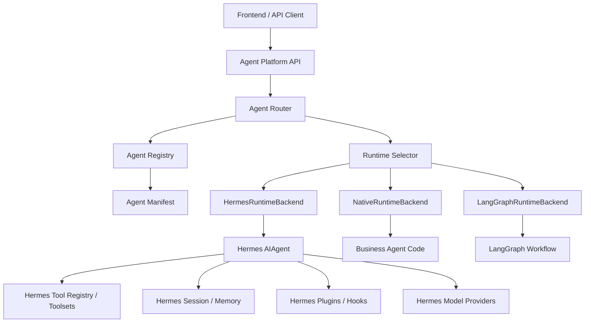
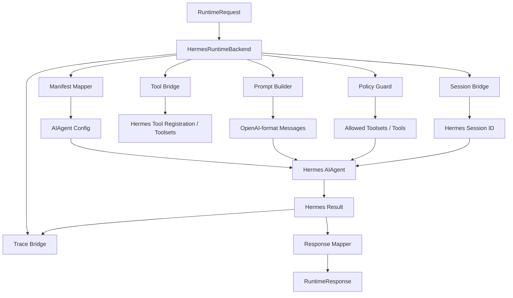
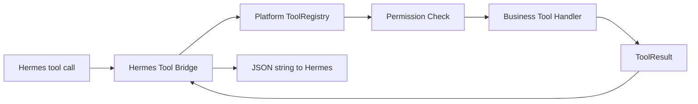

# Hermes Runtime 能力利用设计

> 相关文档：当前实现与设计的差距分析见 [`implementation-gap.md`](../implementation-gap.md) §2.4（Runtime 与 Hermes）；Hermes spike 设计计划见 [`next-stage-design-plan.md`](../next-stage-design-plan.md) §P0-3。

本文档说明 Hermes 作为 `agent-platform` 的可插拔 Runtime Backend 时，哪些能力可以复用、如何接入、边界在哪里，以及哪些业务 Agent 适合使用 HermesBackend。

结论先行：

```text
Agent Platform 是平台本体
Hermes 是可插拔 runtime / capability provider
业务 Agent 通过 manifest 选择是否使用 HermesBackend
```

不建议把业务平台做进 Hermes，也不建议深 fork Hermes。推荐做一层 `HermesBackend Adapter`，把平台契约翻译成 Hermes 的 `AIAgent` 调用。

## 1. Hermes 在平台里的定位



平台仍然负责：

1. 统一 API。
2. 多 Agent 路由。
3. Agent manifest。
4. Agent 注册和版本。
5. 权限、租户、发布、灰度。
6. Eval 门禁。
7. DevFlow / GitLab / Issue 看板。

Hermes 只负责某些 Agent 的单次运行能力：

1. 模型调用。
2. 工具循环。
3. 工具 schema 暴露。
4. tool call dispatch。
5. session / memory。
6. plugin hooks。
7. provider 适配。
8. skills / toolsets。

## 2. 能力映射

| Agent Platform 概念 | Hermes 能力 | 利用方式 |
| --- | --- | --- |
| `RuntimeBackend` | `AIAgent.run_conversation()` / `chat()` | 封装成 `HermesRuntimeBackend.run()` |
| `AgentManifest.runtime` | `AIAgent.__init__` 参数 | manifest 翻译成 provider/model/toolsets/session 等参数 |
| `ToolRegistry` | `tools/registry.py`、`toolsets.py`、plugin tool registration | 平台工具包装成 Hermes tool，或直接启用 Hermes toolsets |
| `ModelGateway` | model-provider plugins | 复用 Hermes provider profile，或由平台注入 base_url/api_key |
| `SessionStore` | `SessionDB`、memory provider | 平台 session_id 映射到 Hermes session_id |
| `TraceCollector` | Hermes logs、hooks、tool call events | Adapter 把 Hermes 事件转成平台 `AgentRun` trace |
| `Policy` | enabled/disabled toolsets、hooks、tool allow/deny | 平台先做权限裁剪，再传给 Hermes |
| `DevFlow Agent` | Hermes CLI/runtime + tools | 需求理解、文档生成、测试生成等内部 Agent 可用 Hermes |
| `Gateway` | Hermes gateway 思路 | 可参考，不建议直接让业务 API 走 Hermes gateway |

## 3. Hermes 适合承载的 Agent 类型

### 3.1 适合

| Agent 类型 | 是否适合 HermesBackend | 原因 |
| --- | --- | --- |
| FAQ / 知识问答 Agent | 适合 | 工具循环简单，适合复用 search / memory / RAG 工具 |
| 内部运营助手 | 适合 | 需要多工具、多模型、多 provider |
| 研发辅助 Agent | 适合 | 需求理解、测试生成、文档生成、Issue 分析 |
| 通用工具 Agent | 适合 | Hermes 工具生态和 plugin hooks 有价值 |
| 长尾业务问答 Agent | 适合 | 不需要强业务协议，容错空间较大 |

### 3.2 谨慎

| Agent 类型 | 风险 |
| --- | --- |
| 强前端协议 Agent | Hermes 默认输出不一定满足业务 command/card 约束 |
| 高确定性推荐 Agent | 需要平台侧强校验、排序、过滤和业务规则 |
| 交易类 Agent | 支付、退款、改价等需要强权限和人工审批 |
| 复杂状态机 Agent | 可能更适合 LangGraph 或 NativeRuntime |

### 3.3 MYJ 的建议

`myj` 第一阶段不建议直接改成 HermesBackend。更稳妥：

```text
H1：myj 使用 NativeRuntimeBackend + adapter 调现有 MYJ
H2：把 MYJ 工具、prompt、eval manifest 化
H3：非核心 MYJ 子能力可试 HermesBackend
H4：如果 HermesBackend 在协议、trace、权限上足够稳定，再评估主链路
```

适合先用 Hermes 的 MYJ 子能力：

1. 店务 FAQ。
2. 内部运营问答。
3. 文档类知识问答。
4. 测试数据生成。
5. Eval case 生成。

不建议第一批用 Hermes 承载：

1. 商品推荐主链路。
2. 商品位置 command 输出。
3. 促销价格强校验。
4. 前端设备动作指令。

## 4. HermesBackend 架构



Adapter 内部建议拆分：

```text
src/agent_platform/integrations/hermes/
├── backend.py           # HermesRuntimeBackend
├── manifest_mapper.py   # manifest -> AIAgent config
├── tool_bridge.py       # platform tools <-> Hermes tools
├── session_bridge.py    # platform session <-> Hermes session
├── response_mapper.py   # Hermes result -> AgentResponse
├── trace_bridge.py      # Hermes events/logs -> AgentRun trace
└── policy.py            # toolsets / permissions guard
```

## 5. RuntimeBackend 接口

平台侧统一接口：

```python
class RuntimeBackend(Protocol):
    name: str

    async def run(self, request: RuntimeRequest) -> RuntimeResponse:
        ...
```

Hermes 实现：

```python
class HermesRuntimeBackend:
    name = "hermes"

    async def run(self, request: RuntimeRequest) -> RuntimeResponse:
        agent_config = self.manifest_mapper.to_hermes_config(request.agent_spec)
        messages = self.prompt_builder.build_messages(request)
        tool_policy = self.policy_guard.resolve_tools(request)
        session_id = self.session_bridge.to_hermes_session(request.session_id)

        agent = self.agent_factory.create(
            config=agent_config,
            session_id=session_id,
            tool_policy=tool_policy,
        )

        result = await self.runner.run(agent, messages, request)
        return self.response_mapper.to_runtime_response(result, request)
```

注意：Hermes `AIAgent` 当前核心 loop 是同步形态时，adapter 可以先用线程池包装：

```python
result = await anyio.to_thread.run_sync(
    agent.run_conversation,
    user_message,
    system_message,
    conversation_history,
)
```

后续如果 Hermes 提供 async runtime，再替换 runner。

## 6. Manifest 中如何选择 Hermes

业务 Agent 可以通过 manifest 选择 runtime：

```yaml
runtime:
  backend: hermes
  max_iterations: 8
  timeout_ms: 15000

models:
  default:
    provider: openai-compatible
    model: gpt-4.1-mini
    temperature: 0.2
    max_tokens: 2048

tools:
  allow:
    - web_search
    - session_search
    - my_platform.product_lookup
  deny:
    - terminal
    - code_execution
  timeout_ms: 3000

extensions:
  hermes:
    enabled_toolsets:
      - safe
      - search
      - memory
    disabled_toolsets:
      - terminal
      - code_execution
    skip_memory: false
    skip_context_files: true
    save_trajectories: true
```

规则：

1. 平台通用字段优先生效，例如 `tools.allow`、`tools.deny`。
2. `extensions.hermes` 只允许 Hermes adapter 消费。
3. 平台权限裁剪必须发生在创建 Hermes `AIAgent` 之前。
4. 即使 Hermes toolset 启用了某工具，平台 deny 也必须能禁止。

## 7. 工具能力如何复用

Hermes 工具能力有两种使用方式。

### 7.1 使用 Hermes 内置工具

适合：

1. 搜索。
2. memory。
3. session search。
4. safe 工具。
5. 浏览器或网页工具。
6. 研发辅助工具。

Manifest：

```yaml
extensions:
  hermes:
    enabled_toolsets:
      - search
      - memory
      - session_search
```

平台需要做：

1. 映射 toolset 名。
2. 校验当前 Agent 是否允许启用。
3. 记录 Hermes tool call 到平台 trace。
4. 对高风险工具默认禁用。

### 7.2 把平台业务工具包装成 Hermes Tool

适合：

1. `myj.goods_search`
2. `myj.goods_location`
3. `promotion_lookup`
4. `store_consult`
5. 公司内部 API 查询

包装方式：



工具包装原则：

1. Hermes tool handler 不直接访问业务系统。
2. handler 调平台 `ToolRegistry.execute()`。
3. 平台负责租户、权限、参数校验、超时、审计。
4. 返回给 Hermes 的结果必须脱敏和结构化。

示意：

```python
def hermes_tool_handler(args: dict, **kwargs) -> str:
    result = platform_tool_registry.execute(
        tool_name="myj.goods_search",
        args=args,
        context=kwargs["platform_context"],
    )
    return result.to_json()
```

## 8. Session / Memory 如何接

平台是 session 的 owner，Hermes 是 runtime 内部 session 使用者。

```text
platform_session_id -> hermes_session_id
```

建议映射：

```text
hermes_session_id = f"{tenant_id}:{agent_id}:{platform_session_id}"
```

平台保存：

```json
{
  "platform_session_id": "sess_001",
  "agent_id": "faq",
  "runtime_backend": "hermes",
  "runtime_session_id": "tenant_myj:faq:sess_001"
}
```

规则：

1. 平台负责 session 生命周期。
2. Hermes memory 是否开启由 manifest 控制。
3. 涉及隐私或强业务状态的 Agent 默认关闭长期 memory。
4. 生产环境必须能清理某租户、某用户、某 session 的 memory。
5. Eval 默认不写长期 memory。

## 9. Model Provider 如何接

两种模式：

### 9.1 平台统一 ModelGateway

平台管理模型配置，然后 adapter 传给 Hermes：

```yaml
models:
  default:
    provider: openai-compatible
    model: gpt-4.1-mini
    base_url_ref: model.openai_compatible.base_url
    api_key_ref: secret.openai_compatible.api_key
```

优点：

1. 密钥统一管理。
2. 成本和限流统一。
3. 平台能审计所有模型调用。

### 9.2 Hermes provider plugins

直接使用 Hermes provider 插件。

优点：

1. 接入快。
2. 复用 Hermes provider 生态。

风险：

1. 密钥和配置可能绕过平台治理。
2. 成本统计不统一。
3. 多租户策略难做。

建议：MVP 可以先复用 Hermes provider，但生产长期应收敛到平台 ModelGateway。

## 10. Trace 如何打通

平台最终需要统一 trace，不应只读 Hermes 日志。

平台 trace 最少包含：

```json
{
  "run_id": "run_001",
  "agent_id": "faq",
  "agent_version": "0.1.0",
  "runtime_backend": "hermes",
  "model": "gpt-4.1-mini",
  "route": "faq.default",
  "tool_calls": [
    {
      "tool_name": "web_search",
      "runtime_tool_name": "web_search",
      "status": "success",
      "latency_ms": 320
    }
  ],
  "latency_ms": 1800,
  "error": null
}
```

TraceBridge 需要捕获：

1. runtime start / end。
2. LLM call start / end。
3. tool call start / end。
4. tool args 摘要。
5. tool result 摘要。
6. error。
7. token usage，如果 Hermes 能提供。

如果 Hermes 当前没有完整结构化事件，需要先通过 adapter 记录平台侧事件；后续再补 Hermes hooks。

## 11. Policy 和权限边界

HermesBackend 必须服从平台 policy。

执行顺序：

```text
AgentManifest tools allow/deny
        |
Tenant policy
        |
Environment policy
        |
Runtime policy
        |
Hermes toolsets / tools
```

默认策略：

1. 生产默认禁用 `terminal`。
2. 生产默认禁用 `code_execution`。
3. 生产默认禁用浏览器写操作。
4. 交易、支付、退款、改价工具必须人工审批。
5. 研发辅助 Agent 可以启用更多工具，但必须在隔离 workspace。

示例：

```yaml
tools:
  allow:
    - web_search
    - my_platform.product_lookup
  deny:
    - terminal
    - code_execution

extensions:
  hermes:
    enabled_toolsets:
      - search
      - terminal
```

最终结果：`terminal` 仍然被禁用。平台 deny 优先。

## 12. 开发侧如何利用 Hermes

相比生产 MYJ 主链路，研发侧更适合先用 Hermes。

可以用 HermesBackend 跑这些内部 Agent：

| Agent | 用途 |
| --- | --- |
| RequirementAgent | 需求澄清、提取验收标准 |
| ArchitectAgent | 生成设计草案、ADR、风险分析 |
| TestAgent | 生成单测、eval case、回归用例 |
| DocAgent | 更新文档、生成 README |
| IssueAgent | 把需求拆成 Plane/GitLab issue |
| ReviewAgent | 预审 MR，找风险和缺测试 |

研发侧 Hermes Agent 可以启用：

1. 文件读写工具。
2. Git 工具。
3. 搜索工具。
4. 文档工具。
5. session search。
6. 受控 terminal。

但必须隔离：

1. 每个任务独立 workspace。
2. 路径白名单。
3. 不直接写 main。
4. 不直接发布。
5. 输出 MR，而不是直接改生产。

## 13. 生产侧如何利用 Hermes

生产侧分三种接法。

### 13.1 Hermes 作为完整 Runtime

适合 FAQ / 内部助手：

```text
AgentRequest
 -> HermesRuntimeBackend
 -> Hermes AIAgent tool loop
 -> AgentResponse
```

### 13.2 Hermes 作为子能力

适合主 Agent 是 Native，但某些子任务给 Hermes：

```text
MYJ NativeRuntime
 -> task: 店务 FAQ
 -> Hermes subagent
 -> answer
 -> MYJ ResponseBuilder
```

这种方式适合逐步验证 Hermes 能力，不影响主链路。

### 13.3 Hermes 作为工具提供者

平台 runtime 不用 Hermes，但复用 Hermes 的某些工具或 provider 思路。

```text
NativeRuntime
 -> Platform ToolRegistry
 -> Hermes-compatible Tool Adapter
```

### 13.4 Hermes 作为生产反馈洞察 Agent

生产侧还可以利用 Hermes 的对话、归纳和工具循环能力，做 Runtime Feedback Intelligence：从脱敏后的运行反馈中判断是否需要生成 bug、需求、知识补齐或体验优化候选。

推荐链路：

```text
AgentRun / Trace / ToolCall / User Feedback / Eval Regression
 -> Sanitizer / Tenant Filter
 -> FeedbackMiner 聚合
 -> Hermes Insight Agent
 -> RequirementProposal
 -> ProposalGate
 -> Plane Backlog / Clarifying
```

Hermes 在该链路中的职责：

| 能力 | 说明 |
| --- | --- |
| 问题归因 | 从多条失败、fallback、低置信回答中归纳共同原因 |
| 类型判断 | 区分 `bug`、`feature`、`optimization`、`knowledge_gap`、`eval_gap` |
| 需求生成 | 生成标题、问题摘要、影响范围、验收标准和 eval case 草案 |
| 证据整理 | 只引用脱敏后的 run_id、摘要和统计，不输出原始敏感内容 |
| 提交建议 | 生成 `RequirementProposal`，交给 `ProposalGate` 判断是否写入 Plane |

硬边界：

1. Hermes 不直接读取未脱敏原始日志。
2. Hermes 不直接调用 Codex / Claude Code 改代码。
3. Hermes 不直接把 Plane 状态改成 `Ready for AI Dev`。
4. Hermes 不跨租户合并明细数据；跨租户只能看匿名聚合统计。
5. Hermes 生成的是候选需求，不是正式开发任务。

## 14. 风险与控制

| 风险 | 控制 |
| --- | --- |
| Hermes 输出不符合业务协议 | ResponseMapper 强校验，不合规则 fallback |
| 工具权限越界 | 平台 policy 先裁剪，deny 优先 |
| Trace 不完整 | Adapter 侧记录必要事件 |
| 同步 runtime 阻塞 async API | 线程池包装，加 timeout |
| Hermes 升级破坏 adapter | 版本 pin + adapter contract test |
| 密钥绕过平台 | 生产收敛到 ModelGateway / Secret Manager |
| Memory 泄露租户数据 | session namespace + tenant isolation + 默认关闭长期 memory |
| run_agent.py 过大难改 | 不改 core，只通过公开接口和轻 patch |
| 生产反馈洞察误判 | ProposalGate + 人审 + 证据链，不直接 Ready for AI Dev |
| 日志 prompt injection | 原始用户输入只作为 data，先脱敏聚合，再交给 Hermes |

## 15. Hermes 接入顺序

> 注意：以下 H0-H4 是 Hermes 接入的内部阶段，与平台总体的 S0-S5 阶段（见 `document-stage-map.md`）是不同维度。

不建议第一阶段把 Hermes 放进生产主链路。推荐顺序：

### H0：设计和接口

1. 定义 `RuntimeBackend`。
2. Manifest 支持 `runtime.backend=hermes`。
3. 定义 Hermes adapter 目录。

### H1：研发侧试点

1. 用 HermesBackend 跑 `DocAgent`。
2. 用 HermesBackend 跑 `TestAgent`。
3. 接入 GitLab MR comment 或本地 task pack。

### H2：低风险生产 Agent

1. FAQ Agent。
2. 内部运营助手。
3. 文档问答 Agent。

### H3：业务子能力

1. MYJ 店务 FAQ 子 Agent。
2. MYJ 运营问答。
3. MYJ eval case 生成。

### H4：评估业务主链路

只有当以下条件满足，才考虑主链路：

1. 工具权限足够可控。
2. 输出协议强校验已完成。
3. Trace 完整。
4. Eval 通过率稳定。
5. 灰度和回滚可用。

## 16. 验收标准

HermesBackend MVP 验收：

1. 一个 manifest 可以声明 `runtime.backend=hermes`。
2. 平台可以创建 Hermes `AIAgent`。
3. 平台 session_id 可以映射到 Hermes session。
4. 平台 tool allow/deny 能限制 Hermes toolsets。
5. Hermes 执行结果可以转换成标准 `AgentResponse`。
6. tool calls 可以进入平台 trace。
7. timeout 和错误可以转换成平台标准 error。
8. CI 有 adapter contract tests。

## 17. 一句话总结

Hermes 应该被当作：

```text
RuntimeBackend + Tool/Plugin/Provider 能力来源
```

而不是：

```text
Agent Platform 本体
```

平台掌控业务契约、路由、发布、权限和研发流程；Hermes 提供通用 Agent 执行能力。这样既能利用 Hermes 的成熟能力，又不会把业务平台绑死在 Hermes 内部结构上。
