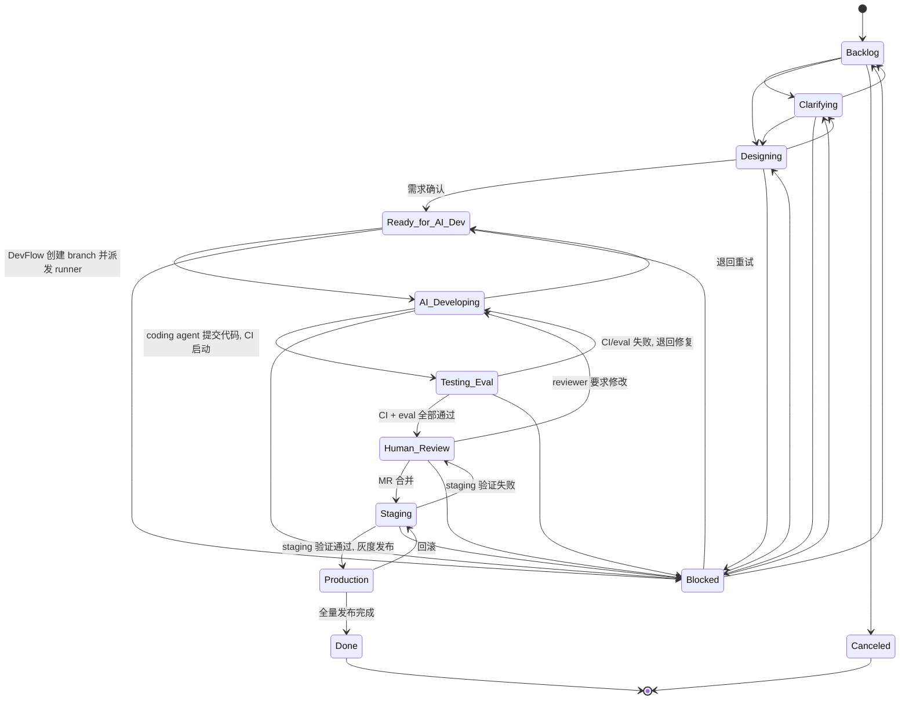

# Plane/GitLab 状态同步设计

> Status: Partially Implemented / 需生产化校准
> Stage: S4
> Owner: platform
> Last verified against code: 2026-05-19

本文档定义 Plane Work Item、GitLab MR/Pipeline、Agent Platform 三者之间的状态同步机制，包括状态机、事件映射、webhook 幂等、重试策略、死信队列和冲突解决规则。

读者：AI coding agent 和平台开发者。

前置阅读：

- `04-devflow/plane.md` -- Plane 集成总体设计
- `04-devflow/gitlab.md` -- GitLab 交付闭环设计
- `01-contracts/devflow-task-pack.md` -- Task Pack 契约
- `implementation-gap.md` -- 当前实现差距
- `next-stage-design-plan.md` -- P0-5 对本文档的需求定义

---

## 1. 当前状态与问题

### 1.1 已有实现

| 组件 | 文件 | 当前能力 |
| --- | --- | --- |
| `PlaneAdapter` | `src/agent_platform/integrations/plane/adapter.py` | httpx async client；支持 work item CRUD、comment、state 更新、custom properties 更新 |
| `GitLabAdapter` | `src/agent_platform/integrations/gitlab/adapter.py` | httpx async client；支持 branch、MR、comment、pipeline status、commit status、artifact |
| `PlaneWebhookVerifier` | `src/agent_platform/integrations/plane/webhook.py` | HMAC-SHA256 签名校验 |
| `DevFlowOrchestrator` | `src/agent_platform/devflow/orchestrator.py` | Plane "Ready for AI Dev" -> 解析 Agent 归属 -> 生成 TaskPack -> 创建 GitLab branch -> 回写 Plane comment/custom properties -> 派发 runner |
| `CodingAgentRunner` | `src/agent_platform/devflow/runner/runner.py` | 在受控 workspace 中执行真实或 mock runner；校验通过后 commit/push；成功后创建或复用 MR；回写 Plane/GitLab |
| webhook endpoint | `src/agent_platform/api/app.py` | 接收 Plane webhook；支持 webhook secret / delivery id；SQL repo 配置后可持久化 delivery |

### 1.2 缺失

1. **强状态机未完全落地**：plane.md 定义了 Backlog -> ... -> Done 的状态流转，代码已覆盖 Ready -> AI Developing -> Testing 的主链路，但还没有对所有状态转换做统一强校验。
2. **GitLab -> Plane 反向同步仍不完整**：GitLab pipeline fail/pass、MR merge、eval 结果的反向回写需要继续补齐和压测。
3. **幂等已具备基础实现，但需生产压测**：SQL repo 配置后可持久化 delivery；业务幂等、并发 in-flight 冲突和重启恢复还需要按真实流量验证。
4. **重试能力需要分层补齐**：HTTP adapter 已有基础重试方向，但 webhook 业务重试、runner job retry、DLQ replay 仍需生产化。
5. **死信队列/对账需要运维化**：DLQ、reconcile 设计已有，但还需要管理端点、运行手册和告警闭环。
6. **冲突解决未完整实现**：Plane 状态和 GitLab MR/Pipeline 状态不一致时，仍需要统一事实源和人工介入规则。

---

## 2. Plane Work Item 状态机

### 2.1 状态定义

```python
class PlaneWorkItemState(str, Enum):
    BACKLOG = "Backlog"
    CLARIFYING = "Clarifying"
    DESIGNING = "Designing"
    READY_FOR_AI_DEV = "Ready for AI Dev"
    AI_DEVELOPING = "AI Developing"
    TESTING_EVAL = "Testing / Eval"
    HUMAN_REVIEW = "Human Review"
    STAGING = "Staging"
    PRODUCTION = "Production"
    DONE = "Done"
    BLOCKED = "Blocked"
    CANCELED = "Canceled"
```

### 2.2 合法转换



### 2.3 状态机在代码中的实现

新增 `src/agent_platform/devflow/state_machine.py`：

```python
from enum import Enum

class PlaneWorkItemState(str, Enum):
    BACKLOG = "Backlog"
    CLARIFYING = "Clarifying"
    DESIGNING = "Designing"
    READY_FOR_AI_DEV = "Ready for AI Dev"
    AI_DEVELOPING = "AI Developing"
    TESTING_EVAL = "Testing / Eval"
    HUMAN_REVIEW = "Human Review"
    STAGING = "Staging"
    PRODUCTION = "Production"
    DONE = "Done"
    BLOCKED = "Blocked"
    CANCELED = "Canceled"

# from_state -> set of allowed to_states
VALID_TRANSITIONS: dict[PlaneWorkItemState, set[PlaneWorkItemState]] = {
    PlaneWorkItemState.BACKLOG: {
        PlaneWorkItemState.CLARIFYING,
        PlaneWorkItemState.DESIGNING,
        PlaneWorkItemState.CANCELED,
    },
    PlaneWorkItemState.CLARIFYING: {
        PlaneWorkItemState.DESIGNING,
        PlaneWorkItemState.BACKLOG,
        PlaneWorkItemState.BLOCKED,
    },
    PlaneWorkItemState.DESIGNING: {
        PlaneWorkItemState.READY_FOR_AI_DEV,
        PlaneWorkItemState.CLARIFYING,
        PlaneWorkItemState.BLOCKED,
    },
    PlaneWorkItemState.READY_FOR_AI_DEV: {
        PlaneWorkItemState.AI_DEVELOPING,
        PlaneWorkItemState.BLOCKED,
    },
    PlaneWorkItemState.AI_DEVELOPING: {
        PlaneWorkItemState.TESTING_EVAL,
        PlaneWorkItemState.BLOCKED,
        PlaneWorkItemState.READY_FOR_AI_DEV,
    },
    PlaneWorkItemState.TESTING_EVAL: {
        PlaneWorkItemState.HUMAN_REVIEW,
        PlaneWorkItemState.AI_DEVELOPING,
        PlaneWorkItemState.BLOCKED,
    },
    PlaneWorkItemState.HUMAN_REVIEW: {
        PlaneWorkItemState.STAGING,
        PlaneWorkItemState.AI_DEVELOPING,
        PlaneWorkItemState.BLOCKED,
    },
    PlaneWorkItemState.STAGING: {
        PlaneWorkItemState.PRODUCTION,
        PlaneWorkItemState.HUMAN_REVIEW,
        PlaneWorkItemState.BLOCKED,
    },
    PlaneWorkItemState.PRODUCTION: {
        PlaneWorkItemState.DONE,
        PlaneWorkItemState.STAGING,
    },
    PlaneWorkItemState.BLOCKED: {
        PlaneWorkItemState.BACKLOG,
        PlaneWorkItemState.CLARIFYING,
        PlaneWorkItemState.DESIGNING,
        PlaneWorkItemState.READY_FOR_AI_DEV,
    },
    PlaneWorkItemState.DONE: set(),
    PlaneWorkItemState.CANCELED: set(),
}


def is_valid_transition(
    from_state: PlaneWorkItemState,
    to_state: PlaneWorkItemState,
) -> bool:
    return to_state in VALID_TRANSITIONS.get(from_state, set())
```

重要规则：

- `DevFlowOrchestrator` 的所有状态回写必须经过 `is_valid_transition` 校验。
- 如果 Plane 当前状态和预期不一致（例如用户手动拖拽看板），平台只写 comment 警告，不强制覆盖。
- `Blocked` 和 `Canceled` 只能由人类操作。平台代码不主动设置这两个状态。

---

## 3. GitLab 状态到 Plane 的映射

### 3.1 GitLab 侧状态

| GitLab 对象 | 状态值 | 含义 |
| --- | --- | --- |
| MR | `opened` (draft) | MR 已创建但标记 draft |
| MR | `opened` | MR 可供 review |
| MR | `merged` | MR 已合并 |
| MR | `closed` | MR 被关闭 |
| Pipeline | `pending` | pipeline 排队 |
| Pipeline | `running` | pipeline 执行中 |
| Pipeline | `success` | pipeline 通过 |
| Pipeline | `failed` | pipeline 失败 |
| Pipeline | `canceled` | pipeline 被取消 |

### 3.2 事件到动作映射表

| 触发事件 | 来源 | 平台动作 | GitLab 动作 | Plane 回写 |
| --- | --- | --- | --- | --- |
| Work Item state -> `Ready for AI Dev` | Plane webhook | 解析 Agent 归属；生成 task pack；派发 runner | 创建 branch | state -> `AI Developing`; 写入 `gitlab_branch` custom property; 添加 comment |
| Coding agent 提交代码 | Runner / GitLab push | 记录 runner report | 创建或复用 MR；push commit | 写入 `gitlab_mr` custom property；添加 comment (代码已提交) |
| Pipeline started | GitLab webhook | 记录 pipeline_id | -- | state -> `Testing / Eval`; 添加 comment |
| Pipeline failed | GitLab webhook | 解析失败原因 | 添加 MR comment (失败详情) | state -> `AI Developing`; 添加 comment (CI 失败 + 链接); 如果 eval 失败，写入 `eval_report_url` |
| Pipeline success + eval pass | GitLab webhook | 提取 eval report URL | MR 去掉 draft; 添加 MR comment (eval 报告) | state -> `Human Review`; 写入 `eval_report_url` custom property; 添加 comment |
| MR approved | GitLab webhook | -- | -- | 添加 comment (已通过 review) |
| MR merged | GitLab webhook | 触发 agent 版本注册 | -- | state -> `Staging`; 添加 comment |
| Staging deploy success | Agent Platform | -- | -- | 添加 comment (staging 环境可用) |
| Staging deploy fail | Agent Platform | -- | -- | 添加 comment (staging 失败); state 保持不变 |
| Prod canary deploy | Agent Platform | -- | -- | state -> `Production`; 添加 comment |
| Prod 100% | Agent Platform | -- | -- | state -> `Done`; 添加 comment |
| Rollback | Agent Platform | -- | -- | state -> `Staging`; 添加 comment (回滚原因) |

### 3.3 GitLab webhook 接入

需要新增 GitLab webhook endpoint：

```
POST /api/v1/integrations/gitlab/webhook
```

GitLab webhook header：

```http
X-Gitlab-Event: Pipeline Hook | Merge Request Hook | Push Hook
X-Gitlab-Token: <shared_secret>
X-Gitlab-Event-UUID: <uuid>
```

使用 `X-Gitlab-Event-UUID` 做幂等键（复用同一个 `webhook_deliveries` 表）。

配置新增：

```python
# config.py Settings
gitlab_webhook_secret: str | None = None  # 对应 GITLAB_WEBHOOK_SECRET
```

---

## 4. Webhook 幂等设计

### 4.1 当前问题

```python
# app.py L166
webhook_deliveries: set[str] = set()
```

这是进程内存 set，服务重启后所有 delivery_id 丢失。多实例部署时各实例的 set 独立，无法跨实例去重。

### 4.2 DB-backed 幂等

新增表 `webhook_deliveries`：

```sql
CREATE TABLE webhook_deliveries (
    id              TEXT PRIMARY KEY,   -- delivery_id (Plane: X-Plane-Delivery, GitLab: X-Gitlab-Event-UUID)
    source          TEXT NOT NULL,      -- 'plane' | 'gitlab'
    event_type      TEXT NOT NULL,      -- e.g. 'work_item.updated', 'Pipeline Hook'
    payload_hash    TEXT NOT NULL,      -- SHA-256 of raw body, 用于调试
    status          TEXT NOT NULL,      -- 'processing' | 'completed' | 'failed' | 'dead_letter'
    work_item_id    TEXT,               -- 关联的 Plane work item id (如有)
    mr_iid          INTEGER,            -- 关联的 GitLab MR iid (如有)
    created_at      TEXT NOT NULL,      -- ISO 8601
    completed_at    TEXT,               -- ISO 8601
    error_message   TEXT,               -- 失败原因
    retry_count     INTEGER DEFAULT 0,
    next_retry_at   TEXT,               -- ISO 8601, 下次重试时间
    idempotency_key TEXT UNIQUE         -- 复合业务幂等键
);

CREATE INDEX idx_webhook_deliveries_status ON webhook_deliveries(status);
CREATE INDEX idx_webhook_deliveries_source ON webhook_deliveries(source, created_at);
CREATE INDEX idx_webhook_deliveries_idempotency ON webhook_deliveries(idempotency_key);
```

### 4.3 幂等键设计

Plane 和 GitLab 各使用两层幂等：

**第一层：delivery_id 去重**

```python
# Plane: X-Plane-Delivery header
# GitLab: X-Gitlab-Event-UUID header
```

如果 `delivery_id` 已存在于 `webhook_deliveries` 表，直接返回 `{"status": "duplicate"}`。这防止 webhook 基础设施的重复投递。

**第二层：业务幂等键 (idempotency_key)**

用于防止逻辑上相同的业务操作被重复执行（即使 delivery_id 不同）：

```python
# Plane work item 状态变更
idempotency_key = f"plane:state:{work_item_id}:{new_state}"

# GitLab pipeline 事件
idempotency_key = f"gitlab:pipeline:{pipeline_id}:{status}"

# GitLab MR 事件
idempotency_key = f"gitlab:mr:{project_id}:{mr_iid}:{action}"
```

如果 `idempotency_key` 已存在且 `status = 'completed'`，跳过处理。如果 `status = 'failed'` 且 retry_count < max_retries，允许重试。

**去重窗口**：保留 7 天内的记录。超过 7 天的记录可清理（定时任务或启动时清理）。

### 4.4 处理流程

```python
async def handle_webhook(delivery_id: str, source: str, event_type: str, raw_body: bytes):
    payload_hash = hashlib.sha256(raw_body).hexdigest()

    # 第一层：delivery_id 去重
    existing = await repo.get_delivery(delivery_id)
    if existing:
        return {"status": "duplicate", "delivery_id": delivery_id}

    # 计算业务幂等键
    payload = json.loads(raw_body)
    idempotency_key = compute_idempotency_key(source, event_type, payload)

    # 第二层：业务幂等键去重
    if idempotency_key:
        existing_by_key = await repo.get_by_idempotency_key(idempotency_key)
        if existing_by_key and existing_by_key.status == "completed":
            # 记录本次 delivery_id 指向已完成的处理
            await repo.insert_delivery(delivery_id, source, event_type,
                                       payload_hash, status="duplicate",
                                       idempotency_key=idempotency_key)
            return {"status": "duplicate"}

    # 插入 processing 记录
    await repo.insert_delivery(delivery_id, source, event_type,
                               payload_hash, status="processing",
                               idempotency_key=idempotency_key)

    try:
        result = await dispatch_event(source, event_type, payload)
        await repo.mark_completed(delivery_id)
        return result
    except Exception as exc:
        await repo.mark_failed(delivery_id, str(exc))
        raise
```

### 4.5 Repository 接口

```python
class WebhookDeliveryRepository(Protocol):
    async def get_delivery(self, delivery_id: str) -> WebhookDelivery | None: ...
    async def get_by_idempotency_key(self, key: str) -> WebhookDelivery | None: ...
    async def insert_delivery(self, delivery_id: str, source: str, event_type: str,
                              payload_hash: str, status: str,
                              idempotency_key: str | None = None) -> None: ...
    async def mark_completed(self, delivery_id: str) -> None: ...
    async def mark_failed(self, delivery_id: str, error_message: str) -> None: ...
    async def mark_dead_letter(self, delivery_id: str) -> None: ...
    async def get_retryable(self, max_count: int = 50) -> list[WebhookDelivery]: ...
    async def increment_retry(self, delivery_id: str, next_retry_at: str) -> None: ...
    async def cleanup_old(self, before: str) -> int: ...
```

提供两个实现：

- `InMemoryWebhookDeliveryRepository`：单测使用，保持当前 `set[str]` 的语义。
- `SqlWebhookDeliveryRepository`：生产使用，操作 `webhook_deliveries` 表。

---

## 5. 重试策略

### 5.1 哪些操作需要重试

| 操作 | 是否重试 | 原因 |
| --- | --- | --- |
| Plane API 调用 (state 更新、comment、custom properties) | 是 | 网络抖动或 Plane 临时不可用 |
| GitLab API 调用 (branch、MR、comment、pipeline) | 是 | 网络抖动或 GitLab 临时不可用 |
| webhook 业务处理逻辑 | 是 | 上游事件不能因为一次失败丢弃 |
| DB 写入 | 否 | DB 不可用应直接报错，不掩盖基础设施问题 |

### 5.2 Adapter 层重试 (httpx 调用)

在 `PlaneAdapter._request` 和 `GitLabAdapter._request` 中实现 transport 层重试。

```python
import random

MAX_RETRIES = 3
BASE_DELAY = 1.0  # 秒
MAX_DELAY = 30.0  # 秒
RETRYABLE_STATUS_CODES = {429, 500, 502, 503, 504}


async def _request_with_retry(self, method: str, path: str, **kwargs) -> dict[str, Any]:
    last_exc: Exception | None = None
    for attempt in range(MAX_RETRIES + 1):
        try:
            async with httpx.AsyncClient(
                base_url=self.base_url,
                headers=self.headers,
                timeout=20,
                transport=self.transport,
            ) as client:
                response = await client.request(method, path, **kwargs)
                if response.status_code in RETRYABLE_STATUS_CODES and attempt < MAX_RETRIES:
                    delay = _backoff_delay(attempt)
                    logger.warning(
                        "Retryable status %s for %s %s, attempt %d, waiting %.1fs",
                        response.status_code, method, path, attempt + 1, delay,
                    )
                    await asyncio.sleep(delay)
                    continue
                response.raise_for_status()
                return response.json()
        except (httpx.ConnectError, httpx.ReadTimeout, httpx.WriteTimeout) as exc:
            last_exc = exc
            if attempt < MAX_RETRIES:
                delay = _backoff_delay(attempt)
                logger.warning(
                    "Network error for %s %s, attempt %d, waiting %.1fs: %s",
                    method, path, attempt + 1, delay, exc,
                )
                await asyncio.sleep(delay)
            else:
                raise
    raise last_exc  # type: ignore[misc]


def _backoff_delay(attempt: int) -> float:
    """指数退避 + jitter"""
    delay = min(BASE_DELAY * (2 ** attempt), MAX_DELAY)
    jitter = random.uniform(0, delay * 0.5)
    return delay + jitter
```

退避参数：

| 参数 | 值 |
| --- | --- |
| 最大重试次数 | 3 |
| 基础延迟 | 1s |
| 最大延迟 | 30s |
| Jitter | 0 ~ 50% of delay |
| 退避公式 | `min(1s * 2^attempt, 30s) + random(0, delay*0.5)` |
| 可重试 HTTP 状态码 | 429, 500, 502, 503, 504 |
| 可重试网络异常 | ConnectError, ReadTimeout, WriteTimeout |

429 (rate limit) 时如果响应包含 `Retry-After` header，使用该值代替计算的 delay。

### 5.3 Webhook 处理层重试

webhook 处理失败后，delivery 记录被标记为 `failed`，由后台重试任务处理。

```python
MAX_WEBHOOK_RETRIES = 5
WEBHOOK_RETRY_DELAYS = [60, 300, 900, 3600, 7200]  # 1m, 5m, 15m, 1h, 2h


async def retry_failed_webhooks(repo: WebhookDeliveryRepository):
    """后台定时任务，每 60 秒执行一次。"""
    retryable = await repo.get_retryable(max_count=50)
    now = datetime.utcnow()

    for delivery in retryable:
        if delivery.next_retry_at and datetime.fromisoformat(delivery.next_retry_at) > now:
            continue
        if delivery.retry_count >= MAX_WEBHOOK_RETRIES:
            await repo.mark_dead_letter(delivery.id)
            logger.error("Webhook %s moved to dead letter after %d retries",
                         delivery.id, delivery.retry_count)
            continue

        try:
            payload = await repo.get_payload(delivery.id)  # 或从原始存储获取
            await dispatch_event(delivery.source, delivery.event_type, payload)
            await repo.mark_completed(delivery.id)
        except Exception as exc:
            next_delay = WEBHOOK_RETRY_DELAYS[
                min(delivery.retry_count, len(WEBHOOK_RETRY_DELAYS) - 1)
            ]
            next_retry = now + timedelta(seconds=next_delay)
            await repo.increment_retry(delivery.id, next_retry.isoformat())
            logger.warning("Webhook %s retry %d failed: %s, next retry at %s",
                           delivery.id, delivery.retry_count + 1, exc, next_retry)
```

---

## 6. 死信队列 (Dead Letter Queue)

### 6.1 设计

当 webhook delivery 重试次数达到 `MAX_WEBHOOK_RETRIES`(5 次) 后，`status` 标记为 `dead_letter`。

死信记录不会被自动重试。需要人工或运维介入处理。

### 6.2 死信的查询和恢复

```python
# 查询死信
GET /api/v1/admin/webhook-deliveries?status=dead_letter

# 手动重试单条
POST /api/v1/admin/webhook-deliveries/{delivery_id}/retry

# 批量重试所有死信
POST /api/v1/admin/webhook-deliveries/retry-dead-letters
```

恢复流程：

1. 运维查看死信列表，分析 `error_message`。
2. 修复根因（外部服务恢复、配置修正等）。
3. 调用 retry API，将 `status` 改回 `failed`、`retry_count` 清零。
4. 后台重试任务会自动拾取。

### 6.3 死信告警

当 dead_letter 数量 > 0 时，`MetricsCollector` 暴露指标：

```
devflow_webhook_dead_letter_total{source="plane"} 3
devflow_webhook_dead_letter_total{source="gitlab"} 0
```

可接入外部告警系统。

### 6.4 DB 存储开销

每条 webhook delivery 记录约 1KB。按每天 100 个 webhook 事件、保留 7 天计算，约 700 条、700KB。即使 10 倍增长也不构成存储压力。

---

## 7. 冲突解决：谁是事实源

### 7.1 核心原则

**每个系统对自己管辖的领域是事实源。**

| 领域 | 事实源 | 其他系统的角色 |
| --- | --- | --- |
| 需求内容、业务验收标准 | **Plane** | GitLab MR 描述引用；平台不持有 |
| Work Item 当前状态 | **Plane** | 平台只发建议状态转换；Plane 可拒绝 |
| 代码变更、分支、MR 内容 | **GitLab** | Plane 只保存 MR 链接摘要 |
| CI/Pipeline 结果 | **GitLab** | 平台读取结果并同步到 Plane |
| MR approval 状态 | **GitLab** | 平台读取并据此判断是否可以推进 Plane 状态 |
| Agent 版本注册、eval 报告 | **Agent Platform** | 回写链接到 Plane custom property |
| Agent 发布状态 (staging/prod) | **Agent Platform** | 回写状态到 Plane |

### 7.2 冲突场景和处理规则

**场景 1：平台要将 Plane 状态从 A 推到 B，但 Plane 当前状态已不是 A**

原因：人类在看板上手动拖拽了状态。

处理：

```python
async def safe_transition_state(
    plane: PlaneAdapter,
    project_id: str,
    work_item_id: str,
    expected_current: PlaneWorkItemState,
    target: PlaneWorkItemState,
    state_id_map: dict[PlaneWorkItemState, str],
) -> bool:
    """安全状态转换：先读当前状态，校验后再写。返回是否成功。"""
    current = await plane.get_work_item(project_id, work_item_id)
    actual_state = extract_state_name(current)

    if actual_state != expected_current.value:
        logger.warning(
            "State conflict for %s: expected %s, actual %s, target %s. "
            "Skipping transition, adding comment instead.",
            work_item_id, expected_current, actual_state, target,
        )
        await plane.add_comment(
            project_id, work_item_id,
            f"<p>DevFlow: 状态同步冲突 -- 预期当前状态 <b>{expected_current.value}</b>，"
            f"实际状态 <b>{actual_state}</b>。"
            f"自动转换到 <b>{target.value}</b> 被跳过。请人工确认。</p>",
        )
        return False

    if not is_valid_transition(expected_current, target):
        logger.error("Invalid transition: %s -> %s", expected_current, target)
        return False

    target_state_id = state_id_map.get(target)
    if not target_state_id:
        logger.error("No state_id mapped for %s", target)
        return False

    await plane.update_work_item_state(project_id, work_item_id, target_state_id)
    return True
```

**场景 2：GitLab pipeline 结果和 Plane 状态不一致**

例如 pipeline 已经 success 但 Plane 还在 `AI Developing`（可能中间 webhook 丢失）。

处理：平台定期（或手动触发）运行 reconciliation，查询 GitLab MR 和 pipeline 的最新状态，与 Plane 当前状态对比，生成修复建议。

**场景 3：两个 webhook 事件几乎同时到达**

例如 pipeline success 和 MR merge 的 webhook 几乎同时到达。

处理：

1. idempotency_key 保证每个事件只处理一次。
2. 状态转换使用 read-then-write 模式（先读 Plane 当前状态再写），不做盲写。
3. 如果因为并发导致实际状态已经超前（例如已经到了 `Staging`），跳过中间状态写入。

### 7.3 state_id 映射

Plane 内部使用 UUID 作为 state_id。平台需要在启动时或配置时获取映射：

```python
# 方法 1：启动时通过 Plane API 查询
async def load_state_id_map(plane: PlaneAdapter, project_id: str) -> dict[str, str]:
    """查询 Plane project states，建立 name -> id 的映射。"""
    # GET /api/v1/workspaces/{slug}/projects/{project_id}/states/
    states = await plane._request("GET",
        f"/api/v1/workspaces/{plane.workspace_slug}/projects/{project_id}/states/")
    return {state["name"]: state["id"] for state in states.get("results", states)}

# 方法 2：环境变量配置（更简单，适合 MVP）
# PLANE_STATE_ID_READY_FOR_AI_DEV=uuid-xxx
# PLANE_STATE_ID_AI_DEVELOPING=uuid-yyy
```

---

## 8. DevFlowStateSync 服务设计

### 8.1 架构

当前的 `DevFlowOrchestrator` 只处理 Plane -> GitLab 方向的单一转换。重构为双向同步需要拆出独立的 `DevFlowStateSync` 服务。

```
DevFlowStateSync
├── PlaneEventHandler      -- 处理 Plane webhook 事件
├── GitLabEventHandler     -- 处理 GitLab webhook 事件
├── PlatformEventHandler   -- 处理 Agent Platform 内部事件 (deploy 等)
├── StateTransitioner      -- 封装 Plane 状态转换逻辑
├── WebhookDeliveryRepo    -- 幂等和 DLQ
└── RetryScheduler         -- 后台重试
```

### 8.2 PlaneEventHandler

```python
class PlaneEventHandler:
    """处理来自 Plane 的 webhook 事件。"""

    async def handle(self, event_type: str, payload: dict) -> dict | None:
        match event_type:
            case "work_item.updated":
                return await self._on_work_item_updated(payload)
            case "work_item.created":
                return await self._on_work_item_created(payload)
            case _:
                return None

    async def _on_work_item_updated(self, payload: dict) -> dict | None:
        work_item = payload.get("data") or payload
        new_state = extract_state_name(work_item)

        match new_state:
            case "Ready for AI Dev":
                return await self._handle_ready_for_ai_dev(work_item)
            case _:
                return None

    async def _handle_ready_for_ai_dev(self, work_item: dict) -> dict:
        """当前 DevFlowOrchestrator.handle_webhook_event 的逻辑移入此处。"""
        # 1. 生成 task pack
        # 2. 解析 Agent 归属，未解析成功则回写 Plane comment 并停止
        # 3. 创建 GitLab branch
        # 4. 回写 Plane state -> AI Developing
        # 5. 回写 Plane custom properties (agent_id, task_type, gitlab_branch)
        # 6. 添加 Plane comment 并派发 runner
        ...
```

### 8.3 GitLabEventHandler

```python
class GitLabEventHandler:
    """处理来自 GitLab 的 webhook 事件。"""

    async def handle(self, event_type: str, payload: dict) -> dict | None:
        match event_type:
            case "Pipeline Hook":
                return await self._on_pipeline(payload)
            case "Merge Request Hook":
                return await self._on_merge_request(payload)
            case _:
                return None

    async def _on_pipeline(self, payload: dict) -> dict | None:
        status = payload["object_attributes"]["status"]
        ref = payload["object_attributes"]["ref"]
        pipeline_id = payload["object_attributes"]["id"]
        project_id = str(payload["project"]["id"])

        # 通过 ref (branch name) 查找关联的 Plane work item
        work_item_id = await self._lookup_work_item_by_branch(ref)
        if not work_item_id:
            return None

        match status:
            case "running":
                await self._transition_to_testing(work_item_id, pipeline_id)
            case "success":
                await self._handle_pipeline_success(work_item_id, pipeline_id, project_id, ref)
            case "failed":
                await self._handle_pipeline_failure(work_item_id, pipeline_id, project_id, ref)
        return {"handled": True}

    async def _handle_pipeline_failure(
        self, work_item_id: str, pipeline_id: int, project_id: str, ref: str,
    ):
        """pipeline 失败 -> 回写 Plane comment + 状态退回 AI Developing"""
        pipeline_url = f"{self.gitlab.base_url}/{project_id}/-/pipelines/{pipeline_id}"
        await self.plane.add_comment(
            self.plane_project_id, work_item_id,
            f"<p>DevFlow: CI Pipeline 失败 -- "
            f"<a href=\"{pipeline_url}\">Pipeline #{pipeline_id}</a></p>"
            f"<p>分支: {ref}</p>"
            f"<p>请修复后重新推送代码。</p>",
        )
        await safe_transition_state(
            self.plane, self.plane_project_id, work_item_id,
            PlaneWorkItemState.TESTING_EVAL,
            PlaneWorkItemState.AI_DEVELOPING,
            self.state_id_map,
        )

    async def _handle_pipeline_success(
        self, work_item_id: str, pipeline_id: int, project_id: str, ref: str,
    ):
        """pipeline 成功 -> 提取 eval report -> 回写 Plane"""
        # 尝试下载 eval report artifact
        eval_report_url = await self._extract_eval_report_url(project_id, pipeline_id)

        if eval_report_url:
            await self.plane.update_custom_properties(
                self.plane_project_id, work_item_id,
                {"eval_report_url": eval_report_url},
            )

        await self.plane.add_comment(
            self.plane_project_id, work_item_id,
            f"<p>DevFlow: CI Pipeline 通过 -- "
            f"<a href=\"{eval_report_url or '#'}\">Eval Report</a></p>"
            f"<p>MR 已准备好进入 Human Review。</p>",
        )
        await safe_transition_state(
            self.plane, self.plane_project_id, work_item_id,
            PlaneWorkItemState.TESTING_EVAL,
            PlaneWorkItemState.HUMAN_REVIEW,
            self.state_id_map,
        )

    async def _on_merge_request(self, payload: dict) -> dict | None:
        action = payload["object_attributes"]["action"]
        mr_iid = payload["object_attributes"]["iid"]
        source_branch = payload["object_attributes"]["source_branch"]

        work_item_id = await self._lookup_work_item_by_branch(source_branch)
        if not work_item_id:
            return None

        match action:
            case "merge":
                await self._handle_mr_merged(work_item_id, mr_iid)
            case "approved":
                await self.plane.add_comment(
                    self.plane_project_id, work_item_id,
                    "<p>DevFlow: MR 已通过 Review Approval。</p>",
                )
        return {"handled": True}

    async def _handle_mr_merged(self, work_item_id: str, mr_iid: int):
        await self.plane.add_comment(
            self.plane_project_id, work_item_id,
            f"<p>DevFlow: MR !{mr_iid} 已合并到 main。</p>",
        )
        await safe_transition_state(
            self.plane, self.plane_project_id, work_item_id,
            PlaneWorkItemState.HUMAN_REVIEW,
            PlaneWorkItemState.STAGING,
            self.state_id_map,
        )
```

### 8.4 branch -> work_item_id 查找

GitLab webhook 不携带 Plane work item id。需要一种方式从 branch 名反查。

方案（按推荐顺序）：

1. **DB 映射表**：`DevFlowOrchestrator` 创建 branch 时写入 `branch_work_item_map(branch_name, work_item_id, project_id, mr_iid)`。GitLabEventHandler 查表。
2. **branch 命名约定**：branch 格式为 `feat/{work_item_id}`（当前实现已是这个格式），从 branch 名提取 work_item_id。但如果 work_item_id 不是人类可读的，需要依赖约定。
3. **GitLab MR 描述解析**：MR 描述中包含 Plane work item id（当前 task pack 已在描述中写入 source task id）。

推荐 MVP 使用方案 2 + 方案 1 作为备选。当前 `TaskPackGenerator` 生成的 branch 格式为 `feat/{task_id.lower()}`，其中 `task_id` 就是 `work_item_id`。

```python
async def _lookup_work_item_by_branch(self, branch: str) -> str | None:
    """从 branch 名提取 work item id。"""
    # 当前格式: feat/{work_item_id}
    if branch.startswith("feat/"):
        return branch.removeprefix("feat/")
    # 查 DB 映射表
    return await self.branch_map_repo.get_work_item_id(branch)
```

---

## 9. Adapter 增强需求

### 9.1 PlaneAdapter 增强

| 需求 | 方法 | 说明 |
| --- | --- | --- |
| 查询 project states | `list_states(project_id)` | 启动时获取 state name -> id 映射 |
| 重试 | `_request` 方法增加重试逻辑 | 见第 5 节 |
| 错误分类 | 区分可重试和不可重试错误 | 4xx (除 429) 不重试 |

```python
# 新增方法
async def list_states(self, project_id: str) -> list[dict[str, Any]]:
    path = f"/api/v1/workspaces/{self.workspace_slug}/projects/{project_id}/states/"
    result = await self._request("GET", path)
    return result.get("results", result) if isinstance(result, dict) else result
```

### 9.2 GitLabAdapter 增强

| 需求 | 方法 | 说明 |
| --- | --- | --- |
| 获取 MR 详情 | `get_merge_request(project_id, mr_iid)` | 查 MR 状态和 approval |
| 获取 pipeline jobs | `list_pipeline_jobs(project_id, pipeline_id)` | 获取 eval job 和 artifact |
| 获取 job artifact URL | `get_job_artifact_url(project_id, job_id)` | 生成 eval report 链接 |
| 重试 | `_request` 方法增加重试逻辑 | 同 PlaneAdapter |

```python
# 新增方法
async def get_merge_request(
    self, project_id: str, mr_iid: int,
) -> dict[str, Any]:
    return await self._request(
        "GET", f"/api/v4/projects/{project_id}/merge_requests/{mr_iid}",
    )

async def list_pipeline_jobs(
    self, project_id: str, pipeline_id: int,
) -> list[dict[str, Any]]:
    return await self._request(
        "GET", f"/api/v4/projects/{project_id}/pipelines/{pipeline_id}/jobs",
    )
```

---

## 10. 错误处理

### 10.1 错误分类

| 错误类型 | 处理 | 示例 |
| --- | --- | --- |
| 可重试网络错误 | adapter 层自动重试 3 次 | ConnectError, ReadTimeout, 502, 503 |
| 可重试业务错误 | webhook 层重试 5 次 | Plane API 返回 429 (rate limit) |
| 不可重试客户端错误 | 标记 dead_letter | Plane 返回 404 (work item 已删除), 403 (权限不足) |
| 不可重试逻辑错误 | 标记 dead_letter + 告警 | 状态机校验失败, 数据不完整 |
| 签名校验失败 | 直接返回 401 | webhook secret 不匹配 |

### 10.2 错误映射

```python
class StateSyncError(Exception):
    """状态同步基础异常。"""
    retryable: bool = True

class PlaneApiError(StateSyncError):
    """Plane API 调用失败。"""
    def __init__(self, status_code: int, message: str):
        self.status_code = status_code
        self.retryable = status_code in {429, 500, 502, 503, 504}
        super().__init__(f"Plane API error {status_code}: {message}")

class GitLabApiError(StateSyncError):
    """GitLab API 调用失败。"""
    def __init__(self, status_code: int, message: str):
        self.status_code = status_code
        self.retryable = status_code in {429, 500, 502, 503, 504}
        super().__init__(f"GitLab API error {status_code}: {message}")

class StateTransitionError(StateSyncError):
    """状态转换不合法。"""
    retryable = False

class WorkItemNotFoundError(StateSyncError):
    """Work item 不存在或已删除。"""
    retryable = False
```

### 10.3 Plane 回写失败不阻断 GitLab 操作

原则：GitLab 操作（创建 branch/MR）是核心操作，Plane 回写是辅助操作。

```python
# 好的做法：GitLab 操作成功后，Plane 回写失败只记录 warning
try:
    mr_result = await gitlab.create_merge_request(...)
except Exception:
    raise  # GitLab 失败必须抛出

# Plane 回写可降级
try:
    await plane.update_work_item_state(...)
except Exception:
    logger.warning("Failed to update Plane state, will retry later")
    # 写入重试队列
```

---

## 11. Reconciliation（对账）

定期对账弥补 webhook 丢失或处理失败导致的状态不一致。

### 11.1 对账逻辑

```python
async def reconcile(
    plane: PlaneAdapter,
    gitlab: GitLabAdapter,
    plane_project_id: str,
    gitlab_project_id: str,
    state_id_map: dict[PlaneWorkItemState, str],
):
    """
    查询所有处于中间状态的 Plane work items，
    检查对应的 GitLab MR/pipeline 实际状态，
    修复不一致。
    """
    # 查询 AI Developing / Testing / Human Review 状态的 work items
    active_items = await plane.list_work_items(plane_project_id)
    for item in active_items:
        state = extract_state_name(item)
        if state not in {"AI Developing", "Testing / Eval", "Human Review"}:
            continue

        gitlab_mr_url = (item.get("properties") or {}).get("gitlab_mr_url")
        if not gitlab_mr_url:
            continue

        mr_iid = extract_mr_iid_from_url(gitlab_mr_url)
        if not mr_iid:
            continue

        mr = await gitlab.get_merge_request(gitlab_project_id, mr_iid)
        mr_state = mr.get("state")
        pipeline_status = await gitlab.get_pipeline_status(gitlab_project_id, mr["source_branch"])

        # 检查不一致并修复
        if mr_state == "merged" and state != "Staging":
            logger.info("Reconcile: work item %s should be Staging (MR merged)", item["id"])
            await safe_transition_state(...)
        elif pipeline_status == "success" and state == "Testing / Eval":
            logger.info("Reconcile: work item %s should be Human Review", item["id"])
            await safe_transition_state(...)
        # ... 更多规则
```

### 11.2 对账频率

- **MVP**：手动触发，或每 30 分钟一次。
- **生产**：每 5 分钟一次，只查活跃状态的 work items。

API：

```
POST /api/v1/admin/devflow/reconcile
```

---

## 12. 配置汇总

新增环境变量：

```env
# GitLab webhook
GITLAB_WEBHOOK_SECRET=xxx

# Plane state id 映射 (可选，也可启动时自动获取)
PLANE_STATE_ID_MAP={"Ready for AI Dev":"uuid-1","AI Developing":"uuid-2",...}

# 重试配置 (可选，有默认值)
WEBHOOK_MAX_RETRIES=5
ADAPTER_MAX_RETRIES=3

# 对账 (可选)
RECONCILE_INTERVAL_SECONDS=1800
```

新增 Settings 字段：

```python
class Settings(BaseModel):
    # ... existing fields ...
    gitlab_webhook_secret: str | None = None
    plane_state_id_map: dict[str, str] | None = None
    webhook_max_retries: int = 5
    adapter_max_retries: int = 3
    reconcile_interval_seconds: int = 1800
```

---

## 13. 实现计划

### Phase 1：幂等持久化 + adapter 重试

1. 创建 `webhook_deliveries` DB 表和 `WebhookDeliveryRepository` 接口。
2. 实现 `InMemoryWebhookDeliveryRepository`（替换当前 `set[str]`）和 `SqlWebhookDeliveryRepository`。
3. 为 `PlaneAdapter._request` 和 `GitLabAdapter._request` 增加重试逻辑。
4. 重构 `app.py` 的 webhook endpoint，使用 repository 替换内存 set。

验收标准：
- Plane webhook delivery 重复不会重复创建 branch、重复派发 runner 或重复创建 MR。
- 服务重启后幂等性不丢失。

### Phase 2：状态机 + GitLab -> Plane 同步

1. 创建 `devflow/state_machine.py`。
2. 创建 `GitLabEventHandler`。
3. 新增 `/api/v1/integrations/gitlab/webhook` endpoint。
4. 实现 pipeline fail -> Plane comment + 状态回写。
5. 实现 pipeline success -> eval report URL 回写。
6. 实现 MR merge -> Plane 状态推进。

验收标准：
- GitLab pipeline fail 会回写 Plane comment 和状态。
- Eval report 链接可回写 Plane custom property。

### Phase 3：死信队列 + 对账

1. 实现后台重试调度器。
2. 实现死信标记和管理 API。
3. 实现 reconciliation 逻辑。
4. 增加 metrics 指标。

验收标准：
- 重试 5 次后进入 dead letter。
- 死信可手动恢复。
- 对账能发现并修复状态不一致。

---

## 14. 测试策略

### 14.1 单元测试

| 测试目标 | 文件 | 测试内容 |
| --- | --- | --- |
| 状态机 | `tests/unit/test_state_machine.py` | 所有合法转换返回 True；非法转换返回 False；覆盖所有状态 |
| 幂等键计算 | `tests/unit/test_idempotency.py` | 相同事件生成相同 key；不同事件生成不同 key |
| WebhookDeliveryRepository | `tests/unit/test_webhook_delivery_repo.py` | insert, get, mark_completed, mark_failed, mark_dead_letter, get_retryable, cleanup_old |
| PlaneEventHandler | `tests/unit/test_plane_event_handler.py` | Ready for AI Dev 触发 MR 创建；非目标状态跳过；重复事件跳过 |
| GitLabEventHandler | `tests/unit/test_gitlab_event_handler.py` | pipeline fail 回写 Plane；pipeline success 回写 eval report URL；MR merge 推进状态 |
| safe_transition_state | `tests/unit/test_state_transitioner.py` | 正常转换；状态冲突时写 comment 但不写状态；非法转换被拒绝 |
| Adapter 重试 | `tests/unit/test_adapter_retry.py` | 502 重试 3 次后成功；404 不重试直接失败；超时重试 |

### 14.2 集成测试

| 测试目标 | 文件 | 测试内容 |
| --- | --- | --- |
| Plane webhook 全流程 | `tests/integration/test_plane_webhook_flow.py` | 发送 Ready for AI Dev webhook -> 验证 MR 创建 -> 验证 Plane 状态更新 -> 发送重复 webhook -> 验证幂等 |
| GitLab webhook 全流程 | `tests/integration/test_gitlab_webhook_flow.py` | 发送 pipeline fail webhook -> 验证 Plane comment -> 发送 pipeline success -> 验证 eval_report_url 回写 |
| 死信和恢复 | `tests/integration/test_dead_letter.py` | 制造持续失败事件 -> 验证进入 dead letter -> 手动恢复 -> 验证重新处理 |

### 14.3 Mock 策略

所有测试使用 `httpx.MockTransport` mock 外部 API（当前测试已有此模式）。不在单测/集成测试中调用真实 Plane/GitLab 实例。

对于 DB，单测使用 `InMemoryWebhookDeliveryRepository`。集成测试使用 SQLite in-memory。

---

## 15. 与其他设计文档的关系

| 文档 | 关系 |
| --- | --- |
| `persistence-storage-design.md` (P0-1) | `webhook_deliveries` 表和 repository 接口遵循该文档的持久化方案。如果该文档先完成，本设计直接复用其 DB 和 migration 框架 |
| `devflow-runner-workspace-design.md` (P0-4) | CodingAgentRunner 完成编码后，由本设计的 GitLabEventHandler 处理后续 pipeline 事件和状态同步 |
| `security-tenant-policy-design.md` (P0-6) | webhook secret 管理和 API 权限控制遵循该文档的安全方案 |
| `observability-eval-feedback-design.md` (P1) | 状态同步的 metrics 和 trace 事件遵循该文档的观测方案 |

---

## 16. 开放问题

1. **Plane 是否支持乐观锁或条件更新？** 当前设计使用 read-then-write 模式，存在 TOCTOU 竞态。如果 Plane API 支持 `If-Match` 或 `expected_state` 参数，可以做到更安全的状态转换。需要验证 Plane API 能力。

2. **GitLab pipeline 事件的 eval report 位置约定。** 当前假设 eval report 是 pipeline artifact，但具体 job name 和 artifact path 需要和 `.gitlab-ci.yml` 约定（建议 job 名为 `agent_eval`，artifact 为 `eval-report.json`）。

3. **多 GitLab project 支持。** 当前设计假设单一 `gitlab_project_id`。如果未来一个 Plane project 对应多个 GitLab repo，需要在 work item custom property 中指定 `gitlab_project`，并在 handler 中路由。

4. **Plane webhook 重试机制。** Plane 自身是否有 webhook 重试？如果 Plane 在收到非 2xx 响应后会自动重试，平台的 delivery_id 去重已经能处理。需要确认 Plane 的重试行为。
