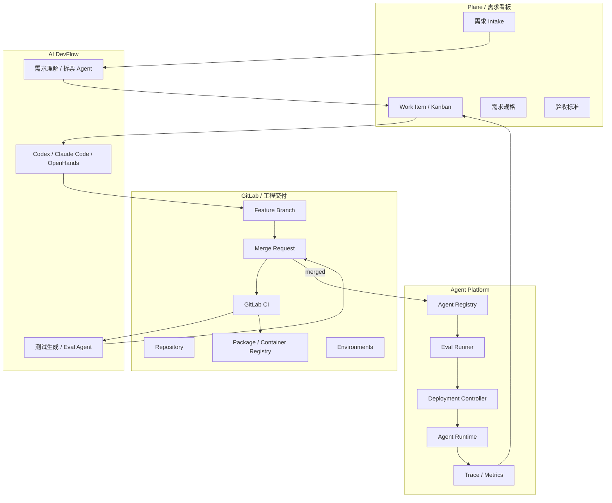

建议采用：**Plane 做需求/产品看板，GitLab 做工程交付闭环，Agent Platform 做生产发布与运行状态**。 

不要让 GitLab 承担所有职责，也不要让 Plane 管发布状态。三者边界清晰最好。

```
Plane
负责：需求、产品任务、AI 拆解、业务验收

GitLab
负责：代码、分支、MR、CI、测试、Review、制品

Agent Platform
负责：Agent 注册、版本、Eval、灰度、发布、运行观测
```

## 推荐集成架构



## 最佳职责划分

| 模块 | Plane | GitLab | Agent Platform |
| --- | --- | --- | --- |
| 业务需求 | 主责 | 只引用 | 不负责 |
| Work Item / Kanban | 主责 | 可同步精简 GitLab issue | 不负责 |
| 代码仓库 | 不负责 | 主责 | 不负责 |
| MR / Review | 不负责 | 主责 | 可读取状态 |
| CI / 测试 | 不负责 | 主责 | 触发 eval 或读取结果 |
| Agent manifest | 需求里引用 | 文件存储和 MR 审查 | 注册和解析 |
| Eval case | 需求里声明验收 | 文件存储和 CI 执行 | 管理结果和门禁 |
| 发布审批 | 业务验收 | MR approval / protected env | 生产发布审批 |
| 灰度发布 | 不负责 | 可触发 pipeline | 主责 |
| 线上 trace | 可回流为 issue | 不负责 | 主责 |

## 推荐流程

### 1. 需求进入 Plane

业务方或产品在 Plane 创建需求：

```
Title: 新增促销推荐 Agent

Fields:
- agent_id: promo_recommendation
- type: agent:new
- priority: P1
- target_channel: store_screen
- owner: product_x
- acceptance:
  - 能推荐门店有库存商品
  - 优先推荐促销商品
  - 返回商品卡片和位置命令
```

AI 需求理解 Agent 做两件事：

1. 补全需求规格。
2. 生成工程任务。

输出：

```
Plane Work Item
├── 需求背景
├── 用户场景
├── 输入输出协议
├── 验收标准
├── 风险点
├── Eval cases 草案
└── GitLab MR checklist
```

### 2. DevFlow 创建 GitLab 分支和 MR

AI DevFlow 从 Plane Work Item 生成 task pack：

```yaml
task:
  source: plane
  issue_id: AGENT-123
  type: agent:new
  title: 新增促销推荐 Agent
  gitlab:
    project_id: meiyijia_agent_hw
    branch: feat/agent-123-promo-recommendation
    merge_request:
      title: "feat(agent): add promo recommendation agent"
      labels:
        - agent:new
        - ai-generated
      reviewers:
        - backend-owner
        - product-owner
```

然后创建 GitLab 分支和 MR。

### 3. Codex / Claude Code 只围绕 GitLab MR 工作

Coding Agent 的输入应该是：

```
Plane Work Item + task pack + 当前代码仓库 + 允许修改路径
```

不要让 AI 自由读一个口头需求直接改全仓库。

建议规则：

```yaml
write_allowed:
  - agents/promo_recommendation/**
  - src/platform/**
  - tests/**
  - docs/**
write_denied:
  - deploy/prod/**
  - secrets/**
  - .env
```

Coding Agent 产出：

```
代码变更
manifest.yaml
prompts
tools
evals
tests
docs
MR 描述
```

### 4. GitLab CI 执行测试和 Eval

`.gitlab-ci.yml` 建议分层：

```yaml
stages:
  - lint
  - test
  - contract
  - eval
  - package
  - deploy_staging
  - promote

lint:
  stage: lint
  script:
    - ruff check src tests

unit_tests:
  stage: test
  script:
    - pytest tests/unit

contract_tests:
  stage: contract
  script:
    - pytest tests/contract

agent_eval:
  stage: eval
  script:
    - python scripts/run_agent_eval.py --changed-only --report eval-report.json
  artifacts:
    paths:
      - eval-report.json

package_agent:
  stage: package
  script:
    - python scripts/package_agent.py --changed-only
  artifacts:
    paths:
      - dist/agents/
```

Eval 结果回写：

```
GitLab MR comment:
- Eval pass rate: 96.3%
- Failed cases: promo_018, promo_021
- Changed agents: promo_recommendation
```

同时回写 Plane Work Item 状态：

```
Testing / Eval -> Human Review
```

### 5. GitLab MR 负责代码 Review

MR 必须包含 checklist：

```markdown
## Linked Plane Work Item

AGENT-123

## Agent Changes

- [ ] 新增或修改 manifest
- [ ] 新增或修改 prompt
- [ ] 新增或修改 tools
- [ ] 新增或修改 eval cases
- [ ] 新增或修改 protocol output

## Safety

- [ ] 未新增高风险工具权限
- [ ] 未写入密钥
- [ ] 工具有超时
- [ ] 工具有参数校验
- [ ] 输出 command 在 allowlist 内

## Tests

- [ ] Unit tests passed
- [ ] Contract tests passed
- [ ] Agent eval passed

## Release

- [ ] 可灰度
- [ ] 可回滚
```

GitLab 里设置：

```
Protected branch: main
Required approvals:
- backend owner
- product owner
- platform owner if src/platform changed
Required pipeline:
- lint
- unit_tests
- contract_tests
- agent_eval
```

### 6. Merge 后注册 Agent 版本

合并后，CI 调用 Agent Platform：

```http
POST /api/v1/agent-packages/register
```

请求：

```json
{
  "gitlab_project_id": "meiyijia_agent_hw",
  "commit_sha": "abc123",
  "agent_id": "promo_recommendation",
  "manifest_path": "agents/promo_recommendation/manifest.yaml",
  "artifact_url": "https://gitlab.example.com/.../artifacts/download"
}
```

Agent Platform 做：

```
manifest 校验
工具权限校验
eval 报告校验
生成 agent_version
状态置为 staging_candidate
```

### 7. GitLab Environment 对接 Agent Platform 发布

GitLab 可以有环境：

```
agent-staging
agent-prod
```

但真正发布逻辑由 Agent Platform 做。

```yaml
deploy_staging:
  stage: deploy_staging
  script:
    - python scripts/deploy_agent.py --env staging --agent changed
  environment:
    name: agent-staging
  when: manual

promote_prod_5:
  stage: promote
  script:
    - python scripts/promote_agent.py --env prod --traffic 5
  environment:
    name: agent-prod
  when: manual
  rules:
    - if: '$CI_COMMIT_BRANCH == "main"'
```

GitLab 负责“触发”和“审计”，Agent Platform 负责：

```
agent version activation
traffic_percent
stable hash routing
rollback
runtime config
```

## 状态同步建议

### Plane 状态

```
Backlog
Clarifying
Designing
Ready for AI Dev
AI Developing
Testing / Eval
Human Review
Staging
Production
Done
```

### GitLab MR 状态

```
Draft
Open
Pipeline Running
Review Required
Approved
Merged
Closed
```

### Agent Platform 状态

```
draft
registered
eval_passed
staging
prod_canary
prod
rolled_back
deprecated
```

### 状态映射

| 事件 | Plane | GitLab | Agent Platform |
| --- | --- | --- | --- |
| 新需求创建 | Backlog | 无 | 无 |
| AI 完成规格 | Ready for AI Dev | 无 | 无 |
| AI 开始开发 | AI Developing | Branch created | 无 |
| MR 创建 | AI Developing | Draft/Open | 无 |
| CI 运行 | Testing / Eval | Pipeline Running | 无 |
| CI + Eval 通过 | Human Review | Review Required | 无 |
| MR 合并 | Staging | Merged | registered |
| staging 发布 | Staging | deploy_staging success | staging |
| prod 5% | Production | promote_prod_5 success | prod_canary |
| prod 100% | Done | promote_prod_100 success | prod |
| 回滚 | Reopened / Incident | rollback pipeline | rolled_back |

## AI 自动化怎么接 GitLab

建议做一个 `GitLab Adapter`，不要让每个 Agent 自己调 GitLab。

```
DevFlow Service
├── PlaneAdapter
├── GitLabAdapter
├── CodexAdapter
├── ClaudeCodeAdapter
├── EvalAdapter
└── AgentPlatformAdapter
```

`GitLabAdapter` 封装：

```python
class GitLabAdapter:
    def create_branch(self, project_id, branch, ref): ...
    def create_merge_request(self, project_id, source_branch, target_branch, title, description): ...
    def comment_merge_request(self, project_id, mr_iid, body): ...
    def update_commit_status(self, project_id, sha, status, context): ...
    def get_pipeline_status(self, project_id, pipeline_id): ...
    def download_artifacts(self, project_id, job_id): ...
```

AI 只通过 DevFlow Service 操作，不直接拿 GitLab token。

## GitLab 自身能不能替代 Plane？

可以，但我不首推。

如果你想少一个系统，可以直接用：

```
GitLab Issues + Issue Boards + Labels + Milestones + MR + CI
```

优点：

- 集成简单
- 权限统一
- MR 和 Issue 天然关联
- CI/CD 完整

缺点：

- 需求 intake、产品规格、roadmap 体验较弱
- AI 需求理解和看板流程表达不如 Plane 灵活
- 多 Agent 产品管理不够舒服

如果团队很工程化，GitLab-only 也可以：

```
GitLab Issue -> AI Task Pack -> Branch -> MR -> CI/Eval -> Review -> Environment Deploy
```

但如果你要“产品需求 + AI 研发工厂”，我还是建议：

```
Plane + GitLab
```

## 推荐落地版本

### MVP

```
Plane:
- 需求、Work Item、看板

GitLab:
- repo、branch、MR、CI、review

Agent Platform:
- manifest 校验
- eval runner
- agent registry
```

先做自动化：

1. Plane Work Item 创建后，AI 生成需求规格。
2. 点击“Ready for AI Dev”后，DevFlow 创建 GitLab branch + MR。
3. Codex/Claude Code 根据 issue + task pack 修改代码。
4. GitLab CI 跑 test + eval。
5. 结果回写 MR 和 Plane。
6. 人审通过后 merge。
7. CI 注册 Agent 版本并发布 staging。

### 不建议 MVP 里做

1. 完整双向同步所有字段。
2. 自动合并 MR。
3. 自动 prod 全量发布。
4. 多 coding agent 并发。
5. 自己重写一个完整看板系统。

## 一句话建议

**Plane 管需求和 AI 任务流，GitLab 管代码和 CI/MR，Agent Platform 管 Agent 注册、评测、灰度和运行。**

如果你想更简单，也可以先 GitLab-only；但长期做“AI + 人 + vibe coding 研发平台”，Plane + GitLab 的边界更清晰。
