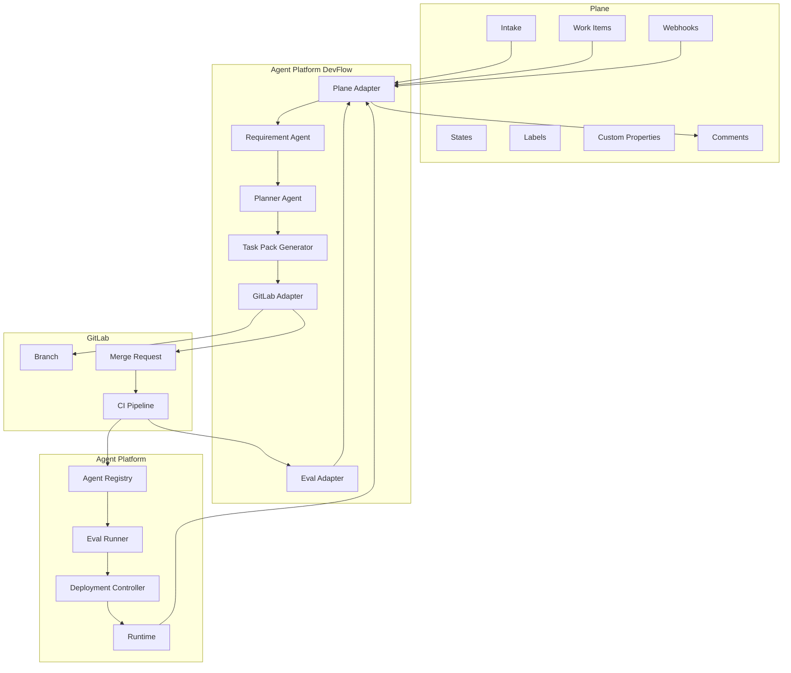
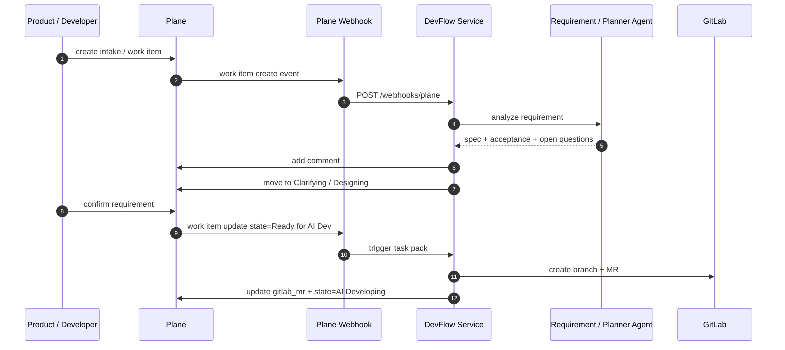

# Plane 集成设计

> 相关文档：Plane API 端点速查表见 [`../vendor/plane/endpoints.md`](../vendor/plane/endpoints.md)；OpenAPI 获取方式见 [`../99-reference/plane-docs-acquisition.md`](../99-reference/plane-docs-acquisition.md)。

本文档定义 `agent-platform` 如何接入已部署的 Plane，把 Plane 作为需求、Work Item、看板和 AI 研发任务流的入口。

当前 Plane 实例：

```text
Plane Web: http://10.193.0.147:3333/
Plane API Base URL: http://10.193.0.147:3333/api
Plane Developer Docs: https://developers.plane.so/
```

官方文档确认 Plane 提供：

1. REST API，用于管理 projects、work items、states、labels、types、custom properties、cycles、modules、intake 等。
2. Webhooks，用于接收 project、work item、cycle、module、comment 等事件。
3. MCP Server，可让 Claude Code、Cursor、VSCode、Zed 等 AI 工具通过 MCP 操作 Plane。

## 1. Plane 在平台里的定位

```text
Plane
负责：需求、Work Item、看板、AI 拆解状态、业务验收入口

GitLab
负责：代码、分支、MR、CI、Review、制品

Agent Platform
负责：Agent 注册、Manifest 校验、Eval、灰度、发布、运行态
```

不要把 Agent 运行状态、发布状态、trace 都塞进 Plane。Plane 只保存研发协作需要的摘要和链接。

## 2. 总体集成架构



## 3. Plane 项目建议

建议先建 3 个 Project：

| Project | 用途 |
| --- | --- |
| `Agent Platform` | 平台核心能力：router、manifest、runtime、eval、devflow |
| `MYJ Agent` | MYJ 业务 Agent package、工具、eval、迁移任务 |
| `Agent R&D Flow` | AI + 人 + coding agent 研发流程、Plane/GitLab/Hermes 集成 |

也可以先只建一个 `Agent Platform` Project，使用 `agent_id` 自定义字段区分业务 Agent。MVP 推荐先单 Project，降低配置成本。

## 4. Work Item Type 设计

Plane 支持 Work Item Types。建议定义：

| Type | 说明 |
| --- | --- |
| `agent:new` | 新增业务 Agent |
| `agent:change` | 修改已有业务 Agent |
| `tool:new` | 新增平台或业务工具 |
| `tool:change` | 修改工具 |
| `knowledge:sync` | 新增或修改知识源同步 |
| `eval:add` | 增加 eval case |
| `protocol:change` | 修改接口协议 |
| `platform:change` | 修改平台核心 |
| `bug` | 缺陷修复 |
| `docs` | 文档任务 |
| `risk` | 风险或安全问题 |

## 5. State / 看板流转

建议在 Plane 项目里配置这些状态：

```text
Backlog
Clarifying
Designing
Ready for AI Dev
AI Developing
Testing / Eval
Human Review
Staging
Production
Done
Blocked
Canceled
```

状态含义：

| State | 说明 | 自动化 |
| --- | --- | --- |
| `Backlog` | 新需求池 | 手动或 Intake 创建 |
| `Clarifying` | AI / 人澄清需求 | AI 可自动补问题 |
| `Designing` | 架构设计、方案确认 | AI 生成 design brief |
| `Ready for AI Dev` | 可交给 coding agent | 触发 task pack |
| `AI Developing` | Coding agent 开发中 | DevFlow 创建 GitLab MR |
| `Testing / Eval` | CI 和 eval 执行中 | GitLab pipeline webhook 更新 |
| `Human Review` | 等待人审 | MR ready + eval pass |
| `Staging` | 已进入 staging | Agent Platform 回写 |
| `Production` | 已进入生产灰度或全量 | Agent Platform 回写 |
| `Done` | 完成 | 人工或自动关闭 |
| `Blocked` | 阻塞 | 人工标记 |
| `Canceled` | 取消 | 人工标记 |

## 6. Labels 设计

建议预置 labels：

```text
ai-generated
needs-clarification
needs-design
ready-for-ai-dev
codex
claude-code
openhands
manifest
runtime
eval
gitlab
hermes
myj
high-risk
requires-human-approval
```

## 7. Custom Properties 设计

Plane API 支持 Custom Properties。建议为 Work Item 增加：

| Property | 类型 | 示例 | 说明 |
| --- | --- | --- | --- |
| `agent_id` | text / dropdown | `myj` | 涉及的 Agent |
| `task_type` | dropdown | `agent:change` | 和 Work Item Type 对齐 |
| `risk_level` | dropdown | `low` / `medium` / `high` | 风险等级 |
| `runtime_backend` | dropdown | `native` / `hermes` / `langgraph` | 目标 runtime |
| `gitlab_project` | text | `agent-platform` | GitLab 项目 |
| `gitlab_mr` | url | MR 链接 | 关联 MR |
| `task_pack_url` | url / text | artifact URL | DevFlow Task Pack |
| `eval_report_url` | url / text | eval report | 评测报告 |
| `agent_version` | text | `0.1.0` | 关联 Agent 版本 |
| `deployment_env` | dropdown | `dev` / `staging` / `prod` | 发布环境 |

MVP 可以先不用全部字段。第一阶段至少需要：

```text
agent_id
task_type
risk_level
gitlab_mr
eval_report_url
```

## 8. Plane REST API 使用方式

Plane 官方 API 是 REST 风格。自部署实例的 API base URL 应该使用：

```text
http://10.193.0.147:3333/api
```

认证方式：

```http
X-API-Key: <PLANE_API_KEY>
```

或 OAuth：

```http
Authorization: Bearer <oauth_access_token>
```

MVP 推荐先用 Personal Access Token / API Key。

### 8.1 环境变量

```env
PLANE_BASE_URL=http://10.193.0.147:3333/api
PLANE_API_KEY=plane_api_xxx
PLANE_WORKSPACE_SLUG=<workspace_slug>
PLANE_DEFAULT_PROJECT_ID=<project_id>
```

不要把 API Key 写入 manifest、docs 或代码。

### 8.2 关键 API 资源

根据官方 API 导航，DevFlow 主要需要：

| Plane Resource | 用途 |
| --- | --- |
| Project | 获取和管理项目 |
| Work Item | 创建、查询、更新研发任务 |
| Work Item States | 创建和查询看板状态 |
| Work Item Labels | 管理 labels |
| Work Item Types | 管理任务类型 |
| Custom Properties | 管理自定义字段 |
| Work Item Comments | 回写 AI 分析、MR、CI、Eval 结果 |
| Intake | 接收业务需求入口 |
| Cycles | Sprint / 迭代 |
| Modules | 功能模块，例如 manifest、runtime、eval |

## 9. PlaneAdapter 设计

建议封装统一 adapter，不让业务代码直接调 Plane API。

```python
class PlaneAdapter:
    def list_projects(self) -> list[PlaneProject]:
        ...

    def create_work_item(self, request: CreateWorkItemRequest) -> PlaneWorkItem:
        ...

    def get_work_item(self, work_item_id: str) -> PlaneWorkItem:
        ...

    def update_work_item_state(self, work_item_id: str, state_id: str) -> None:
        """state_id 是 Plane 内部 UUID，通过 States API 查询获得。"""
        ...

    def update_custom_properties(self, work_item_id: str, values: dict) -> None:
        ...

    def add_comment(self, work_item_id: str, body: str) -> None:
        ...

    def search_work_items(self, query: str) -> list[PlaneWorkItem]:
        ...
```

Adapter 负责：

1. API base URL。
2. API key。
3. workspace slug。
4. pagination。
5. retry。
6. error mapping。
7. idempotency。
8. markdown comment 格式。

## 10. DevFlow 和 Plane 的事件流



## 11. Webhook 设计

Plane Webhooks 会向指定 URL 发送 HTTP POST。官方文档说明 header 包含：

```http
X-Plane-Delivery: <uuid>
X-Plane-Event: <event>
X-Plane-Signature: <hmac_sha256>
```

支持事件包括：

```text
Project
Work Item
Cycle
Module
Work Item Comment
```

平台 webhook endpoint：

```http
POST /api/v1/integrations/plane/webhook
```

必须做：

1. 校验 `X-Plane-Signature`。
2. 使用 `X-Plane-Delivery` 做幂等。
3. 只处理白名单 workspace。
4. 只处理目标 project。
5. 快速返回 200，复杂任务异步处理。

签名校验伪代码：

```python
expected = hmac_sha256(secret, raw_body)
if not hmac.compare_digest(expected, received_signature):
    raise Unauthorized
```

## 12. MCP Server 使用方式

Plane 官方提供 MCP Server。配置方式和环境变量见 [`../99-reference/plane-docs-acquisition.md`](../99-reference/plane-docs-acquisition.md) §4。

建议用途：

1. Claude Code / Cursor / Codex 读取需求。
2. AI 自动创建或更新 work item。
3. AI 根据 issue 生成 task pack。
4. AI 回写开发总结和风险点。

注意：

1. MCP 适合人机交互和 coding agent 工作台。
2. 服务端自动化仍建议通过 Plane REST API 实现。
3. 不要让 MCP token 具有超过必要范围的权限。

## 13. Work Item 模板

推荐需求模板：

```markdown
## 背景

## 用户场景

## 期望行为

## 非目标

## 涉及 Agent

## 输入协议

## 输出协议

## 涉及工具 / 知识源

## 验收标准

## Eval Cases

## 风险点

## GitLab / MR

## 发布计划
```

AI 需求理解 Agent 回写评论：

```markdown
## AI 需求理解结果

### 规格摘要

### 待澄清问题

### 建议任务拆分

### 建议 Eval Cases

### 风险
```

## 14. Plane 与 GitLab 状态同步

| 事件 | Plane 更新 | GitLab 更新 |
| --- | --- | --- |
| Work Item 进入 `Ready for AI Dev` | 生成 task pack | 创建 branch + draft MR |
| MR 创建成功 | 写入 `gitlab_mr` 字段，状态到 `AI Developing` | MR 描述引用 Plane Work Item |
| CI 开始 | 状态到 `Testing / Eval` | pipeline running |
| CI / Eval 通过 | 状态到 `Human Review` | MR ready for review |
| MR 合并 | 状态到 `Staging` | main merged |
| Agent staging 发布 | 评论发布结果 | environment deploy success |
| Prod 灰度 | 状态到 `Production` | manual deploy job |
| 完成 | 状态到 `Done` | MR closed / merged |

避免双向同步过度：

1. Plane 保存 GitLab MR 链接和摘要。
2. GitLab MR 保存 Plane Work Item 链接。
3. 细节以各自系统为准。

## 15. MVP 落地步骤

第一阶段：

1. 在 Plane 创建 `Agent Platform` Project。
2. 配置 states。
3. 配置 labels。
4. 配置最小 custom properties。
5. 生成 API Key。
6. 在 agent-platform 配置 `PLANE_BASE_URL`、`PLANE_API_KEY`、`PLANE_WORKSPACE_SLUG`。
7. 实现 `PlaneAdapter` 的 work item 查询、评论、状态更新。
8. 实现 webhook endpoint。
9. 打通 `Ready for AI Dev -> GitLab MR`。
10. 把 CI / Eval 结果回写 Plane comment。

第二阶段：

1. 接入 Intake。
2. 接入 MCP 给 Claude Code / Codex 使用。
3. 自动生成 task pack。
4. 自动拆子任务。
5. 支持 Plane Modules / Cycles。

## 16. 安全要求

1. `PLANE_API_KEY` 只放环境变量或 secret manager。
2. Webhook secret 必须校验。
3. Plane webhook 要做幂等，防止重复创建 MR。
4. Coding agent 不能直接拿高权限 Plane token。
5. 生产发布仍以 GitLab + Agent Platform 审批为准，不能只靠 Plane 状态。
6. Plane 评论里不能写密钥、完整用户隐私、内部 API token。

## 17. 官方文档参考

- Plane Developer Docs: https://developers.plane.so/
- API Reference: https://developers.plane.so/api-reference/introduction
- Webhooks: https://developers.plane.so/dev-tools/intro-webhooks
- MCP Server: https://developers.plane.so/dev-tools/mcp-server
