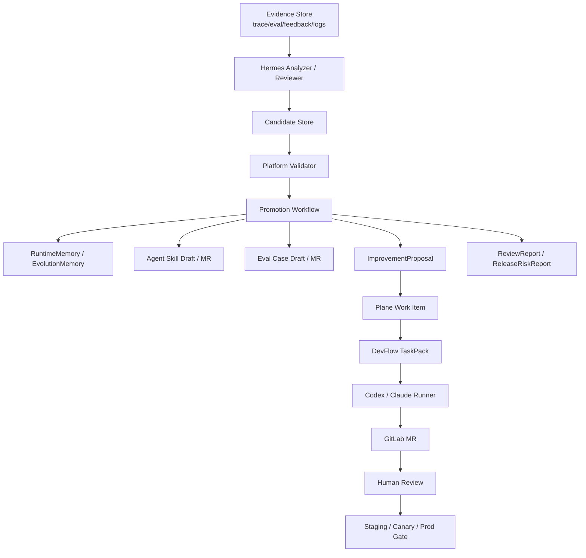

# 自进化 Agent 系统文档索引

本目录定义 Agent Platform 的自进化能力：如何从运行反馈、eval failure、用户反馈和日志模式中生成改进提案，并通过 Plane、DevFlow、GitLab MR、人类 review 和发布门禁形成受控闭环。

## 阅读顺序

1. [自进化 Agent 系统总体设计](self-evolving-agent-system.md)
2. [Evolution Engine 设计](evolution-engine-design.md)
3. [Hermes 自进化能力调研与借鉴](hermes-lessons-for-self-evolution.md)
4. [Platform Memory 与 Agent Skills 设计](memory-and-skills-design.md)
5. [Candidate 契约](candidate-contract.md)
6. [Improvement Proposal 契约](improvement-proposal-contract.md)
7. [自进化风险策略](risk-policy.md)
8. [自进化 Agent 系统落地路线](rollout-plan.md)

## S9 总览图



## 文档职责

| 文档 | 职责 |
| --- | --- |
| `self-evolving-agent-system.md` | 总体架构、边界、两层自进化 |
| `candidate-contract.md` | Candidate schema、状态机、晋升、API、审计 |
| `evolution-engine-design.md` | Evolution Engine、Background Review Fork、Candidate Store 使用 |
| `memory-and-skills-design.md` | RuntimeMemory、EvolutionMemory、Agent Skills、SkillRegistry |
| `improvement-proposal-contract.md` | 正式改进提案到 Plane/TaskPack/MR 的映射 |
| `risk-policy.md` | 风险等级、toolset、command guard、checkpoint |
| `rollout-plan.md` | 自进化能力阶段推进 |

## 核心边界

```
Hermes / Evolution Analyst
  负责：观察、归因、候选资产、提案草案、review、自己的分析能力自进化

Agent Platform
  负责：事实源、编排、治理、权限、eval、发布、审计和资产晋升

Codex / Claude Code Runner
  负责：在 TaskPack 和 PathGuard 限制下修改代码

Plane / GitLab
  负责：需求协作、MR、CI、review 和审计
```

## 第一阶段建议

先做最小闭环：

```
Eval Failure
  -> Candidate
  -> Platform validate/promote
  -> ImprovementProposal
  -> 人工确认
  -> Plane Work Item
  -> DevFlow
  -> MR
```

第一阶段不要自动修改平台核心代码，不要自动 merge，不要自动发布生产。

## Hermes 借鉴重点

Hermes 的经验不应直接照搬为平台入口，但有几类机制值得吸收：

1. 后台 review fork：只允许写 memory / skills / proposal，不允许 shell/web/deploy。
2. curated memory：有边界、有证据、有注入扫描、有租户/agent 隔离。
3. kanban worker 生命周期：heartbeat、retry budget、zombie reclaim、hallucination gate。
4. checkpoint / approval / path security：runner 自动修改前后的安全兜底。
5. trajectory / insights：把运行、修复、review、eval 结果沉淀为可分析数据。

## Memory / Skills 边界

Memory 和 Skills 都应该设计在 Platform 层，但性质不同：

```text
Memory 是数据资产
  需要隔离、脱敏、TTL、evidence、审计

Skills 是代码/知识资产
  需要版本、review、eval、发布、回滚
```

短期经验先进入 Evolution Memory；被验证、review 后，再固化为 Skill / Prompt / Eval，并进入 Agent Package。

## Candidate Store 原则

```text
Hermes writes candidates, Platform promotes assets.
```

Hermes 可以生成：

```text
MemoryCandidate
SkillDraft
EvalCaseDraft
ProposalDraft
TaskPackDraft
ReviewReport
ReleaseRiskReport
```

Platform 负责校验、去重、风险分类、审批和晋升。正式 Memory、Skill、Eval、Plane Work Item、MR 和发布资产都必须由 Platform 激活。
