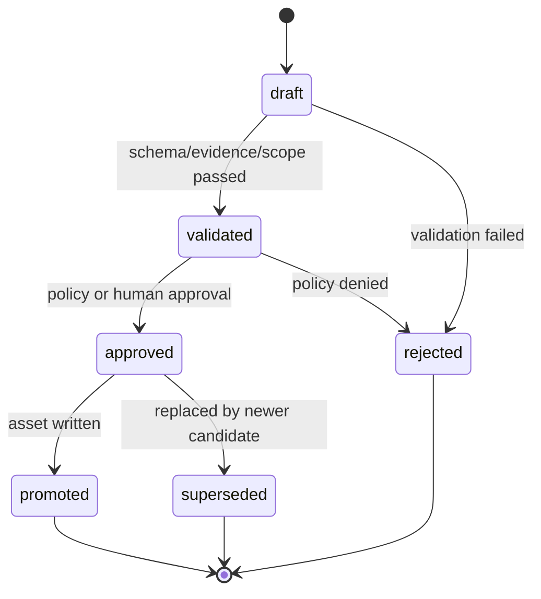

# Candidate 契约

> Status: 平台基础能力已实现，真实模型 Review Fork 候选生成闭环仍处于联调/不稳定状态
> Stage: S9
> Owner: platform
> Last updated: 2026-05-20

Candidate 是 Hermes 与 Agent Platform 之间的结构化缓冲契约。

核心原则：

```text
Hermes writes candidates, Platform promotes assets.
```

Hermes 可以充分参与分析、总结、生成草案和 review，但它写入的是候选资产，不是生产事实源。Platform 负责校验、去重、风险分类、审批和晋升。

## 1. Candidate 类型

| 类型 | 说明 | 晋升目标 |
| --- | --- | --- |
| `memory_candidate` | 建议沉淀运行或演进经验 | `RuntimeMemory` / `EvolutionMemory` |
| `skill_draft` | 建议新增或修改 Agent skill | DevFlow MR 修改 `agents/<agent_id>/skills/**` |
| `eval_case_draft` | 建议新增回归用例 | DevFlow MR 修改 `agents/<agent_id>/evals/**` |
| `proposal_draft` | 建议创建正式改进提案 | `ImprovementProposal` |
| `task_pack_draft` | 建议 DevFlow 任务拆解 | `DevelopmentTask` |
| `review_report` | 审查 MR 是否真正修复问题 | MR/Plane comment 或 release gate input |
| `release_risk_report` | 分析 staging/canary/prod 风险 | Deployment gate input |

## 2. Candidate Schema

```yaml
schema_version: 1
candidate_id: cand_20260520_0001
candidate_type: proposal_draft

generated_by: hermes
generator_role: HermesAnalyzer
generator_version: hermes-agent@0.13

tenant_id: tenant_a
agent_id: myj
environment: prod

source_event_ids:
  - run_123
  - feedback_456
evidence_ids:
  - evidence_123

payload:
  title: "促销价格解释不稳定"
  summary: "过去 24h 多条负反馈集中在第二件半价解释。"
  root_cause: prompt_gap
  confidence: 0.82
  proposed_changes:
    - type: eval_case_add
      path: agents/myj/evals/golden.yaml

risk:
  level: low
  reason: "仅建议新增 eval 和 prompt rule，不涉及工具代码。"

promotion:
  target: improvement_proposal
  mode: manual | auto
  requires_human_approval: true

status: draft
validation_errors: []
created_at: "2026-05-20T10:00:00Z"
updated_at: "2026-05-20T10:00:00Z"
```

## 3. 字段定义

| 字段 | 必填 | 说明 |
| --- | --- | --- |
| `schema_version` | 是 | 当前为 `1` |
| `candidate_id` | 是 | 全局唯一 ID |
| `candidate_type` | 是 | 候选类型 |
| `generated_by` | 是 | `hermes` / `platform` / `human` |
| `generator_role` | 是 | HermesAnalyzer / HermesCurator / HermesPlanner / HermesReviewer 等 |
| `tenant_id` | 是 | 租户隔离 |
| `agent_id` | 是 | 目标 Agent |
| `environment` | 是 | dev/staging/prod |
| `source_event_ids` | 是 | 触发来源 |
| `evidence_ids` | 是 | 证据 |
| `payload` | 是 | 类型相关内容 |
| `risk` | 是 | 风险等级 |
| `promotion` | 是 | 晋升目标和模式 |
| `status` | 是 | 状态 |

## 4. 状态机



状态含义：

| 状态 | 含义 |
| --- | --- |
| `draft` | Hermes 或平台刚生成，尚未校验 |
| `validated` | schema、evidence、scope、脱敏等校验通过 |
| `approved` | policy 或人类审批允许晋升 |
| `promoted` | 已写入正式平台资产 |
| `rejected` | 被拒绝，需记录原因 |
| `superseded` | 被更新候选替代 |

## 5. 校验规则

Platform Validator 必须执行：

1. schema validation。
2. candidate type validation。
3. tenant/agent/environment scope validation。
4. evidence existence validation。
5. PII/secret scan。
6. prompt injection scan。
7. duplicate detection。
8. risk classification consistency check。
9. promotion target permission check。

任何一个失败，candidate 必须进入 `rejected` 或保持 `draft` 并写入 `validation_errors`。

## 6. 晋升规则

| Candidate | Low | Medium | High/Critical |
| --- | --- | --- | --- |
| `memory_candidate` | 可自动晋升 EvolutionMemory | 需 owner 确认 | 不晋升，只报告 |
| `skill_draft` | 创建低风险 DevFlow MR | 需 owner 确认后 DevFlow | 只生成 discovery item |
| `eval_case_draft` | 可自动创建 DevFlow MR | 需确认 | 只报告 |
| `proposal_draft` | 可晋升 ImprovementProposal | 需确认 | discovery / incident |
| `task_pack_draft` | 需绑定 proposal 后使用 | 需确认 | 禁止派发 |
| `review_report` | 可写 MR/Plane comment | 可写但需标记风险 | release gate 阻断建议 |
| `release_risk_report` | 可作为 gate input | 需 release owner 确认 | 阻断自动发布 |

## 7. API 草案

```http
POST /api/v1/evolution/candidates
GET  /api/v1/evolution/candidates
GET  /api/v1/evolution/candidates/{candidate_id}
POST /api/v1/evolution/candidates/{candidate_id}/validate
POST /api/v1/evolution/candidates/{candidate_id}/approve
POST /api/v1/evolution/candidates/{candidate_id}/promote
POST /api/v1/evolution/candidates/{candidate_id}/reject
POST /api/v1/evolution/candidates/{candidate_id}/supersede
```

权限：

```text
evolution:candidate:read
evolution:candidate:write
evolution:candidate:validate
evolution:candidate:approve
evolution:candidate:promote
```

## 8. Repository 草案

```python
class EvolutionCandidateRepository(Protocol):
    async def create(candidate: EvolutionCandidate) -> None: ...
    async def get(candidate_id: str) -> EvolutionCandidate | None: ...
    async def list(
        tenant_id: str,
        agent_id: str | None = None,
        status: str | None = None,
        candidate_type: str | None = None,
    ) -> list[EvolutionCandidate]: ...
    async def update_status(candidate_id: str, status: str, reason: str | None = None) -> None: ...
    async def mark_promoted(candidate_id: str, target_type: str, target_id: str) -> None: ...
```

## 9. Audit Events

```text
candidate.created
candidate.validated
candidate.approved
candidate.promoted
candidate.rejected
candidate.superseded
```

事件字段：

```yaml
event_id: audit_123
event_type: candidate.promoted
tenant_id: tenant_a
agent_id: myj
candidate_id: cand_123
candidate_type: proposal_draft
target_type: improvement_proposal
target_id: evo_123
actor_type: system | human | hermes | platform
request_id: req_123
created_at: "2026-05-20T10:00:00Z"
```

