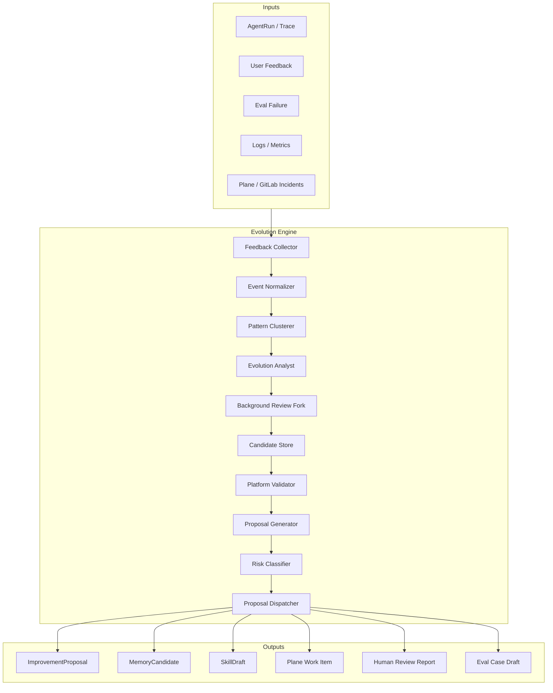

# Evolution Engine 设计

> Status: Partially Implemented（Engine/Risk/Repo/API/Candidate Store/Promotion Workflow 已实现；Review Fork/Pattern Clusterer 待实现）
> Stage: S9
> Owner: platform
> Last updated: 2026-05-20

Evolution Engine 是自进化 Agent 系统的决策层。它不直接改代码，不直接发布，只负责把运行反馈转化为可审计、可验证、可执行的候选资产和改进提案。

## 1. 职责边界

Evolution Engine 负责：

1. 收集和归一化反馈事件。
2. 聚合相似问题。
3. 判断是否值得发起改进。
4. 生成 `ImprovementProposal`。
5. 做风险分类和自动化等级判断。
6. 创建 Plane Work Item 或生成待确认报告。
7. 跟踪提案到 MR、eval、release 的结果。
8. 管理 Hermes 输出的 Candidate Store 和 promotion workflow。

Evolution Engine 不负责：

1. 直接调用 Codex/Claude Code 改代码。
2. 直接合并 MR。
3. 直接发布 staging/prod。
4. 覆盖人类在 Plane/GitLab 上的决策。
5. 绕过 tenant/security/policy。

## 2. 架构



### 2.1 Background Review Fork

借鉴 Hermes 的 self-improvement loop，Evolution Engine 应把“每次运行后的自进化判断”设计成后台 review fork，而不是在主请求链路中同步执行。

触发时机：

```text
AgentRun completed
EvalRun completed
UserFeedback received
DevFlowJob completed
MR review completed
```

执行边界：

1. 异步 sidecar，不阻塞用户请求。
2. 输入只包含脱敏后的 trace、eval、feedback、logs、MR/review 摘要。
3. toolset 必须受限，第一阶段只允许：
   - `proposal.write`
   - `memory.write`
   - `eval_draft.write`
   - `evidence.read`
4. 禁止：
   - shell / terminal
   - web unrestricted browsing
   - git push / merge
   - deploy / rollback
   - secret read
   - production write
5. 输出必须是结构化候选资产：`MemoryCandidate`、`SkillDraft`、`EvalCaseDraft`、`ProposalDraft`、`ReviewReport` 或 `ReleaseRiskReport`。
6. 候选资产必须进入 Candidate Store，由 Platform 决定是否晋升为正式资产。

Review fork 的结果需要进入审计：

```text
review_fork_id
source_event_id
agent_id
tenant_id
input_evidence_ids
output_type
candidate_id
proposal_id
risk_level
model/provider
created_at
```

## 3. 输入事件

### 3.1 FeedbackEvent

```yaml
event_type: feedback
feedback_id: fb_123
tenant_id: tenant_a
agent_id: myj
session_id: sess_123
run_id: run_123
rating: negative
reason: answer_wrong
message: "用户说促销信息不准确"
created_at: "2026-05-19T10:00:00Z"
```

### 3.2 EvalFailureEvent

```yaml
event_type: eval_failure
eval_run_id: eval_123
agent_id: echo
case_id: golden_001
expected: "..."
actual: "..."
failure_type: contains_mismatch
created_at: "2026-05-19T10:00:00Z"
```

### 3.3 RuntimeAnomalyEvent

```yaml
event_type: runtime_anomaly
agent_id: myj
run_id: run_123
severity: warning
signal: tool_timeout_rate_high
metric:
  tool_name: myj.goods_search
  timeout_rate: 0.18
window: 1h
```

### 3.4 HumanIssueEvent

```yaml
event_type: human_issue
source: plane
work_item_id: "..."
agent_id: myj
title: "门店促销回答不稳定"
description: "..."
```

## 4. 处理流程

```text
collect_events()
  -> normalize()
  -> deduplicate()
  -> cluster_by_agent_and_symptom()
  -> summarize_evidence()
  -> classify_root_cause()
  -> run_background_review_fork()
  -> write_candidate_store()
  -> validate_candidate()
  -> promote_candidate()
  -> generate_proposal()
  -> classify_risk()
  -> dispatch()
```

### 4.1 去重规则

去重键建议：

```text
tenant_id + agent_id + symptom_type + normalized_message_hash + time_window
```

示例：

```text
tenant_a:myj:promo_wrong_answer:hash123:2026-05-19T10
```

同一窗口内重复反馈应聚合为一个 proposal，而不是重复创建多个 Plane Work Item。

### 4.2 聚类维度

| 维度 | 示例 |
| --- | --- |
| agent_id | `myj`, `echo`, `promo_recommendation` |
| failure_type | answer_wrong, format_invalid, tool_timeout, routing_wrong |
| tool_name | `myj.goods_search` |
| prompt_section | `orchestrator.md` |
| channel | web, mobile, pos |
| tenant_id | tenant isolation |

## 5. 根因分类

| root_cause | 含义 | 常见动作 |
| --- | --- | --- |
| `prompt_gap` | prompt 没覆盖该场景 | 修改 prompt，增加 eval |
| `eval_gap` | 没有回归用例 | 增加 eval |
| `knowledge_gap` | 知识缺失或过期 | 更新 knowledge source |
| `tool_schema_gap` | 工具参数/描述不足 | 修改 schema 或 adapter |
| `tool_runtime_error` | 工具调用失败、超时 | 修 tool 或降级策略 |
| `routing_error` | 路由到错误 Agent | 修改 routing/ownership |
| `frontend_contract_gap` | 输出 command/card 不符合前端契约 | 修改 response builder / contract test |
| `platform_bug` | 平台 runtime/security/persistence 等问题 | 只生成高风险提案 |
| `product_requirement` | 新需求，不是 bug | 创建需求，不自动开发 |

## 6. 输出动作

| 风险等级 | 输出动作 |
| --- | --- |
| Low | 自动创建 Plane Work Item，可自动触发 DevFlow |
| Medium | 创建待确认 Plane Work Item，不自动触发 DevFlow |
| High | 只生成报告或 Plane discovery item，需要人类确认 |
| Critical | 触发告警，不自动创建开发任务 |

## 7. 与 DevFlow 的衔接

Evolution Engine 生成的 Plane Work Item 必须包含：

1. `agent_id`
2. `task_type`
3. `proposal_id`
4. `risk_level`
5. `allowed_paths`
6. `blocked_paths`
7. `evidence`
8. `validation_commands`
9. `expected_eval_changes`

DevFlow 只接受满足条件的提案进入自动编码：

```text
risk_level in [low]
allowed_paths 不为空
blocked_paths 不为空
至少一个 evidence
至少一个 validation command
```

Hermes 生成的 `TaskPackDraft` 也不能直接派发 runner，必须先晋升为正式 `DevelopmentTask`：

```text
TaskPackDraft
  -> schema validation
  -> allowed_paths / blocked_paths check
  -> risk policy check
  -> DevelopmentTask
  -> DevFlow
```

## 8. 数据存储建议

新增 repository：

```python
class EvolutionProposalRepository(Protocol):
    async def create(proposal: ImprovementProposal) -> None: ...
    async def get(proposal_id: str) -> ImprovementProposal | None: ...
    async def list_by_agent(agent_id: str, status: str | None = None) -> list[ImprovementProposal]: ...
    async def mark_dispatched(proposal_id: str, plane_work_item_id: str) -> None: ...
    async def mark_closed(proposal_id: str, outcome: str) -> None: ...
```

建议新增表：

```text
evolution_proposals
evolution_evidence
evolution_feedback_events
evolution_clusters
evolution_review_forks
evolution_candidates
evolution_memory
evolution_eval_drafts
```

第一阶段可以先用文件或现有 SQL repository 模式实现，后续再接完整后台任务。

## 9. API 草案

```http
POST /api/v1/evolution/proposals/analyze
GET  /api/v1/evolution/proposals
GET  /api/v1/evolution/proposals/{proposal_id}
POST /api/v1/evolution/proposals/{proposal_id}/dispatch-to-plane
POST /api/v1/evolution/proposals/{proposal_id}/dismiss
GET  /api/v1/evolution/candidates
GET  /api/v1/evolution/candidates/{candidate_id}
POST /api/v1/evolution/candidates/{candidate_id}/validate
POST /api/v1/evolution/candidates/{candidate_id}/promote
POST /api/v1/evolution/candidates/{candidate_id}/reject
```

管理端点需要 `evolution:read`、`evolution:write`、`evolution:dispatch`、`evolution:promote` scopes。

## 9.1 Candidate Store

Candidate Store 是 Hermes 与 Platform 之间的结构化缓冲层。Hermes 在这里充分发挥能力，但不会直接修改生产事实源。

Candidate 类型：

| 类型 | 用途 | 晋升目标 |
| --- | --- | --- |
| `MemoryCandidate` | 建议沉淀运行/演进经验 | RuntimeMemory / EvolutionMemory |
| `SkillDraft` | 建议新增或修改 skill | DevFlow MR 修改 `agents/<agent_id>/skills/**` |
| `EvalCaseDraft` | 建议新增回归用例 | DevFlow MR 修改 `agents/<agent_id>/evals/**` |
| `ProposalDraft` | 建议创建正式改进提案 | `ImprovementProposal` |
| `TaskPackDraft` | 建议 DevFlow 任务拆解 | `DevelopmentTask` |
| `ReviewReport` | 审查 MR 是否真正修复问题 | MR/Plane comment 或 release gate input |
| `ReleaseRiskReport` | 分析 staging/canary 风险 | Deployment gate input |

Platform promotion workflow：

```text
Candidate
  -> schema validation
  -> evidence validation
  -> tenant/agent/environment scope validation
  -> PII/secret/prompt injection scan
  -> duplicate detection
  -> risk classification
  -> approval decision
  -> promote to platform asset
```

原则：

```text
Hermes writes candidates, Platform promotes assets.
```

## 10. Hermes 借鉴映射

| Hermes 机制 | Evolution Engine 设计 |
| --- | --- |
| 后台 self-improvement review fork | `BackgroundReviewFork`，只允许 proposal/memory/eval draft |
| memory tool 注入扫描 | `EvolutionMemory` 写入前脱敏和 injection scan |
| skills self-improve | Agent package playbook/skill/eval draft |
| kanban heartbeat/reclaim | DevFlow job heartbeat/retry/DLQ/reclaim |
| checkpoint manager | Runner workspace checkpoint |
| approval hardline blocklist | `RiskPolicy` + `CommandGuard` + `PathGuard` |
| trajectory save/compress | `RuntimeTrajectory` / `RepairTrajectory` |
| insights engine | `EvolutionInsights` |

## 11. Hermes Self-Improvement vs Platform Evolution

Evolution Engine 同时支持两类学习闭环：

| 闭环 | 目标 | 结果 |
| --- | --- | --- |
| Hermes Self-Improvement | 提升 Hermes 作为 Analyst/Curator/Planner/Reviewer 的质量 | 更好的候选资产、更好的 review、更好的 root cause 分类 |
| Platform Evolution | 提升业务 Agent 的能力 | prompt/eval/skills/tools/routing/knowledge/release 的受控变更 |

Hermes 可以根据 proposal 被接受/拒绝、MR review 结果、eval 是否改善来优化自己的分析策略。但如果这些优化要影响业务 Agent，必须进入 Candidate Store 并经过 Platform promotion。
