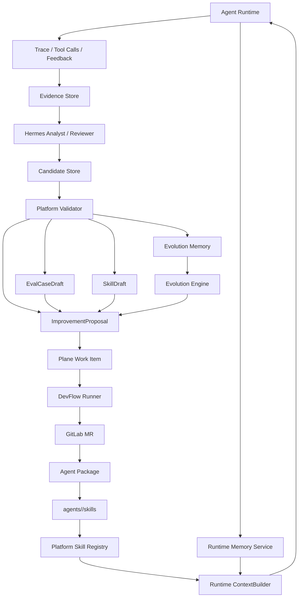
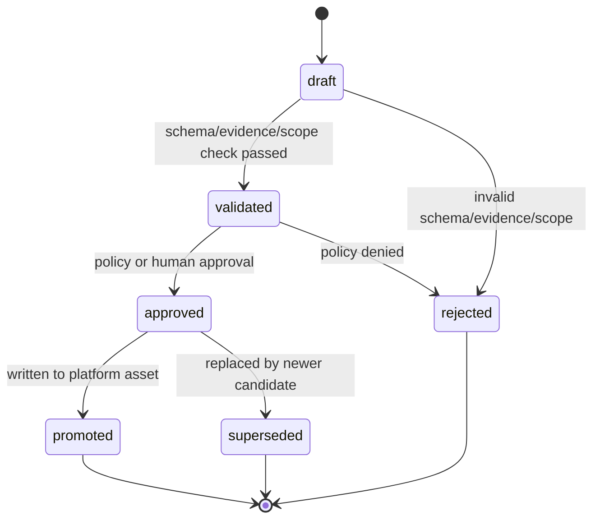

# Platform Memory 与 Agent Skills 设计

> Status: Draft
> Stage: S9 Proposal
> Owner: platform
> Last updated: 2026-05-20

本文档定义 Agent Platform 中 Memory 与 Skills 的平台级设计。结论先行：

```text
Memory / Skills 应该成为 Agent Platform 的一等能力
但不能照搬 Hermes 的个人 memory / skills

Memory 是数据资产：需要隔离、脱敏、TTL、evidence、审计
Skills 是代码/知识资产：需要版本、review、eval、发布、回滚
```

## 1. 为什么要设计在 Platform 层

如果 memory / skills 只放在某个 runtime、某个 agent 进程或某个 Hermes profile 中，会带来几个问题：

1. **多 Agent 复用困难**：`myj`、`promo_recommendation`、`echo` 等业务 Agent 以后会越来越多，不能每个 runtime 各自沉淀经验。
2. **租户隔离困难**：不同 tenant、业务线、环境的反馈、偏好、错误模式不能混用。
3. **审计困难**：memory/skill 影响 Agent 行为时，必须知道谁写入、基于什么证据、何时生效、能否回滚。
4. **发布困难**：skills 如果影响 Agent 行为，就应该像 prompt/eval/tool 一样进入版本、review、eval 和发布链路。
5. **自进化无法闭环**：如果经验不能从 memory 固化为 skill/prompt/eval，系统只能每次临时推理，无法稳定变好。

因此：

```text
Runtime 可以消费 memory / skills
Hermes 可以帮助生成 memory / skill draft
但所有治理、索引、审计和发布应由 Agent Platform 负责
```

更具体的原则：

```text
Hermes writes candidates, Platform promotes assets.
```

Hermes 可以生成候选资产，但不能直接激活正式资产：

```text
MemoryCandidate
SkillDraft
EvalCaseDraft
ProposalDraft
ReviewReport
ReleaseRiskReport
```

这些候选资产必须经过 Platform 的 schema 校验、evidence 校验、租户/Agent scope 校验、风险分类和审批后，才能晋升为正式的 Platform Memory、Agent Skill、Eval Case、Plane Work Item 或 Release gate 输入。

## 2. 概念分层

不要把所有东西都叫 memory。平台内至少分三类：

```text
Runtime Memory
Evolution Memory
Agent Skills
Candidate Store
```

### 2.1 Runtime Memory

Runtime Memory 服务在线对话或用户体验。

示例：

```text
用户偏好
会话摘要
用户历史问题
门店上下文
设备/channel 偏好
```

特点：

1. 可能影响当前或后续回答。
2. 具有较强隐私属性。
3. 必须按 tenant/user/session/agent 隔离。
4. 需要 TTL、脱敏、访问控制和注入策略。

归属：

```text
Platform Memory Service
```

不建议进入 Git，也不建议直接进入 Agent Package。

### 2.2 Evolution Memory

Evolution Memory 服务自进化系统，用于记录 Agent 的失败模式、工具经验、改进经验。

示例：

```text
myj 在促销价格解释上高频失败
goods_search 超时后应降级为门店咨询
echo agent 的重复输入 case 需要保留
Plane test-project 默认映射到 echo agent
某类用户反馈经常是 knowledge_gap 而不是 prompt_gap
```

特点：

1. 不一定直接影响线上回答。
2. 用于 Evolution Engine 生成 proposal。
3. 必须带 evidence 和 confidence。
4. 可以被 review 后固化为 skill/prompt/eval。

归属：

```text
Platform EvolutionMemoryRepository
```

### 2.3 Agent Skills

Agent Skills 是可复用的过程性知识、操作流程和任务能力。

示例：

```text
促销问题排查 skill
门店商品查询 skill
新增业务 Agent package skill
eval case 生成 skill
Plane issue 分析 skill
DevFlow 失败归因 skill
```

特点：

1. 可版本化。
2. 可 review。
3. 可测试。
4. 可随 Agent 发布。
5. 可回滚。
6. 可统计使用效果。

归属：

```text
Agent Package + Platform Skill Registry
```

建议目录：

```text
agents/<agent_id>/skills/
  promotion-debug/
    SKILL.md
    manifest.yaml
    evals.yaml
    references/
    templates/
  store-query/
    SKILL.md
    manifest.yaml
```

### 2.4 Candidate Store

Candidate Store 是 Hermes 与 Platform 之间的受控缓冲层。Hermes 不直接写正式资产，而是写候选资产。

候选类型：

```text
MemoryCandidate
SkillDraft
EvalCaseDraft
ProposalDraft
ReviewReport
ReleaseRiskReport
TaskPackDraft
```

特点：

1. 可由 Hermes 写入。
2. 不直接影响 runtime。
3. 不直接进入 Agent Package。
4. 不直接创建 MR 或发布。
5. 必须经过 Platform promotion workflow。

归属：

```text
Platform Candidate Repository
```

## 3. 生命周期关系

Memory 和 Skill 的关系不是并列存储，而是经验成熟度的不同阶段：

```text
Raw Signal
  -> Evidence
  -> Hermes Candidate
  -> Platform Validation
  -> Evolution Memory / Improvement Proposal / EvalDraft / SkillDraft
  -> Plane Work Item
  -> DevFlow MR
  -> Skill / Prompt / Eval
  -> Release
  -> Runtime 使用
  -> 新反馈
```

原则：

1. 短期经验存在 memory。
2. 稳定经验沉淀为 skill/prompt/eval。
3. 线上 runtime 只消费经过策略允许的 memory/skill。
4. 影响生产行为的 skill 必须走 MR 和发布。

## 4. 总体架构



## 5. 数据模型草案

### 5.1 RuntimeMemory

```yaml
memory_id: mem_123
tenant_id: tenant_a
agent_id: myj
scope: session | user | tenant | agent
subject_id: user_123
session_id: sess_123
memory_type: preference | session_summary | context_hint | user_profile
content: "用户偏好简短回答"
source:
  type: agent_run
  id: run_123
confidence: 0.7
privacy_level: internal
status: active | disabled | expired
ttl_seconds: 2592000
created_by: system | human | evolution_reviewer
created_at: "2026-05-20T10:00:00Z"
expires_at: "2026-06-19T10:00:00Z"
```

### 5.2 EvolutionMemory

```yaml
memory_id: evo_mem_123
tenant_id: tenant_a
agent_id: myj
environment: prod
memory_type: issue_pattern | tool_quirk | routing_hint | eval_gap | prompt_gap
summary: "促销价格解释问题集中在多件优惠场景"
details: "过去 24h 有 7 条负反馈，均涉及第二件半价解释。"
evidence_ids:
  - run_123
  - feedback_456
  - eval_789
confidence: 0.82
trust_level: observed | reviewed | promoted
status: active | superseded | rejected | expired
promotion_target: skill | prompt | eval | routing_rule | none
created_by: evolution_reviewer
created_at: "2026-05-20T10:00:00Z"
expires_at: "2026-06-20T10:00:00Z"
```

### 5.3 SkillManifest

```yaml
schema_version: 1
skill_id: promotion-debug
agent_id: myj
version: 0.1.0
title: "促销问题排查"
description: "用于分析促销查询、价格解释和用户反馈的排查流程。"
risk_level: medium
scope:
  tenant: "*"
  channels:
    - web
    - internal
allowed_tools:
  - myj.promotion_lookup
  - myj.goods_search
required_context:
  - store
  - user_query
entrypoint: SKILL.md
evals:
  - evals.yaml
status: draft | active | deprecated | archived
created_by: human
updated_by: devflow
```

### 5.4 SkillUsage

```yaml
usage_id: skill_usage_123
tenant_id: tenant_a
agent_id: myj
skill_id: promotion-debug
skill_version: 0.1.0
run_id: run_123
proposal_id: evo_123
selected_by: runtime | evolution_engine | human
outcome: success | failure | unknown
latency_ms: 120
created_at: "2026-05-20T10:00:00Z"
```

### 5.5 Candidate

```yaml
candidate_id: cand_123
candidate_type: memory_candidate | skill_draft | eval_case_draft | proposal_draft | review_report | release_risk_report | task_pack_draft
generated_by: hermes
generator_role: HermesAnalyzer | HermesCurator | HermesPlanner | HermesReviewer | HermesRuntimeBackend
tenant_id: tenant_a
agent_id: myj
environment: prod
source_event_ids:
  - run_123
  - feedback_456
evidence_ids:
  - evidence_123
payload:
  summary: "促销价格解释问题集中在多件优惠场景"
  root_cause: prompt_gap
risk_level: low
status: draft | validated | approved | promoted | rejected | superseded
promotion_target: evolution_memory | runtime_memory | agent_skill | eval_case | improvement_proposal | plane_work_item | none
validation_errors: []
created_at: "2026-05-20T10:00:00Z"
updated_at: "2026-05-20T10:10:00Z"
```

Candidate 的关键约束：

1. candidate 不是事实源。
2. candidate 不直接注入 runtime。
3. candidate 不直接写 Agent Package。
4. candidate 不直接创建 MR 或发布。
5. candidate 可以被拒绝、合并、替换或晋升。

### 5.6 Candidate 状态机



## 6. 写入流程

### 6.1 Runtime Memory 写入

```text
Agent run / user feedback
  -> Memory Write Candidate
  -> PII/secret scan
  -> prompt injection scan
  -> tenant/user/session scope check
  -> write RuntimeMemory
  -> audit event
```

写入规则：

1. 默认不自动写长期 user memory。
2. 涉及用户偏好时，需要明确来源和 TTL。
3. 不保存原始敏感内容，只保存脱敏摘要。
4. 不能把用户输入中的指令直接写入 system-level memory。

### 6.2 Evolution Memory 写入

```text
Evidence cluster
  -> Background Review Fork
  -> EvolutionMemoryCandidate
  -> evidence check
  -> confidence scoring
  -> Candidate Store
  -> Platform promotion
  -> write EvolutionMemory
  -> optional ImprovementProposal
```

写入规则：

1. 必须有 evidence。
2. 必须有 confidence。
3. 必须有 memory_type。
4. 默认不直接注入 runtime。
5. 可被 proposal 引用。

### 6.3 Skill 写入

Skill 不应由 runtime 直接写入，应走 Git/MR：

```text
EvolutionMemory
  -> SkillDraft Candidate
  -> Platform validation
  -> ImprovementProposal
  -> Plane Work Item
  -> DevFlow TaskPack
  -> Codex/Claude Code 修改 agents/<agent_id>/skills/**
  -> tests/eval
  -> GitLab MR
  -> human review
  -> release
```

### 6.4 Promotion Workflow

Candidate 晋升为正式资产必须经过统一 promotion workflow：

```text
Candidate created
  -> schema validation
  -> evidence validation
  -> tenant/agent/environment scope validation
  -> PII/secret/prompt injection scan
  -> duplicate detection
  -> risk classification
  -> approval decision
  -> promotion target write
  -> audit event
```

Promotion 目标：

| Candidate 类型 | Promotion 目标 |
| --- | --- |
| `memory_candidate` | `RuntimeMemory` 或 `EvolutionMemory` |
| `skill_draft` | `agents/<agent_id>/skills/**` DevFlow MR |
| `eval_case_draft` | `agents/<agent_id>/evals/**` DevFlow MR |
| `proposal_draft` | `ImprovementProposal` |
| `review_report` | MR comment / Plane comment / release gate input |
| `release_risk_report` | Deployment gate input |
| `task_pack_draft` | `DevelopmentTask` |

晋升原则：

1. Low risk 可由 policy 自动晋升为 `ImprovementProposal` 或 `EvolutionMemory`。
2. Medium risk 需要 agent owner 或 product owner 确认。
3. High/Critical 不自动晋升为可执行任务。
4. 任何会进入 Git 的资产必须走 DevFlow MR。
5. 任何会影响 runtime 注入的资产必须经过 policy 和 audit。

## 7. 注入流程

### 7.1 Runtime Memory 注入

Runtime memory 通过 `ContextBuilder` 注入，而不是由 backend 自行读取。

```text
AgentRequest
  -> ContextBuilder
  -> resolve tenant/user/session/agent scope
  -> retrieve RuntimeMemory
  -> policy filter
  -> rank / trim
  -> inject into runtime context
```

注入约束：

1. 按 channel/capability 过滤。
2. 按 privacy_level 过滤。
3. 按 TTL 过滤。
4. 按 max token budget 截断。
5. 注入内容必须标注“memory is context, not source of truth”。

### 7.2 Evolution Memory 使用

Evolution memory 默认只给 Evolution Engine 使用：

```text
Feedback/Eval/Trace
  -> Evolution Engine
  -> retrieve related EvolutionMemory
  -> proposal generation
```

只有经过 review/promote 的 EvolutionMemory 才能进入 runtime context。

### 7.3 Skill 注入

Skill 注入也应由 `ContextBuilder` 或 `SkillSelector` 控制：

```text
AgentRequest
  -> SkillSelector
  -> match agent_id / task_type / intent / tool availability
  -> policy check
  -> load active skill version
  -> inject selected skill instructions
```

Skill 不应无限注入。需要选择：

1. 只注入最相关 skill。
2. 大 skill 用摘要 + references。
3. 高风险 skill 只在 internal channel 或 human-confirmed task 中启用。

## 8. 权限与审计

### 8.1 Scope

建议新增 scopes：

```text
memory:read
memory:write
memory:admin
evolution_memory:read
evolution_memory:write
skill:read
skill:write
skill:publish
skill:admin
```

### 8.2 审计事件

必须记录：

```text
candidate.created
candidate.validated
candidate.approved
candidate.promoted
candidate.rejected
memory.created
memory.updated
memory.disabled
memory.injected
evolution_memory.created
evolution_memory.promoted
skill.registered
skill.published
skill.deprecated
skill.injected
skill.used
```

审计字段：

```yaml
event_id: audit_123
event_type: memory.injected
tenant_id: tenant_a
agent_id: myj
subject_id: user_123
resource_id: mem_123
actor_type: system | human | evolution_reviewer | runtime
evidence_ids:
  - run_123
request_id: req_123
created_at: "2026-05-20T10:00:00Z"
```

## 9. 与 Hermes 的对应关系

| Hermes 概念 | Platform 设计 |
| --- | --- |
| `MEMORY.md` | RuntimeMemory / EvolutionMemory |
| `USER.md` | RuntimeMemory(scope=user) |
| memory tool scan | Memory write policy + injection scan |
| background review fork | Evolution Reviewer |
| skills | Agent Package Skills + SkillRegistry |
| skill self-improve | Skill proposal -> DevFlow MR -> eval/review |
| session search | Runtime/Evolution evidence search |
| trajectory | RuntimeTrajectory / RepairTrajectory |

关键差异：

1. Hermes 是 profile/user 级 memory；Platform 必须 tenant/agent/environment 隔离。
2. Hermes skills 偏个人助手；Platform skills 必须版本化、发布、回滚。
3. Hermes 可在本机文件里存 memory；Platform 应使用 repository + audit。
4. Hermes self-improvement 可以更新 skills；Platform skill 更新必须走 MR。

## 9.1 Hermes Self-Improvement 与 Platform Evolution

Hermes 并不会因为 Platform 拥有最终晋升权而失去自进化能力。更准确的边界是：

```text
Hermes 自进化的是“分析者能力”
Platform 自进化的是“业务 Agent 能力”
```

| 维度 | Hermes Self-Improvement | Platform Evolution |
| --- | --- | --- |
| 目标 | 提升 Hermes 作为 Analyst/Curator/Planner/Reviewer 的质量 | 提升业务 Agent 的 prompt、eval、skills、tools、routing、knowledge |
| 资产 | Hermes analyst memory、proposal rubric、review skill、proposal quality eval | Platform Memory、Agent Package、SkillRegistry、EvalRegistry、Plane/GitLab 资产 |
| 写入方式 | 写入 Candidate Store 或 Hermes 自身 profile/skill draft | 通过 Platform promotion、DevFlow MR、review、release |
| 生效范围 | 影响后续分析、候选生成和 review 质量 | 影响业务 Agent runtime 和发布 |
| 是否可自动 | 可在 Hermes 自身作用域内自动学习 | 生产资产必须受 Platform gate 控制 |

Hermes 可以持续优化：

1. root cause 分类策略。
2. proposal 生成质量。
3. eval draft 生成质量。
4. MR review rubric。
5. release risk 分析策略。
6. 自己的 analyst memory 和 skills。

但如果 Hermes 的学习结果要影响业务 Agent，必须先变成 candidate：

```text
Hermes Self-Improvement
  -> Candidate Store
  -> Platform validation
  -> Promotion Workflow
  -> Platform asset
```

硬规则：

```text
Hermes-generated memory/skill/proposal is candidate-only.
Platform is the sole authority for activation, versioning, runtime injection, and release.
```

## 10. 第一阶段实现范围

不要一次做完整 memory/skill 平台。建议分阶段：

### Phase 1：Evolution Memory 最小版

1. 只支持 `EvolutionMemory`。
2. 引入 Candidate Store，只允许 Hermes 写 `memory_candidate` / `proposal_draft`。
3. 只从 eval failure / feedback 写入。
4. 只供 proposal generation 使用。
5. 不注入 runtime。
6. SQL repository + audit。

验收：

1. eval failure 后可生成 evolution memory。
2. memory 必须有 evidence。
3. proposal 可以引用 memory。

### Phase 2：Skill Registry 索引

1. 扫描 `agents/<agent_id>/skills/**/manifest.yaml`。
2. 支持 skill list/get。
3. Skill 仍只作为文档资产，不自动注入 runtime。
4. DevFlow 可以新增/修改 skill，并生成 MR。

验收：

1. skill manifest 校验通过。
2. MR 能新增 skill。
3. skill 与 eval case 关联。

### Phase 3：Runtime Memory

1. 支持 session/user scoped RuntimeMemory。
2. ContextBuilder 读取 memory。
3. memory 注入受 policy 控制。
4. 支持 TTL 和 disable。

验收：

1. 多轮 session 可以读取 session summary。
2. tenant/user 隔离通过测试。
3. memory 注入有审计记录。

### Phase 4：Skill Runtime 注入

1. SkillSelector 选择 active skill。
2. ContextBuilder 注入 skill 摘要。
3. skill usage 被记录。
4. skill eval 参与发布 gate。

验收：

1. skill 只在匹配 agent/task/channel 时注入。
2. skill 使用结果可统计。
3. skill 回滚后不再注入旧版本。

## 11. 推荐决策

建议现在就把 memory/skills 作为 platform 设计域，但实现顺序保守：

```text
先 EvolutionMemory
再 SkillRegistry
再 RuntimeMemory
最后 Skill runtime injection
```

原因：

1. EvolutionMemory 对自进化闭环最关键，风险最低。
2. SkillRegistry 能让 skills 先进入版本化治理。
3. RuntimeMemory 直接影响线上回答，必须等 policy/context/audit 更稳。
4. Skill runtime injection 影响行为最大，必须有 eval 和 rollback 后再做。
