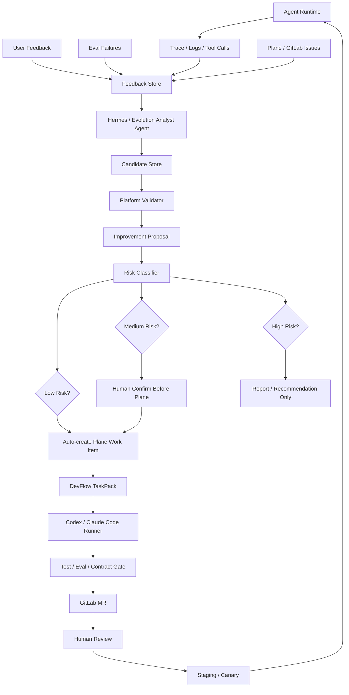

# 自进化 Agent 系统总体设计

> Status: Partially Implemented（Engine/Risk/Repo/API/Memory/Skills 已实现；Candidate Store/Review Fork/Hermes Analyst/RuntimeMemory 待实现）
> Stage: S9
> Owner: platform
> Last updated: 2026-05-20

本文档定义 Agent Platform 如何从“多 Agent 运行平台 + AI 研发流”演进为“可自进化的 Agent 系统”。

核心目标不是让系统无约束地自我修改和自我发布，而是形成一个受治理的闭环：

```text
运行反馈
  -> 问题发现
  -> 改进提案
  -> Plane Work Item
  -> DevFlow TaskPack
  -> Codex/Claude Code 修改
  -> test/eval/contract gate
  -> GitLab MR
  -> 人类 review
  -> staging/canary
  -> 新反馈继续进入下一轮
```

## 1. 设计原则

1. **自驱动，不自治**：系统可以自动发现问题、生成需求、提交 MR，但不能绕过 review、eval gate 和发布审批。
2. **提案先于修改**：Hermes/分析 Agent 只生成候选资产和 `ImprovementProposal`，不直接改代码。
3. **证据驱动**：每个改进提案必须绑定 evidence，例如 trace_id、session_id、eval_run_id、feedback_id、日志摘要或 Plane/GitLab 链接。
4. **低风险先自动化**：第一阶段只允许自动改 prompt、eval、docs、contract tests。业务工具代码和平台核心代码必须更严格。
5. **持续增加回归集**：每次线上失败都应优先沉淀为 eval case，再考虑修改 prompt/tool/code。
6. **Plane/GitLab 是审计边界**：所有可执行改动必须进入 Plane Work Item 和 GitLab MR。
7. **Agent package 是默认改动边界**：自进化优先改 `agents/<agent_id>/...`，不默认修改 `src/agent_platform/...`。
8. **Platform-Owned, Hermes-Powered**：Platform 拥有事实源、权限、审计、版本和发布；Hermes 提供分析、归因、候选记忆、候选技能、任务规划和 review 能力。
9. **Hermes writes candidates, Platform promotes assets**：Hermes 可以写入 Candidate Store，但正式 memory、skill、eval、Plane Work Item 和发布资产必须由 Platform 校验和晋升。

## 2. 总体架构



## 3. 核心组件

| 组件 | 职责 | 当前依赖 |
| --- | --- | --- |
| Runtime Event Collector | 收集 Agent run、tool call、model call、error、latency、feedback | `AgentRunRepository`、trace、metrics |
| Feedback Store | 存储用户反馈、eval failure、线上异常、人工标注 | 后续新增 repository |
| Evolution Analyst Agent | 聚合反馈并判断是否需要改进 | HermesBackend 或 Native 分析 Agent |
| Candidate Store | 保存 Hermes 生成的 MemoryCandidate、SkillDraft、EvalDraft、ProposalDraft、ReviewReport | `memory-and-skills-design.md` |
| Platform Memory Service | 管理 Runtime Memory 和 Evolution Memory | `memory-and-skills-design.md` |
| Skill Registry | 索引 Agent Package 内的 skills，并记录版本和使用效果 | `memory-and-skills-design.md` |
| Improvement Proposal Generator | 生成标准化改进提案 | `ImprovementProposal` 契约 |
| Risk Classifier | 判断自动化等级和允许修改范围 | `risk-policy.md` |
| Plane Work Item Creator | 把提案转成需求卡片 | Plane Adapter |
| DevFlow Bridge | 从提案生成 TaskPack 并派发 runner | DevFlowOrchestrator / TaskPackGenerator |
| Regression Manager | 把失败样本沉淀为 eval case | EvalRunner / agent eval files |
| Release Guard | 控制 staging/canary/prod 门禁 | Deployment / Artifact / Eval gate |

## 4. Hermes 的位置

Hermes 适合作为“分析和提案”的能力提供者。更准确的定位是：

```text
Platform-Owned Evolution
Hermes-Powered Intelligence
```

Platform 拥有事实源、权限、审计、版本、发布和 runtime 注入权；Hermes 提供智能分析、候选资产生成、任务规划、MR/release review 和 runtime tool-loop 能力。

Hermes 可以深度参与：

1. 汇总 trace、日志、feedback。
2. 识别重复问题和异常模式。
3. 归因是 prompt、knowledge、tool、routing、runtime 还是产品需求问题。
4. 生成 `MemoryCandidate`、`SkillDraft`、`EvalCaseDraft`、`ProposalDraft`。
5. 把 proposal 拆成 TaskPack 草案、验收标准和 validation commands。
6. 审查 MR 是否真正修复问题、是否越权改动、是否新增回归。
7. 生成 release risk report。
8. 维护 Hermes 自己作为 Analyst/Reviewer 的 memory 和 skills。

Hermes 不直接负责：

1. 调 Codex/Claude Code 修改代码。
2. 创建或合并 GitLab MR。
3. 推进生产发布。
4. 绕过 Agent Platform 的 DevFlow、Policy、Eval、Release gate。
5. 直接写入正式 Platform Memory、Agent Package、SkillRegistry 或 EvalRegistry。

边界：

```text
Hermes = 观察、归因、候选资产、提案、review、自己的分析能力自进化
Agent Platform = 编排、治理、路由、发布、审计
Codex/Claude Code = 受控代码修改
Plane/GitLab = 协作、review、CI、审计
```

### 4.1 两层自进化

为了避免边界混乱，自进化分成两层：

| 层级 | 目标 | 资产 | 生效范围 |
| --- | --- | --- | --- |
| Hermes Self-Improvement | 提升 Hermes 作为 Analyst/Curator/Planner/Reviewer 的能力 | Hermes analyst memory、proposal skill、eval draft skill、review rubric | 影响后续分析和候选生成质量 |
| Platform Evolution | 提升业务 Agent 的 prompt、eval、skills、tools、routing、knowledge、release | Platform memory、Agent package、SkillRegistry、EvalRegistry、Plane/GitLab 资产 | 影响业务 Agent runtime 和发布 |

规则：

1. Hermes 可以自进化自己的分析策略、review skill、proposal quality eval。
2. Hermes 的自进化成果如果要影响业务 Agent，必须先进入 Candidate Store。
3. Platform 是唯一有权激活、版本化、注入 runtime、发布上线的系统。
4. Hermes 自进化的是“分析者能力”；Platform 自进化的是“业务 Agent 能力”。

## 5. 第一阶段闭环

第一阶段只做低风险自进化：

```text
Eval failure / bad feedback
  -> Evolution Proposal
  -> Plane Work Item
  -> DevFlow
  -> Codex 修改 prompt/eval/docs/tests
  -> MR
  -> 人类 review
```

允许自动修改：

```text
agents/<agent_id>/prompts/**
agents/<agent_id>/evals/**
tests/contract/**
docs/**
```

默认禁止自动修改：

```text
src/agent_platform/**
agents/<agent_id>/tools/**
agents/<agent_id>/adapters/**
deploy/**
infra/**
.env
secrets/**
```

## 6. 自进化类型

| 类型 | 示例 | 默认风险 | 第一阶段是否自动化 |
| --- | --- | --- | --- |
| Prompt 优化 | 修复回答格式、补充边界规则 | Low | 是 |
| Eval 增强 | 把失败对话转成 golden case | Low | 是 |
| 文档补充 | 根据 incident 生成验证说明 | Low | 是 |
| Contract test | 为协议回归补测试 | Low/Medium | 是，需 review |
| Knowledge 更新 | 补 FAQ、业务规则 | Medium | 需确认来源 |
| Tool 参数修复 | 修正字段映射、错误处理 | Medium | 需人工确认 |
| Routing 规则 | 项目/标签/关键词映射 Agent | Medium | 需人工确认 |
| 业务代码修复 | 修改 adapter/tool 行为 | High | 只提案，不自动开发 |
| 平台核心修改 | 修改 runtime/router/persistence/security | High | 不进入自进化自动闭环 |

## 6.1 Memory 与 Skills 的位置

自进化系统需要把经验分成短期数据资产和长期可发布资产：

```text
短期经验：Evolution Memory
稳定经验：Skill / Prompt / Eval
```

原则：

1. Runtime Memory 服务在线会话，按 tenant/user/session/agent 隔离。
2. Evolution Memory 服务提案生成，必须绑定 evidence 和 confidence。
3. Agent Skills 是可版本化、可 review、可 eval、可回滚的 Agent Package 资产。
4. Memory 不应直接进入 Git；被验证的 memory 可以通过 proposal 固化为 skill/prompt/eval。
5. Skills 应进入 `agents/<agent_id>/skills/**`，并由 Platform Skill Registry 索引。
6. Runtime 是否注入 memory/skill 必须由 `ContextBuilder`、Policy 和 Eval gate 控制。

详细设计见 `07-evolution/memory-and-skills-design.md`。

## 7. 与现有文档关系

| 文档 | 关系 |
| --- | --- |
| `02-architecture/agent-platform-design.md` | 平台总体架构仍是边界基线 |
| `02-architecture/ai-human-vibecoding-rd-platform.md` | 自进化系统是 AI + 人研发闭环的增强层 |
| `03-runtime/hermes-runtime.md` | Hermes 作为分析/记忆/提案 runtime |
| `07-evolution/memory-and-skills-design.md` | Memory / Skills 平台化边界 |
| `04-devflow/plane.md` | Plane Work Item 是自进化需求入口 |
| `04-devflow/gitlab.md` | GitLab MR/CI 是代码变更审计入口 |
| `04-devflow/devflow-runner-workspace-design.md` | Codex/Claude Code runner 执行受控改动 |
| `05-production/security-tenant-policy-design.md` | 风险策略和权限边界必须复用安全设计 |

## 8. 成功标准

第一阶段完成后，应能验证：

1. 从 eval failure 自动生成 `ImprovementProposal`。
2. 提案带有 evidence 和风险等级。
3. 低风险提案可以自动创建 Plane Work Item。
4. Plane Work Item 可以触发 DevFlow。
5. Codex runner 只修改允许路径。
6. 新 eval case 被加入回归集。
7. GitLab MR 中能看到提案摘要、证据和验证结果。
8. 人类 review 后才能进入发布流程。
