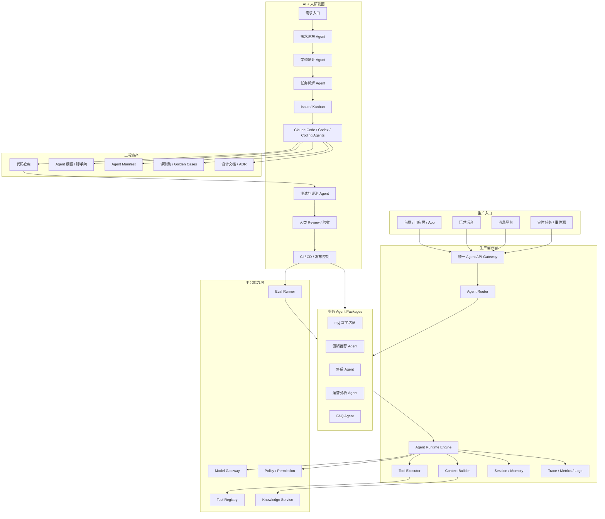
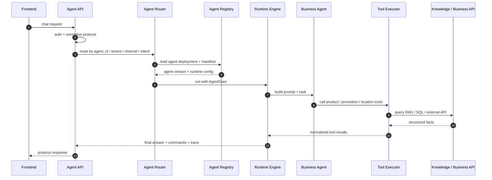
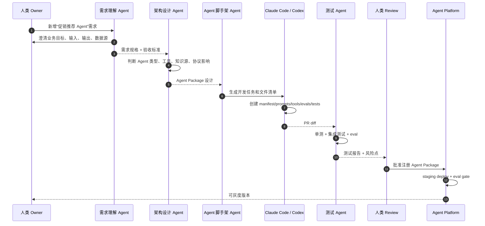
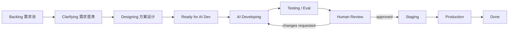
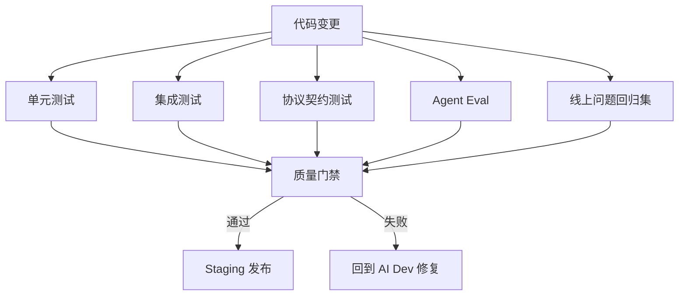
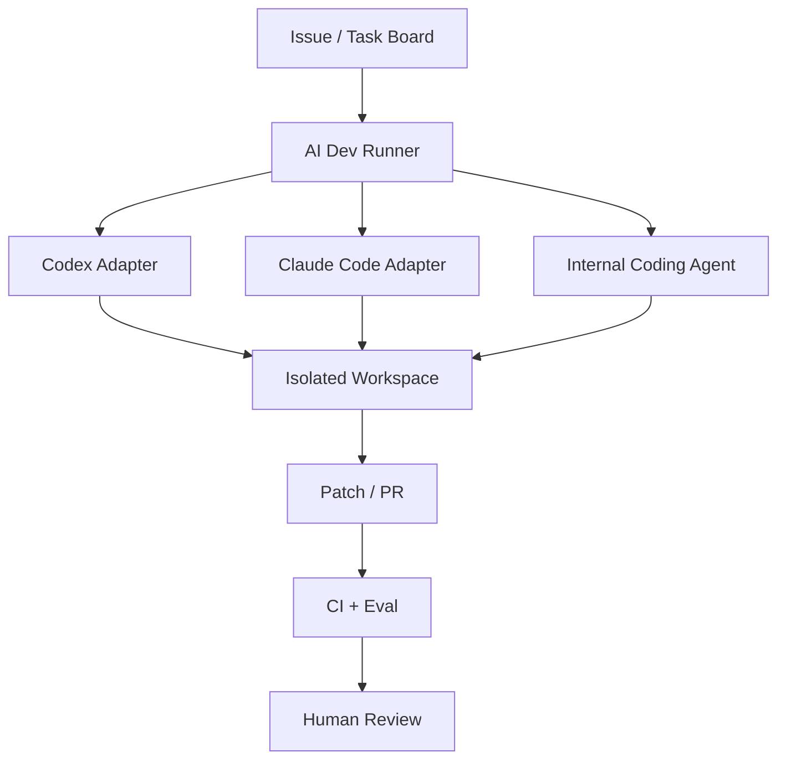

# AI + 人 + Vibe Coding 研发一体化平台设计

本文档描述一个“生产 + 开发一体化”的 Agent 平台设计。平台同时服务两类目标：

1. **生产侧**：承载多个业务 Agent，对前端、门店设备、运营后台、消息渠道提供问答、推荐、导购、店务咨询、工具调用等能力。
2. **研发侧**：当需要新增或改造业务 Agent 时，由 AI 参与需求理解、方案设计、代码生成、测试生成、Issue 看板流转、评审和发布，减少重复开发成本。

核心思想：业务 Agent 不应该每次都从零开发。平台要沉淀 Agent 的标准契约、运行时、工具注册、知识接入、评测、发布流程和研发自动化流水线。人负责目标、边界、验收和关键决策；AI 负责高频重复的分析、编码、测试、文档和变更执行。

## 1. 设计目标

### 1.1 生产目标

1. 支持多个业务 Agent 并存，例如 `myj` 数字店员、促销推荐 Agent、售后 Agent、运营 Agent、企业 FAQ Agent。
2. 前端只需要调用统一接口，由平台路由到正确 Agent。
3. 每个 Agent 可独立版本化、灰度、回滚、评测和观测。
4. 每个 Agent 可声明自己的 prompt、工具、知识库、输出协议和业务策略。
5. 业务 Agent 可复用平台的模型网关、工具执行、会话、权限、日志、trace 和发布能力。

### 1.2 研发目标

1. 新增业务 Agent 时，不需要大量手写样板代码。
2. 需求理解、方案拆解、Issue 生成、开发任务分配、测试补齐、文档更新可由 AI 辅助完成。
3. 支持 Claude Code、Codex、内部 coding agent 等工具接入同一研发流程。
4. 人类研发负责架构约束、代码评审、业务验收和高风险发布决策。
5. 平台持续沉淀模板、脚手架、评测集和最佳实践，让后续 Agent 开发越来越快。

## 2. 总体架构图



## 3. 平台分层

| 层 | 主要职责 | 关键产物 |
| --- | --- | --- |
| 生产接入层 | 统一 API、鉴权、协议适配、流式返回、租户识别 | `AgentRequest`、`AgentResponse` |
| Agent 路由层 | 根据 `agent_id`、租户、渠道、语义意图选择 Agent | `ResolvedAgent` |
| Agent 运行时 | 模型调用、工具循环、上下文构造、会话、trace | `RuntimeRun` |
| 能力层 | 工具、知识库、模型、权限、评测 | `ToolDefinition`、`KnowledgeSource`、`EvalSuite` |
| Agent Package 层 | 每个业务 Agent 的业务资产 | `manifest.yaml`、prompts、policies、tools、evals |
| 研发自动化层 | 需求理解、设计、拆票、编码、测试、文档、发布 | Issue、PR、测试报告、ADR |
| 人类治理层 | 架构评审、代码评审、业务验收、发布审批 | Review 结论、发布单、回滚策略 |

## 4. 生产侧：多个业务 Agent 如何服务前端

前端不应该感知每个业务 Agent 的内部实现。推荐统一入口：

```http
POST /api/v1/agent/chat
```

请求携带：

```json
{
  "request_id": "req_001",
  "agent_id": "myj",
  "session_id": "sess_001",
  "context": {
    "tenant": {
      "retailer_id": "myj"
    },
    "store": {
      "store_id": "V01031"
    },
    "channel": {
      "channel_id": "store_screen"
    }
  },
  "input": {
    "query": "帮我推荐一瓶低糖饮料",
    "capabilities": [
      "product.recommend",
      "product.locate",
      "cart.add"
    ]
  }
}
```

平台内部流程：



响应建议统一为：

```json
{
  "request_id": "req_001",
  "agent_id": "myj",
  "agent_version": "1.3.0",
  "session_id": "sess_001",
  "output": {
    "text": {
      "display": "推荐元气森林白桃味，低糖，冷藏柜第二层有售。",
      "tts": "推荐元气森林白桃味，低糖，冷藏柜第二层有售。"
    },
    "cards": [
      {
        "type": "product",
        "sku_id": "SKU_10001",
        "name": "元气森林白桃味",
        "price": 5.5
      }
    ],
    "commands": [
      {
        "name": "product.locate",
        "data": {
          "sku_id": "SKU_10001",
          "area": "冷藏柜",
          "shelf": "第二层"
        }
      }
    ]
  },
  "debug": {
    "route": "myj.recommendation_worker",
    "tools": [
      "goods_search",
      "goods_location"
    ],
    "latency_ms": 920
  }
}
```

## 5. 研发侧：AI + 人 + Vibe Coding 流程

研发流程不是“让 AI 直接改生产”。正确形态是：AI 参与每个环节，但每个阶段都有明确输入、输出和人类把关点。

```mermaid
flowchart LR
    Req[业务需求 / 前端任务 / 用户反馈] --> Intake[需求 intake]
    Intake --> ProductAgent[需求理解 Agent]
    ProductAgent --> Spec[需求规格 / 验收标准]
    Spec --> ArchitectAgent[架构设计 Agent]
    ArchitectAgent --> Design[设计文档 / ADR]
    Design --> PlannerAgent[任务拆解 Agent]
    PlannerAgent --> Issues[Issue / Kanban]
    Issues --> Coding[Claude Code / Codex 开发]
    Coding --> PR[Pull Request]
    PR --> TestAgent[测试生成 / 回归评测]
    TestAgent --> Report[测试报告 / Eval 报告]
    Report --> HumanReview[人类 Review]
    HumanReview -->|通过| Merge[Merge]
    HumanReview -->|修改| Issues
    Merge --> Deploy[灰度发布]
    Deploy --> Observe[线上观测]
    Observe --> Feedback[反馈进入下一轮]
    Feedback --> Intake
```



### 5.1 角色分工

| 角色 | 谁来做 | 负责内容 |
| --- | --- | --- |
| 需求提出 | 产品、运营、前端、业务方 | 描述目标、用户场景、约束 |
| 需求理解 Agent | AI | 澄清需求、抽取实体、生成验收标准 |
| 架构设计 Agent | AI + 架构师 | 判断是否新增 Agent、扩展工具、改协议或改知识库 |
| 任务拆解 Agent | AI | 生成 Issue、依赖关系、开发步骤、测试计划 |
| Coding Agent | Claude Code / Codex | 修改代码、补测试、补文档、生成 manifest |
| 测试 Agent | AI + CI | 单测、集成测试、eval、回归报告 |
| 人类 Reviewer | 研发、架构师、业务 owner | 审查风险、确认业务正确性、批准发布 |
| 发布控制 | CI/CD + 人 | 灰度、回滚、监控 |

### 5.2 AI 不能越权的事项

1. 不能无审批修改生产部署比例。
2. 不能无审批删除数据、删除 Agent、删除评测集。
3. 不能绕过代码评审直接合并主干。
4. 不能自行扩展高风险工具权限，例如支付、退款、批量改价。
5. 不能把密钥写入代码、manifest、prompt 或文档。

## 6. 新增业务 Agent 的自动化流程

目标：新增业务 Agent 时，尽量从“写大量代码”变成“填写目标 + AI 生成草案 + 人审 + 自动测试 + 发布”。



新增 Agent 的标准产物：

```text
agents/
  promo_recommendation/
    manifest.yaml
    README.md
    prompts/
      orchestrator.md
      reply_style.md
    policies/
      routing.yaml
      safety.yaml
      output.yaml
    tools/
      promotion_search.py
      product_rank.py
    knowledge/
      sources.yaml
    evals/
      intent_cases.yaml
      golden_answers.yaml
    tests/
      test_routing.py
      test_tools.py
      test_protocol_output.py
```

## 7. Issue 看板设计

平台应该把 AI 研发过程显式化，不要让 coding agent 在黑盒里自由发挥。推荐用 Issue / Kanban 管理每次 Agent 变更。

### 7.1 看板泳道



### 7.2 Issue 类型

| 类型 | 说明 | AI 可自动生成 |
| --- | --- | --- |
| `agent:new` | 新增业务 Agent | 是 |
| `agent:change` | 修改已有 Agent 的意图、回复、工具或知识 | 是 |
| `tool:new` | 新增业务工具 | 是 |
| `tool:change` | 修改工具参数、权限、超时、返回结构 | 是 |
| `knowledge:sync` | 新增或修改知识源同步 | 是 |
| `protocol:change` | 修改前后端协议 | 可生成草案，必须人审 |
| `eval:add` | 增加评测集或 golden case | 是 |
| `bug` | 修复线上问题 | 是 |
| `risk` | 安全、权限、数据风险 | AI 可发现，人必须确认 |

### 7.3 Issue 模板

```markdown
## 背景

## 用户场景

## 期望行为

## 非目标

## 输入协议

## 输出协议

## 涉及 Agent

## 涉及工具 / 知识源

## 验收标准

## 测试要求

## 风险点

## 发布计划
```

## 8. 需求理解 Agent

需求理解 Agent 的职责是把自然语言需求变成可开发规格。

输入示例：

```text
我们想做一个促销推荐 Agent，前端传门店和用户问题，Agent 要结合当前门店商品和优惠活动推荐商品。
```

输出示例：

```yaml
requirement:
  title: 促销推荐 Agent
  goal: 根据门店商品、促销、用户偏好生成推荐
  users:
    - store_customer
    - store_operator
  inputs:
    required:
      - store_id
      - query
    optional:
      - member_id
      - location
      - cart_context
  outputs:
    - display_text
    - tts_text
    - product_cards
    - locate_command
    - cart_add_command
  acceptance:
    - 能推荐门店有库存商品
    - 优先推荐活动商品
    - 不推荐缺货商品
    - 返回商品卡片和位置命令
  open_questions:
    - 促销数据源在哪里
    - 是否允许基于会员画像推荐
    - 是否需要解释推荐理由
```

它不直接写代码，而是生成开发可用的规格和待澄清问题。

## 9. 架构设计 Agent

架构设计 Agent 负责判断需求应该落在哪个层：

| 需求类型 | 推荐落点 |
| --- | --- |
| 只改话术 | Agent prompt / reply policy |
| 新增意图 | routing policy + eval |
| 新增外部 API 查询 | tool plugin |
| 新增知识检索 | knowledge source + sync job |
| 新增前端交互能力 | output command + protocol |
| 新增完整业务域 | new Agent Package |
| 涉及权限和风控 | policy + human approval |

架构设计输出：

```markdown
# Design Brief

## Decision

新增 `promo_recommendation` Agent Package，而不是塞进 `myj` 主 Agent。

## Reason

促销推荐有独立数据源、评测集、工具和推荐策略；后续可能服务多个零售商。

## Components

- Agent manifest
- promotion_search tool
- product_rank tool
- promotion knowledge source
- product recommendation eval suite

## Risks

- 促销数据实时性
- 缺货商品过滤
- 前端命令兼容
```

## 10. Coding Agent 执行方式

Claude Code / Codex 不应该直接收到一句“帮我做促销 Agent”。它应该收到结构化任务包。

### 10.1 任务包格式

```yaml
task:
  id: issue-123
  type: agent:new
  title: 新增促销推荐 Agent
  repo: meiyijia_agent_hw
  branch: feat/promo-agent
  scope:
    write_allowed:
      - src/platform/**
      - agents/promo_recommendation/**
      - tests/**
      - docs/**
    write_denied:
      - secrets/**
      - deploy/prod/**
  constraints:
    - 不修改现有 /chat 对外协议
    - 不引入未审批的外部服务
    - 新增工具必须有超时和参数校验
  required_outputs:
    - manifest.yaml
    - prompts
    - tool adapters
    - tests
    - eval cases
    - docs
  validation:
    commands:
      - pytest tests/test_promo_agent.py
      - pytest tests/test_agent_routing.py
```

### 10.2 Coding Agent 工作约束

1. 必须先读取相关代码和文档。
2. 必须输出变更计划。
3. 只能修改任务包允许的路径。
4. 必须补测试或说明无法补测试的原因。
5. 必须更新 manifest、文档和 eval。
6. 必须在最终报告里列出变更文件、测试结果、风险点。

## 11. Eval 和测试体系

多 Agent 平台必须把“业务正确性”纳入测试，不只是跑单元测试。



测试类型：

| 测试 | 验证内容 |
| --- | --- |
| 单元测试 | 工具参数、路由函数、manifest loader |
| 集成测试 | Agent 调用工具、RAG、业务 API |
| 协议契约测试 | 前端输入输出结构不破坏 |
| Eval | 意图识别、工具选择、回答质量、拒答策略 |
| 回归测试 | 历史线上 bug 不复发 |
| Shadow 测试 | 新版本处理真实流量副本，不影响用户 |

Eval case 示例：

```yaml
- id: promo_001
  agent_id: promo_recommendation
  input:
    query: "今天有什么饮料优惠"
    context:
      store_id: V01031
  expected:
    intent: promotion_recommendation
    must_call_tools:
      - promotion_search
      - product_rank
    output_contains:
      - 优惠
    forbidden:
      - 推荐缺货商品
```

## 12. 人类 Review 设计

人类 Review 不应该只看代码 diff，还要看 AI 产出的需求、设计、测试和风险。

Review checklist：

1. 需求是否被正确理解。
2. 是否应该新增 Agent，还是扩展已有 Agent。
3. manifest 是否清晰声明工具、知识、权限和输出协议。
4. 新工具是否有权限、超时、参数校验和错误处理。
5. 是否有足够 eval case。
6. 是否破坏前端协议。
7. 是否存在数据安全或越权风险。
8. 是否有灰度和回滚方案。

Review 结论建议结构化：

```yaml
review:
  status: changes_requested
  blockers:
    - promotion_search 缺少超时配置
    - eval 未覆盖缺货商品过滤
  suggestions:
    - 将推荐理由作为可选字段返回
  approval_required_from:
    - backend_owner
    - product_owner
```

## 13. 从 Vibecoding 到可控工程化

Vibe coding 的价值是快速把想法变成可运行原型，但生产平台必须给它加边界。

| Vibe Coding 能力 | 工程化约束 |
| --- | --- |
| 快速生成代码 | 路径白名单、任务包、代码评审 |
| 快速试错 | feature flag、staging、shadow traffic |
| 自动补测试 | quality gate、coverage、eval pass rate |
| 自动改 prompt | prompt version、eval、线上 trace 对比 |
| 自动改工具 | tool permission、schema validation、timeout |
| 自动写文档 | ADR、README、manifest 同步 |

推荐原则：

1. 原型阶段允许 AI 快速生成，但必须隔离在 feature branch。
2. 进入 staging 前必须有测试和 eval。
3. 进入 prod 前必须有人类 approve。
4. 所有 AI 生成变更必须可追溯到 issue。
5. 所有上线 Agent 必须能回滚到上一版本。

## 14. 平台核心对象

### 14.1 AgentPackage

```yaml
agent_package:
  id: promo_recommendation
  version: 1.0.0
  owner: retail-ai
  manifest_path: agents/promo_recommendation/manifest.yaml
  status: draft
```

### 14.2 DevelopmentTask

```yaml
development_task:
  id: issue-123
  type: agent:new
  status: ai_developing
  requirement_ref: req-456
  design_ref: adr-789
  agent_id: promo_recommendation
  assigned_to:
    type: coding_agent
    name: codex
  human_owner: backend_owner
```

### 14.3 RuntimeDeployment

```yaml
runtime_deployment:
  deployment_id: dep-promo-prod
  agent_id: promo_recommendation
  version: 1.0.0
  environment: prod
  traffic_percent: 5
  rollout_strategy: stable_hash
```

### 14.4 EvalRun

```yaml
eval_run:
  id: eval-001
  agent_id: promo_recommendation
  version: 1.0.0
  suite: promo_golden_cases
  pass_rate: 0.97
  regressions:
    - promo_018
```

## 15. 和 Hermes / Claude Code / Codex 的关系

这个平台不应该绑定某一个 AI 编码工具，而应该把它们都看成可替换执行器。



适配器职责：

| Adapter | 负责内容 |
| --- | --- |
| Codex Adapter | 本地代码修改、测试、文档、代码库理解 |
| Claude Code Adapter | 长任务开发、复杂重构、跨文件修改 |
| Hermes Runtime Adapter | 可选，用于生产 Agent 的工具循环、插件、session 能力 |
| Internal Agent Adapter | 公司内部模型、权限系统、私有知识库 |

关键点：Claude Code / Codex 负责“研发执行”，Hermes 更适合作为“Agent Runtime 能力来源”。两者可以并存，但不要混成一个不可控黑盒。

## 16. 第一阶段落地方案

第一阶段目标是最小闭环：

1. 生产侧支持多个 Agent 的 manifest 注册和路由。
2. 研发侧支持 AI 从需求生成 issue、设计、代码任务包。
3. Coding agent 根据任务包生成 Agent Package。
4. CI 跑测试和 eval。
5. 人审后进入 staging。

建议实现：

```text
src/
  platform/
    contracts.py
    router.py
    registry.py
    manifest_loader.py
    runtime/
      base.py
      native_graph.py
    devflow/
      requirement_parser.py
      issue_generator.py
      task_pack.py
      eval_report.py
agents/
  myj/
    manifest.yaml
    prompts/
    policies/
    evals/
docs/
  design/
    ai-human-vibecoding-rd-platform.md
```

第一阶段不做：

1. 完整 Web 研发平台。
2. 全自动生产发布。
3. 多 coding agent 并发调度。
4. 自动创建真实 GitHub/Jira issue。
5. 完整 Agent marketplace。

## 17. 第二阶段演进

第二阶段可以加入：

1. Issue 看板 UI。
2. 自动 PR 创建。
3. 多 coding agent 分工。
4. Eval dashboard。
5. Shadow traffic 和线上对照实验。
6. Agent 版本运营后台。
7. Prompt diff 和工具调用 diff。
8. 线上失败样本自动回流到 eval。

## 18. 风险与控制

| 风险 | 控制方式 |
| --- | --- |
| AI 误解需求 | 需求澄清问题、人类确认验收标准 |
| AI 乱改代码 | 任务包路径白名单、PR review |
| 新 Agent 质量不稳定 | eval gate、staging、shadow traffic |
| 工具越权 | Tool permission、tenant policy、审批 |
| Prompt 改动引发回归 | prompt version、golden case、线上对照 |
| 线上不可追踪 | trace、agent_version、tool call log |
| 过度平台化 | 先支持 `myj` 和一个新 Agent，避免提前建设大而全 |

## 19. 推荐实施顺序


优先级：

| 优先级 | 工作 | 原因 |
| --- | --- | --- |
| P0 | `AgentRequest` / `AgentResponse` / `manifest.yaml` | 平台契约先行 |
| P0 | `myj` package 化 | 用真实业务验证平台抽象 |
| P0 | Agent Router | 支持多个业务 Agent |
| P1 | Tool Registry 和 Knowledge config | 降低新增 Agent 成本 |
| P1 | Eval Runner | 没有评测就无法放心自动开发 |
| P1 | AI Dev Task Pack | 让 Claude/Codex 有结构化输入 |
| P2 | Issue 看板和自动 PR | 提升研发协作效率 |
| P2 | Hermes Runtime Adapter | 复用更强 Agent runtime |
| P3 | Web 管理后台和 Agent marketplace | 平台运营能力 |

## 20. 结论

这个平台的核心不是“做很多 Agent”，而是建立一条可复制的 Agent 生产线：

1. 前端任务进入统一 Agent API。
2. 平台路由到正确业务 Agent。
3. 业务 Agent 用 manifest 声明自己的 prompt、工具、知识、策略和评测。
4. 新需求进入 AI + 人协作研发流。
5. AI 负责需求整理、设计草案、拆票、编码、测试和文档。
6. 人负责关键判断、review、验收和发布审批。
7. 测试、eval、trace 和灰度保证 Agent 可持续演进。

最终形态是：新增一个业务 Agent 不再是一轮完整手工项目，而是一次标准化流水线执行。人定义目标和边界，AI 完成大部分重复研发工作，平台保证生产质量和可控发布。
